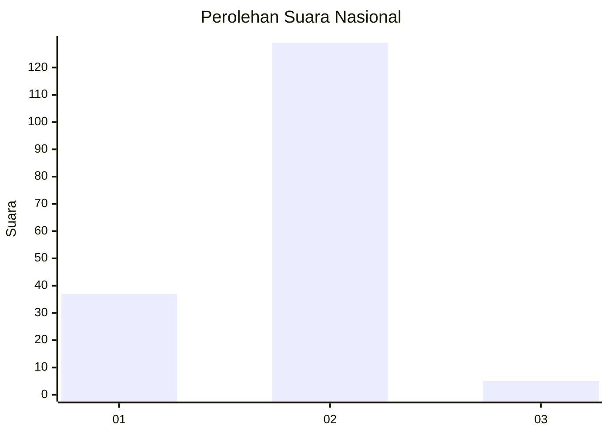

# Hasil

## Grafik

## Tabel

| No. | Nama Paslon    | Suara | Suara (raw) | Persentase |
|:--- |:-------------- | -----:| -----------:| ----------:|
| 1   | ANIES MUHAIMIN | 37    | [37][p-1]   | 21,64      |
| 2   | PRABOWO GIBRAN | 129   | [129][p-2]  | 75,44      |
| 3   | GANJAR MAHFUD  | 5     | [5][p-3]    | 2,92       |

[p-1]: https://github.com/gigit-pemilu/pemilu-2024/blob/main/pilpres/hitung-suara/sub/15-jambi/sub/01--kerinci/sub/01-gunung-raya/sub/1004-lempur-tengah/sub/004-tps/sub/paslon-1.txt
[p-2]: https://github.com/gigit-pemilu/pemilu-2024/blob/main/pilpres/hitung-suara/sub/15-jambi/sub/01--kerinci/sub/01-gunung-raya/sub/1004-lempur-tengah/sub/004-tps/sub/paslon-2.txt
[p-3]: https://github.com/gigit-pemilu/pemilu-2024/blob/main/pilpres/hitung-suara/sub/15-jambi/sub/01--kerinci/sub/01-gunung-raya/sub/1004-lempur-tengah/sub/004-tps/sub/paslon-3.txt

## Foto C Plano

https://sirekap-obj-formc.kpu.go.id/5f49/pemilu/ppwp/15/01/01/10/04/1501011004004-20240216-165742--035f4583-1a1c-4c8f-afc3-20ef0aaa64cc.jpg

https://sirekap-obj-formc.kpu.go.id/5f49/pemilu/ppwp/15/01/01/10/04/1501011004004-20240215-002242--855ef746-c864-4e58-a6db-d1089d6252b9.jpg

## Metadata

| Key        | Value               |
| ---------- | ------------------- |
| Time Stamp | 2024-02-16 17:00:00 |

