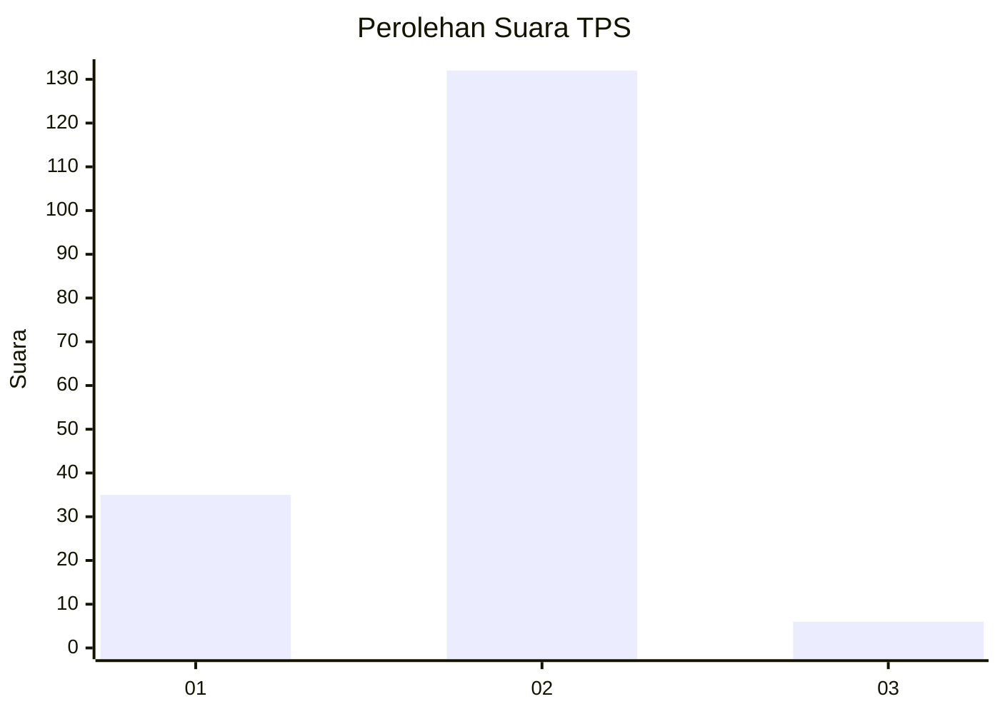

# Hasil

## Grafik

## Tabel

| No. | Nama Paslon    | Suara | Suara (raw) | Persentase |
|:--- |:-------------- | -----:| -----------:| ----------:|
| 1   | ANIES MUHAIMIN | 35    | [35][p-1]   | 20,23      |
| 2   | PRABOWO GIBRAN | 132   | [132][p-2]  | 76,30      |
| 3   | GANJAR MAHFUD  | 6     | [6][p-3]    | 3,47       |

[p-1]: https://github.com/gigit-pemilu/pemilu-2024-15-jambi/blob/main/pilpres/hitung-suara/sub/15-jambi/sub/01--kerinci/sub/01-gunung-raya/sub/2001-selam-paung/sub/002-tps/sub/paslon-1.txt
[p-2]: https://github.com/gigit-pemilu/pemilu-2024-15-jambi/blob/main/pilpres/hitung-suara/sub/15-jambi/sub/01--kerinci/sub/01-gunung-raya/sub/2001-selam-paung/sub/002-tps/sub/paslon-2.txt
[p-3]: https://github.com/gigit-pemilu/pemilu-2024-15-jambi/blob/main/pilpres/hitung-suara/sub/15-jambi/sub/01--kerinci/sub/01-gunung-raya/sub/2001-selam-paung/sub/002-tps/sub/paslon-3.txt

## Foto C Plano

https://sirekap-obj-formc.kpu.go.id/f41f/pemilu/ppwp/15/01/01/20/01/1501012001002-20240216-184647--1ccac55f-6173-4d5f-8056-c01cfbee0cf1.jpg

https://sirekap-obj-formc.kpu.go.id/f41f/pemilu/ppwp/15/01/01/20/01/1501012001002-20240216-184648--a0aaceb6-f9e5-456d-832a-d8db84b6e2cc.jpg

https://sirekap-obj-formc.kpu.go.id/f41f/pemilu/ppwp/15/01/01/20/01/1501012001002-20240216-184648--8eb0bd89-a7f5-4984-b681-0bcdd2352605.jpg

## Metadata

| Key        | Value               |
| ---------- | ------------------- |
| Time Stamp | 2024-02-16 21:01:00 |

## DATA PEMILIH TETAP

Jumlah pemilih dalam DPT: **0**.
 * L: **0**.
 * P: **0**.

## DATA PENGGUNA HAK PILIH

Jumlah pengguna hak pilih dalam DPT: **0**.
 * L: **0**.
 * P: **0**.

Jumlah pengguna hak pilih dalam DPTb: **0**.
 * L: **0**.
 * P: **0**.

Jumlah pengguna hak pilih dalam DPK: **0**.
 * L: **0**.
 * P: **0**.

Jumlah pengguna hak pilih: **0**.
 * L: **0**.
 * P: **0**.

## JUMLAH SUARA SAH DAN TIDAK SAH

JUMLAH SELURUH SUARA SAH: **173**.

JUMLAH SUARA TIDAK SAH: **8**.

JUMLAH SELURUH SUARA SAH DAN SUARA TIDAK SAH: **181**.

