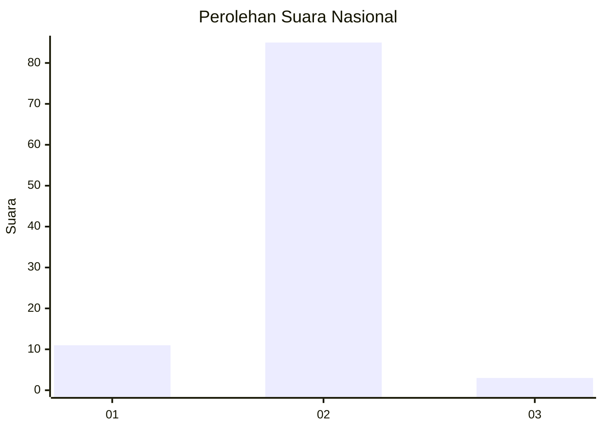
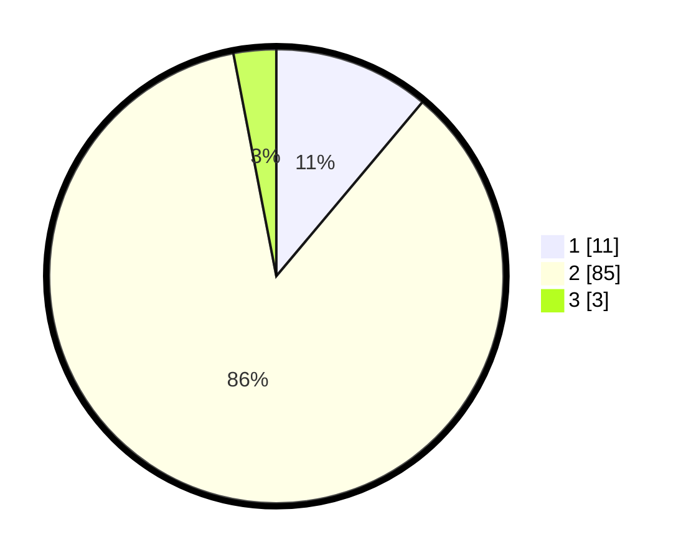

# Hasil

## Grafik

## Tabel

| No. | Nama Paslon    | Suara | Suara (raw) | Persentase |
|:--- |:-------------- | -----:| -----------:| ----------:|
| 1   | ANIES MUHAIMIN | 11    | [11][p-1]   | 11,11      |
| 2   | PRABOWO GIBRAN | 85    | [85][p-2]   | 85,86      |
| 3   | GANJAR MAHFUD  | 3     | [3][p-3]    | 3,03       |

[p-1]: https://github.com/gigit-pemilu/pemilu-2024/blob/main/pilpres/hitung-suara/sub/15-jambi/sub/01--kerinci/sub/04-sitinjau-laut/sub/2009-ambai-atas/sub/001-tps/sub/paslon-1.txt
[p-2]: https://github.com/gigit-pemilu/pemilu-2024/blob/main/pilpres/hitung-suara/sub/15-jambi/sub/01--kerinci/sub/04-sitinjau-laut/sub/2009-ambai-atas/sub/001-tps/sub/paslon-2.txt
[p-3]: https://github.com/gigit-pemilu/pemilu-2024/blob/main/pilpres/hitung-suara/sub/15-jambi/sub/01--kerinci/sub/04-sitinjau-laut/sub/2009-ambai-atas/sub/001-tps/sub/paslon-3.txt

## Foto C Plano

https://sirekap-obj-formc.kpu.go.id/46a8/pemilu/ppwp/15/01/04/20/09/1501042009001-20240216-162003--98ae8b87-a0df-481e-be16-eee3b923702c.jpg

https://sirekap-obj-formc.kpu.go.id/46a8/pemilu/ppwp/15/01/04/20/09/1501042009001-20240215-031040--b9e9b31f-7d6a-4751-a15b-ecc31b102963.jpg

https://sirekap-obj-formc.kpu.go.id/46a8/pemilu/ppwp/15/01/04/20/09/1501042009001-20240215-022945--ca6df2f0-637b-4690-88c0-a7c2bfdbf2a2.jpg

## Metadata

| Key        | Value               |
| ---------- | ------------------- |
| Time Stamp | 2024-02-16 16:25:10 |

