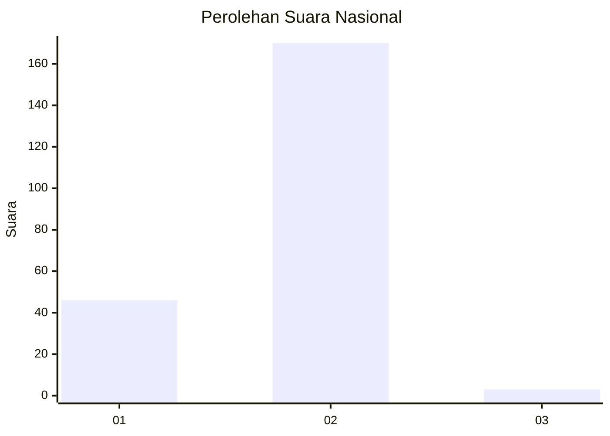
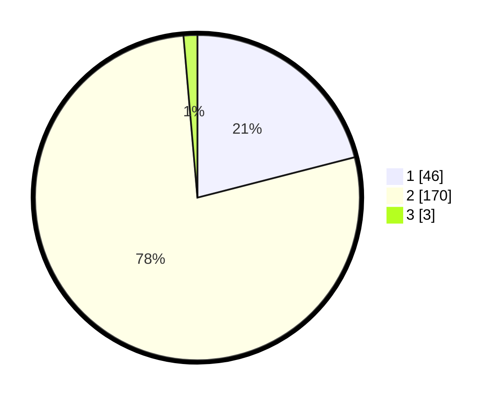

# Hasil

## Grafik

## Tabel

| No. | Nama Paslon    | Suara | Suara (raw) | Persentase |
|:--- |:-------------- | -----:| -----------:| ----------:|
| 1   | ANIES MUHAIMIN | 46    | [46][p-1]   | 21,00      |
| 2   | PRABOWO GIBRAN | 170   | [170][p-2]  | 77,63      |
| 3   | GANJAR MAHFUD  | 3     | [3][p-3]    | 1,37       |

[p-1]: https://github.com/gigit-pemilu/pemilu-2024/blob/main/pilpres/hitung-suara/sub/15-jambi/sub/01--kerinci/sub/06-gunung-kerinci/sub/2040-baru-sungai-betung-mudik/sub/001-tps/sub/paslon-1.txt
[p-2]: https://github.com/gigit-pemilu/pemilu-2024/blob/main/pilpres/hitung-suara/sub/15-jambi/sub/01--kerinci/sub/06-gunung-kerinci/sub/2040-baru-sungai-betung-mudik/sub/001-tps/sub/paslon-2.txt
[p-3]: https://github.com/gigit-pemilu/pemilu-2024/blob/main/pilpres/hitung-suara/sub/15-jambi/sub/01--kerinci/sub/06-gunung-kerinci/sub/2040-baru-sungai-betung-mudik/sub/001-tps/sub/paslon-3.txt

## Foto C Plano

https://sirekap-obj-formc.kpu.go.id/ec1c/pemilu/ppwp/15/01/06/20/40/1501062040001-20240215-005319--80a6dc7a-50dd-410b-82f7-c099c6dd062c.jpg

https://sirekap-obj-formc.kpu.go.id/ec1c/pemilu/ppwp/15/01/06/20/40/1501062040001-20240215-005522--fc6f6dbb-5df9-4e22-bcfd-3f3b7819b766.jpg

https://sirekap-obj-formc.kpu.go.id/ec1c/pemilu/ppwp/15/01/06/20/40/1501062040001-20240215-005709--a6143bff-b60e-4eb3-9ad0-8e6dbaee26e8.jpg

## Metadata

| Key        | Value               |
| ---------- | ------------------- |
| Time Stamp | 2024-02-15 15:00:29 |

