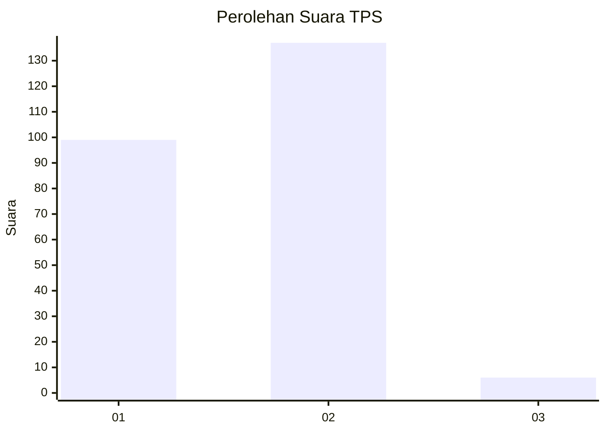
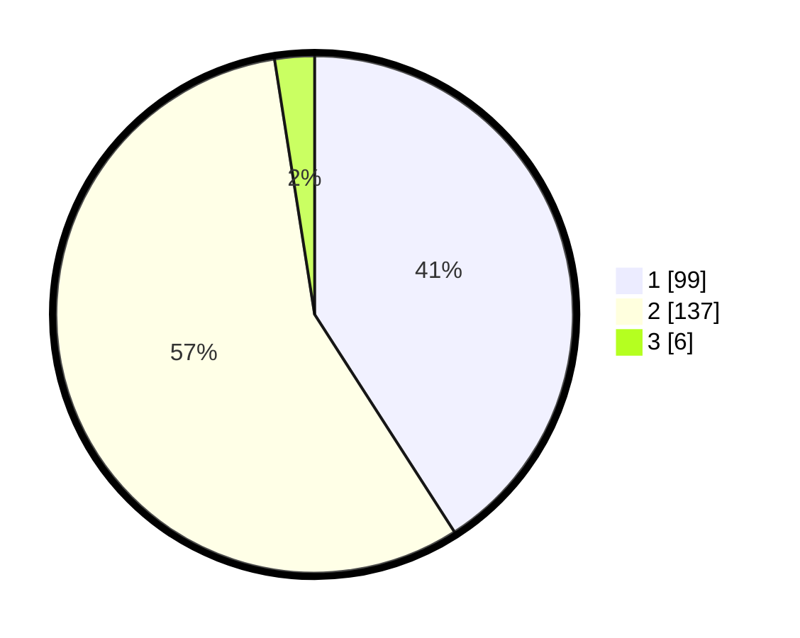

# Hasil

## Grafik

## Tabel

| No. | Nama Paslon    | Suara | Suara (raw) | Persentase |
|:--- |:-------------- | -----:| -----------:| ----------:|
| 1   | ANIES MUHAIMIN | 99    | [99][p-1]   | 40,91      |
| 2   | PRABOWO GIBRAN | 137   | [137][p-2]  | 56,61      |
| 3   | GANJAR MAHFUD  | 6     | [6][p-3]    | 2,48       |

[p-1]: https://github.com/gigit-pemilu/pemilu-2024-15-jambi/blob/main/pilpres/hitung-suara/sub/15-jambi/sub/01--kerinci/sub/11-air-hangat-timur/sub/2002-kemantan-kebalai/sub/002-tps/sub/paslon-1.txt
[p-2]: https://github.com/gigit-pemilu/pemilu-2024-15-jambi/blob/main/pilpres/hitung-suara/sub/15-jambi/sub/01--kerinci/sub/11-air-hangat-timur/sub/2002-kemantan-kebalai/sub/002-tps/sub/paslon-2.txt
[p-3]: https://github.com/gigit-pemilu/pemilu-2024-15-jambi/blob/main/pilpres/hitung-suara/sub/15-jambi/sub/01--kerinci/sub/11-air-hangat-timur/sub/2002-kemantan-kebalai/sub/002-tps/sub/paslon-3.txt

## Foto C Plano

https://sirekap-obj-formc.kpu.go.id/1213/pemilu/ppwp/15/01/11/20/02/1501112002002-20240214-190612--108cecd0-17a4-4f5b-a2d8-9908078bb29a.jpg

https://sirekap-obj-formc.kpu.go.id/1213/pemilu/ppwp/15/01/11/20/02/1501112002002-20240214-190631--f39cadd1-874e-4d01-a964-174b7c377d1e.jpg

https://sirekap-obj-formc.kpu.go.id/1213/pemilu/ppwp/15/01/11/20/02/1501112002002-20240214-190718--f2861165-5e6a-420f-8b55-abb385c99f5d.jpg

## Metadata

| Key        | Value               |
| ---------- | ------------------- |
| Time Stamp | 2024-02-24 22:31:28 |

