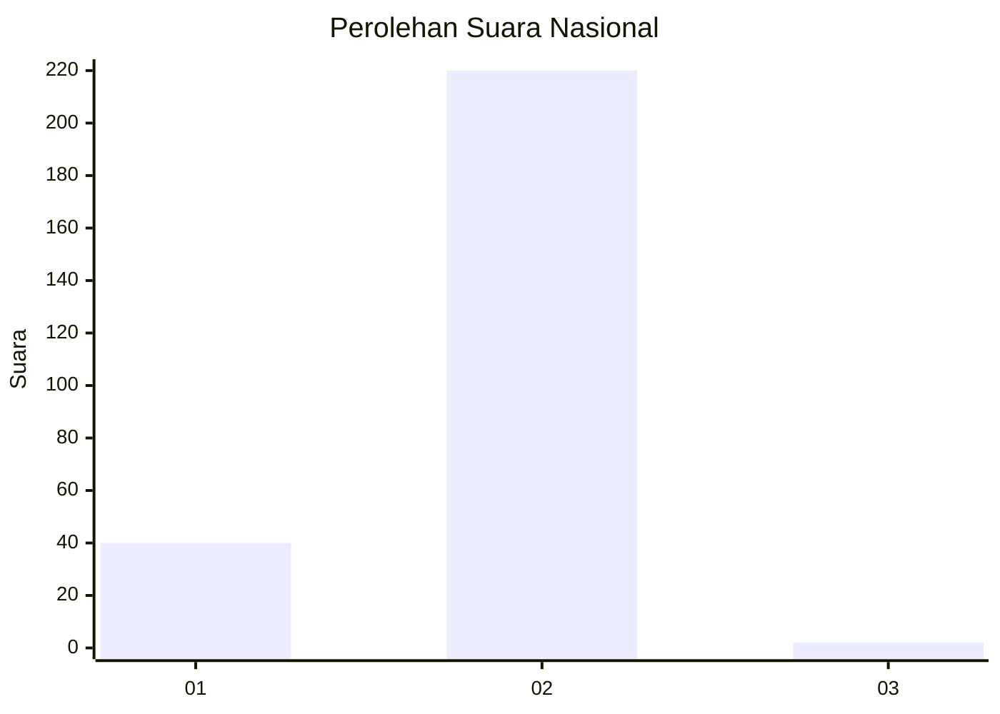
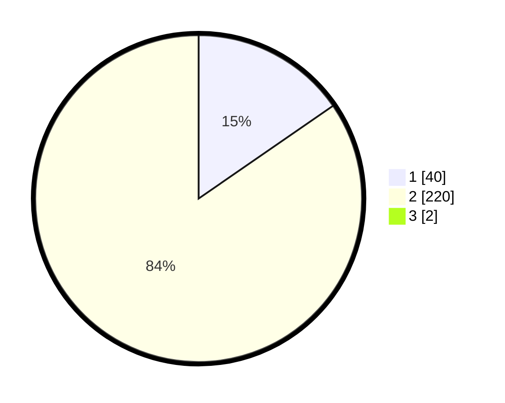

# Hasil

## Grafik

## Tabel

| No. | Nama Paslon    | Suara | Suara (raw) | Persentase |
|:--- |:-------------- | -----:| -----------:| ----------:|
| 1   | ANIES MUHAIMIN | 40    | [40][p-1]   | 15,27      |
| 2   | PRABOWO GIBRAN | 220   | [220][p-2]  | 83,97      |
| 3   | GANJAR MAHFUD  | 2     | [2][p-3]    | 0,76       |

[p-1]: https://github.com/gigit-pemilu/pemilu-2024/blob/main/pilpres/hitung-suara/sub/15-jambi/sub/01--kerinci/sub/11-air-hangat-timur/sub/2028-baru-sungaiabu/sub/002-tps/sub/paslon-1.txt
[p-2]: https://github.com/gigit-pemilu/pemilu-2024/blob/main/pilpres/hitung-suara/sub/15-jambi/sub/01--kerinci/sub/11-air-hangat-timur/sub/2028-baru-sungaiabu/sub/002-tps/sub/paslon-2.txt
[p-3]: https://github.com/gigit-pemilu/pemilu-2024/blob/main/pilpres/hitung-suara/sub/15-jambi/sub/01--kerinci/sub/11-air-hangat-timur/sub/2028-baru-sungaiabu/sub/002-tps/sub/paslon-3.txt

## Foto C Plano

https://sirekap-obj-formc.kpu.go.id/d7df/pemilu/ppwp/15/01/11/20/28/1501112028002-20240215-085249--589c7737-a0b7-4afb-bfc3-2ff08ce9469a.jpg

https://sirekap-obj-formc.kpu.go.id/d7df/pemilu/ppwp/15/01/11/20/28/1501112028002-20240215-090515--b8932dd5-b117-47dd-839a-5b94c4e48ad6.jpg

https://sirekap-obj-formc.kpu.go.id/d7df/pemilu/ppwp/15/01/11/20/28/1501112028002-20240215-090823--5a92296e-f585-4156-81e9-4c0d70f910d6.jpg

## Metadata

| Key        | Value               |
| ---------- | ------------------- |
| Time Stamp | 2024-02-15 15:30:25 |

