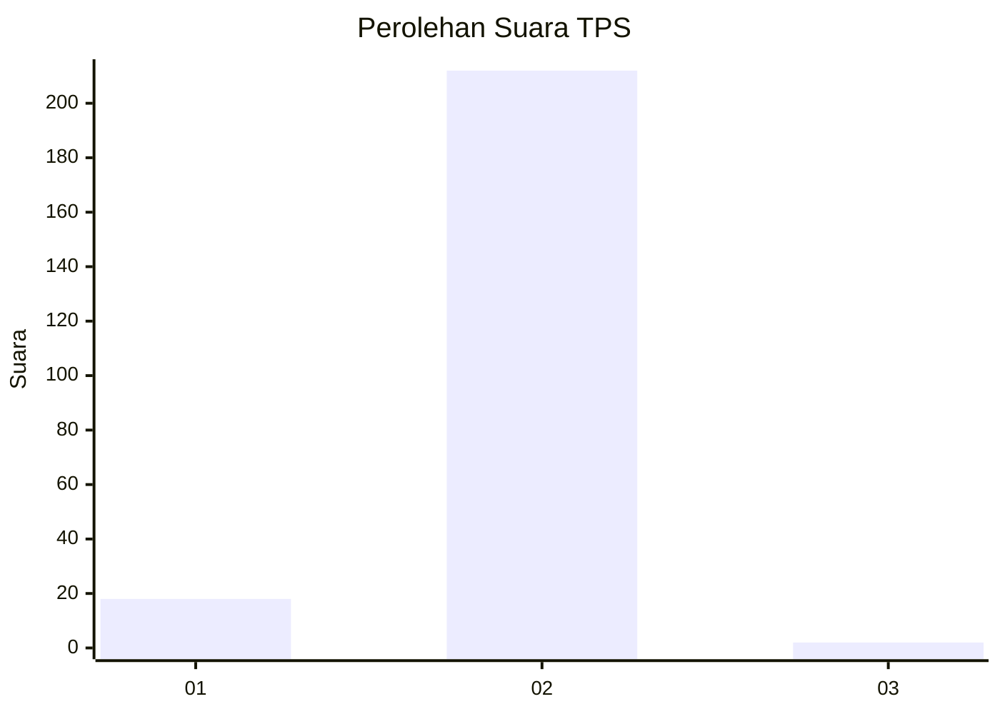
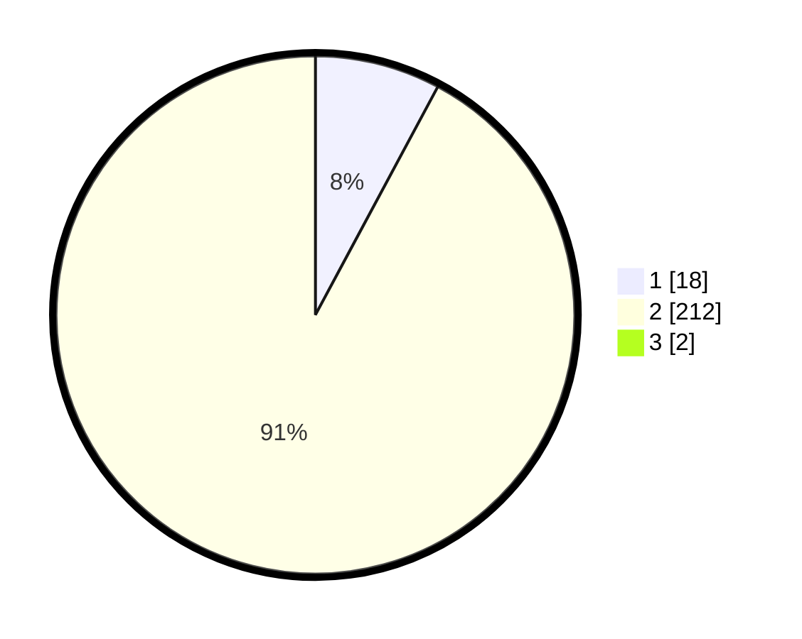

# Hasil

## Grafik

## Tabel

| No. | Nama Paslon    | Suara | Suara (raw) | Persentase |
|:--- |:-------------- | -----:| -----------:| ----------:|
| 1   | ANIES MUHAIMIN | 18    | [18][p-1]   | 7,76       |
| 2   | PRABOWO GIBRAN | 212   | [212][p-2]  | 91,38      |
| 3   | GANJAR MAHFUD  | 2     | [2][p-3]    | 0,86       |

[p-1]: https://github.com/gigit-pemilu/pemilu-2024-15-jambi/blob/main/pilpres/hitung-suara/sub/15-jambi/sub/01--kerinci/sub/16-siulak/sub/2012-koto-kapeh/sub/001-tps/sub/paslon-1.txt
[p-2]: https://github.com/gigit-pemilu/pemilu-2024-15-jambi/blob/main/pilpres/hitung-suara/sub/15-jambi/sub/01--kerinci/sub/16-siulak/sub/2012-koto-kapeh/sub/001-tps/sub/paslon-2.txt
[p-3]: https://github.com/gigit-pemilu/pemilu-2024-15-jambi/blob/main/pilpres/hitung-suara/sub/15-jambi/sub/01--kerinci/sub/16-siulak/sub/2012-koto-kapeh/sub/001-tps/sub/paslon-3.txt

## Foto C Plano

https://sirekap-obj-formc.kpu.go.id/9920/pemilu/ppwp/15/01/16/20/12/1501162012001-20240216-135349--d22e86d3-8e2d-40d1-8ea6-b7c55651e9f0.jpg

https://sirekap-obj-formc.kpu.go.id/9920/pemilu/ppwp/15/01/16/20/12/1501162012001-20240216-135406--36dc0a29-45ae-4484-8acb-66ac31dd8998.jpg

https://sirekap-obj-formc.kpu.go.id/9920/pemilu/ppwp/15/01/16/20/12/1501162012001-20240216-135419--06757fb3-51ad-4b8f-9b0c-8215d8715d0e.jpg

## Metadata

| Key        | Value               |
| ---------- | ------------------- |
| Time Stamp | 2024-02-16 21:01:00 |

