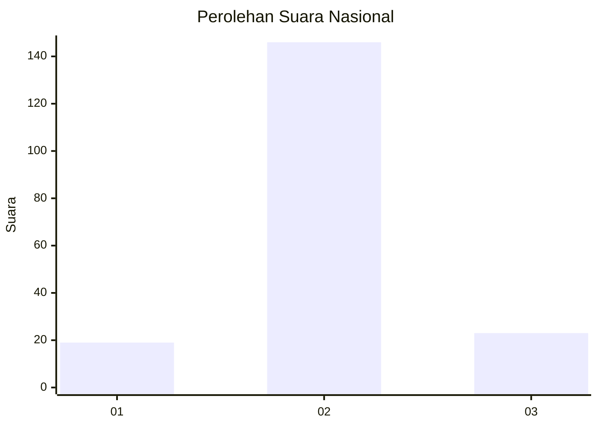
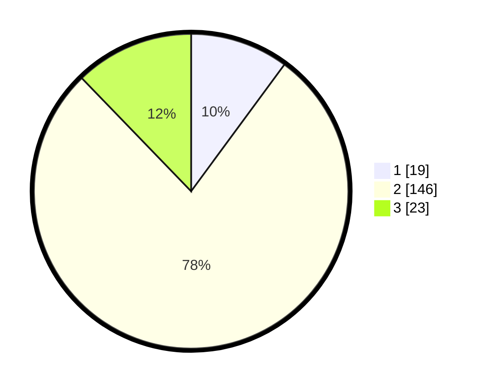

# Hasil

## Grafik

## Tabel

| No. | Nama Paslon    | Suara | Suara (raw) | Persentase |
|:--- |:-------------- | -----:| -----------:| ----------:|
| 1   | ANIES MUHAIMIN | 19    | [19][p-1]   | 10,11      |
| 2   | PRABOWO GIBRAN | 146   | [146][p-2]  | 77,66      |
| 3   | GANJAR MAHFUD  | 23    | [23][p-3]   | 12,23      |

[p-1]: https://github.com/gigit-pemilu/pemilu-2024/blob/main/pilpres/hitung-suara/sub/15-jambi/sub/01--kerinci/sub/19-kayu-aro-barat/sub/2001-batu-hampar/sub/004-tps/sub/paslon-1.txt
[p-2]: https://github.com/gigit-pemilu/pemilu-2024/blob/main/pilpres/hitung-suara/sub/15-jambi/sub/01--kerinci/sub/19-kayu-aro-barat/sub/2001-batu-hampar/sub/004-tps/sub/paslon-2.txt
[p-3]: https://github.com/gigit-pemilu/pemilu-2024/blob/main/pilpres/hitung-suara/sub/15-jambi/sub/01--kerinci/sub/19-kayu-aro-barat/sub/2001-batu-hampar/sub/004-tps/sub/paslon-3.txt

## Foto C Plano

https://sirekap-obj-formc.kpu.go.id/5b52/pemilu/ppwp/15/01/19/20/01/1501192001004-20240215-000938--4e54be40-807a-48d9-a816-51c012bc3834.jpg

https://sirekap-obj-formc.kpu.go.id/5b52/pemilu/ppwp/15/01/19/20/01/1501192001004-20240215-001051--c5951bc1-2655-4cf6-a78d-7111d6a86c6a.jpg

https://sirekap-obj-formc.kpu.go.id/5b52/pemilu/ppwp/15/01/19/20/01/1501192001004-20240216-174743--071eebfc-97c2-4f22-a6db-0353eb904c8f.jpg

## Metadata

| Key        | Value               |
| ---------- | ------------------- |
| Time Stamp | 2024-02-16 21:01:00 |

