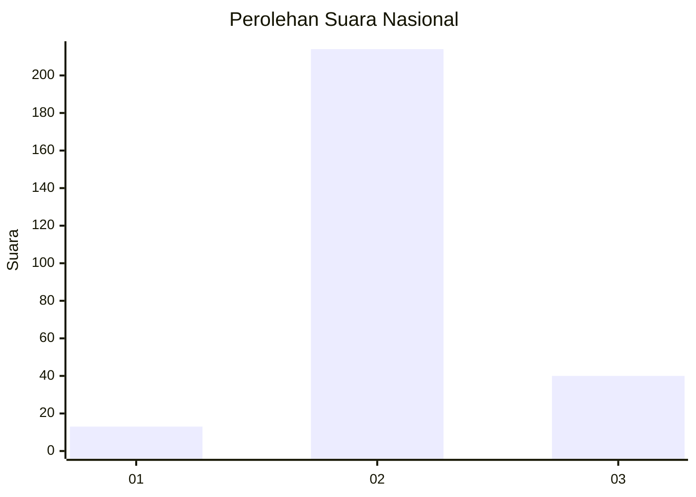

# Hasil

## Grafik

## Tabel

| No. | Nama Paslon    | Suara | Suara (raw) | Persentase |
|:--- |:-------------- | -----:| -----------:| ----------:|
| 1   | ANIES MUHAIMIN | 13    | [13][p-1]   | 4,87       |
| 2   | PRABOWO GIBRAN | 214   | [214][p-2]  | 80,15      |
| 3   | GANJAR MAHFUD  | 40    | [40][p-3]   | 14,98      |

[p-1]: https://github.com/gigit-pemilu/pemilu-2024/blob/main/pilpres/hitung-suara/sub/15-jambi/sub/01--kerinci/sub/19-kayu-aro-barat/sub/2012-gununglabu/sub/007-tps/sub/paslon-1.txt
[p-2]: https://github.com/gigit-pemilu/pemilu-2024/blob/main/pilpres/hitung-suara/sub/15-jambi/sub/01--kerinci/sub/19-kayu-aro-barat/sub/2012-gununglabu/sub/007-tps/sub/paslon-2.txt
[p-3]: https://github.com/gigit-pemilu/pemilu-2024/blob/main/pilpres/hitung-suara/sub/15-jambi/sub/01--kerinci/sub/19-kayu-aro-barat/sub/2012-gununglabu/sub/007-tps/sub/paslon-3.txt

## Foto C Plano

https://sirekap-obj-formc.kpu.go.id/4ce9/pemilu/ppwp/15/01/19/20/12/1501192012007-20240216-115845--dac9d558-5216-4c78-bbc5-2af74ac60f30.jpg

https://sirekap-obj-formc.kpu.go.id/4ce9/pemilu/ppwp/15/01/19/20/12/1501192012007-20240215-021253--d349932d-6d79-4089-8b39-2c6f427f214b.jpg

https://sirekap-obj-formc.kpu.go.id/4ce9/pemilu/ppwp/15/01/19/20/12/1501192012007-20240215-021453--6ac1b89f-966f-40f7-a8b1-2a9cb366e729.jpg

## Metadata

| Key        | Value               |
| ---------- | ------------------- |
| Time Stamp | 2024-02-16 12:51:22 |

