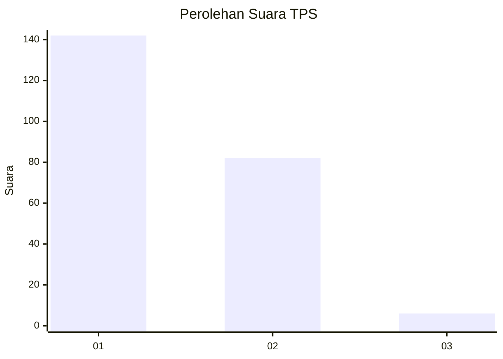
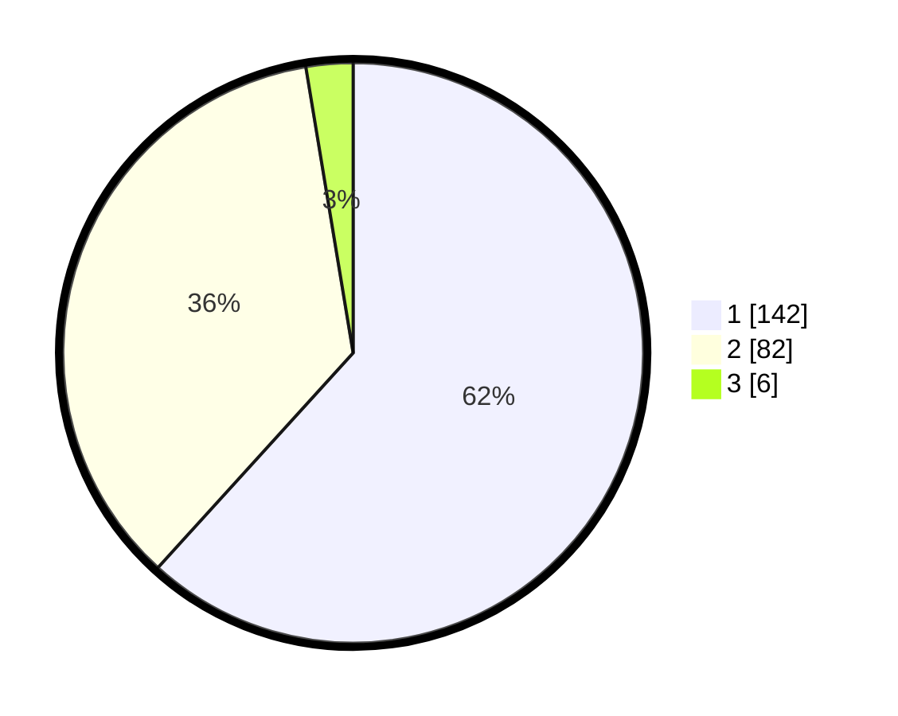

# Hasil

## Grafik

## Tabel

| No. | Nama Paslon    | Suara | Suara (raw) | Persentase |
|:--- |:-------------- | -----:| -----------:| ----------:|
| 1   | ANIES MUHAIMIN | 142   | [142][p-1]  | 61,74      |
| 2   | PRABOWO GIBRAN | 82    | [82][p-2]   | 35,65      |
| 3   | GANJAR MAHFUD  | 6     | [6][p-3]    | 2,61       |

[p-1]: https://github.com/gigit-pemilu/pemilu-2024-15-jambi/blob/main/pilpres/hitung-suara/sub/15-jambi/sub/01--kerinci/sub/23-danau-kerinci-barat/sub/2001-pancuran-tiga/sub/002-tps/sub/paslon-1.txt
[p-2]: https://github.com/gigit-pemilu/pemilu-2024-15-jambi/blob/main/pilpres/hitung-suara/sub/15-jambi/sub/01--kerinci/sub/23-danau-kerinci-barat/sub/2001-pancuran-tiga/sub/002-tps/sub/paslon-2.txt
[p-3]: https://github.com/gigit-pemilu/pemilu-2024-15-jambi/blob/main/pilpres/hitung-suara/sub/15-jambi/sub/01--kerinci/sub/23-danau-kerinci-barat/sub/2001-pancuran-tiga/sub/002-tps/sub/paslon-3.txt

## Foto C Plano

https://sirekap-obj-formc.kpu.go.id/1805/pemilu/ppwp/15/01/23/20/01/1501232001002-20240215-102241--6ebcd040-0367-42a7-8223-53576a94387e.jpg

https://sirekap-obj-formc.kpu.go.id/1805/pemilu/ppwp/15/01/23/20/01/1501232001002-20240215-102447--84e53065-0831-4271-a241-53fc81caaab8.jpg

https://sirekap-obj-formc.kpu.go.id/1805/pemilu/ppwp/15/01/23/20/01/1501232001002-20240215-102658--f8dec81a-ace5-4eb2-9c7d-1edb71891ce1.jpg

## Metadata

| Key        | Value               |
| ---------- | ------------------- |
| Time Stamp | 2024-02-15 15:30:25 |

