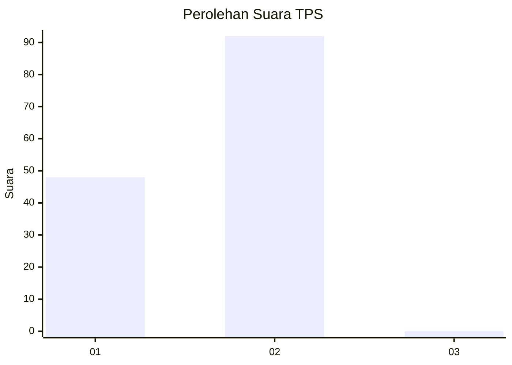
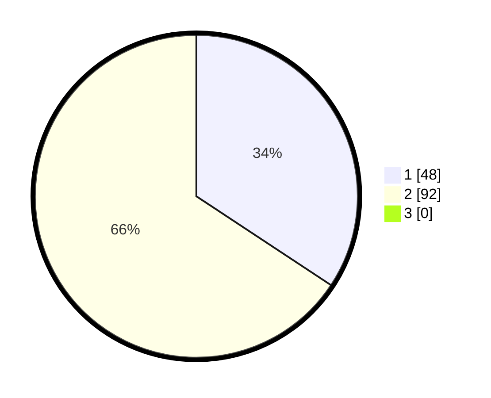

# Hasil

## Grafik

## Tabel

| No. | Nama Paslon    | Suara | Suara (raw) | Persentase |
|:--- |:-------------- | -----:| -----------:| ----------:|
| 1   | ANIES MUHAIMIN | 48    | [48][p-1]   | 34,29      |
| 2   | PRABOWO GIBRAN | 92    | [92][p-2]   | 65,71      |
| 3   | GANJAR MAHFUD  | 0     | [0][p-3]    | 0,00       |

[p-1]: https://github.com/gigit-pemilu/pemilu-2024-15-jambi/blob/main/pilpres/hitung-suara/sub/15-jambi/sub/02--merangin/sub/01-jangkat/sub/2005-renah-alai/sub/002-tps/sub/paslon-1.txt
[p-2]: https://github.com/gigit-pemilu/pemilu-2024-15-jambi/blob/main/pilpres/hitung-suara/sub/15-jambi/sub/02--merangin/sub/01-jangkat/sub/2005-renah-alai/sub/002-tps/sub/paslon-2.txt
[p-3]: https://github.com/gigit-pemilu/pemilu-2024-15-jambi/blob/main/pilpres/hitung-suara/sub/15-jambi/sub/02--merangin/sub/01-jangkat/sub/2005-renah-alai/sub/002-tps/sub/paslon-3.txt

## Foto C Plano

https://sirekap-obj-formc.kpu.go.id/9cbf/pemilu/ppwp/15/02/01/20/05/1502012005002-20240215-125719--8928de59-0f75-498e-98d3-147123cef6d1.jpg

https://sirekap-obj-formc.kpu.go.id/9cbf/pemilu/ppwp/15/02/01/20/05/1502012005002-20240215-015701--030f1159-bff0-4e8f-97eb-c45689ceabdb.jpg

https://sirekap-obj-formc.kpu.go.id/9cbf/pemilu/ppwp/15/02/01/20/05/1502012005002-20240215-174808--dce63599-406f-429c-b832-77faed982ece.jpg

## Metadata

| Key        | Value               |
| ---------- | ------------------- |
| Time Stamp | 2024-02-15 18:00:26 |

