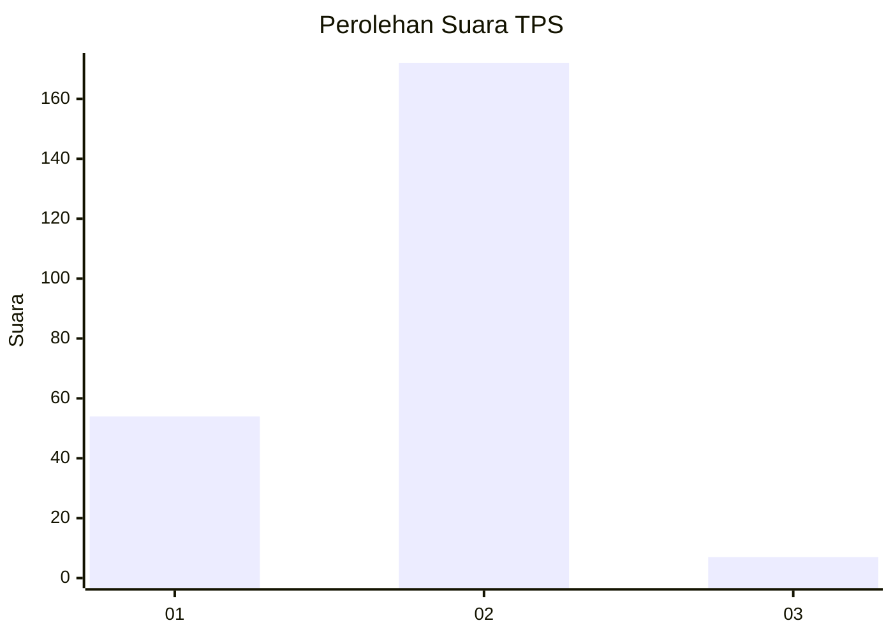

# Hasil

## Grafik

## Tabel

| No. | Nama Paslon    | Suara | Suara (raw) | Persentase |
|:--- |:-------------- | -----:| -----------:| ----------:|
| 1   | ANIES MUHAIMIN | 54    | [54][p-1]   | 23,18      |
| 2   | PRABOWO GIBRAN | 172   | [172][p-2]  | 73,82      |
| 3   | GANJAR MAHFUD  | 7     | [7][p-3]    | 3,00       |

[p-1]: https://github.com/gigit-pemilu/pemilu-2024-15-jambi/blob/main/pilpres/hitung-suara/sub/15-jambi/sub/02--merangin/sub/06-pamenang/sub/1008-pamenang/sub/001-tps/sub/paslon-1.txt
[p-2]: https://github.com/gigit-pemilu/pemilu-2024-15-jambi/blob/main/pilpres/hitung-suara/sub/15-jambi/sub/02--merangin/sub/06-pamenang/sub/1008-pamenang/sub/001-tps/sub/paslon-2.txt
[p-3]: https://github.com/gigit-pemilu/pemilu-2024-15-jambi/blob/main/pilpres/hitung-suara/sub/15-jambi/sub/02--merangin/sub/06-pamenang/sub/1008-pamenang/sub/001-tps/sub/paslon-3.txt

## Foto C Plano

https://sirekap-obj-formc.kpu.go.id/9f76/pemilu/ppwp/15/02/06/10/08/1502061008001-20240215-030103--74cdaf57-a3d9-4a88-a2f4-34382343b309.jpg

https://sirekap-obj-formc.kpu.go.id/9f76/pemilu/ppwp/15/02/06/10/08/1502061008001-20240215-030142--ca27936a-2ecf-4907-8805-2b3ce8db5df6.jpg

https://sirekap-obj-formc.kpu.go.id/9f76/pemilu/ppwp/15/02/06/10/08/1502061008001-20240215-041558--eae93aa1-0258-41a6-bb88-de65515d5aab.jpg

## Metadata

| Key        | Value               |
| ---------- | ------------------- |
| Time Stamp | 2024-02-15 21:30:27 |

