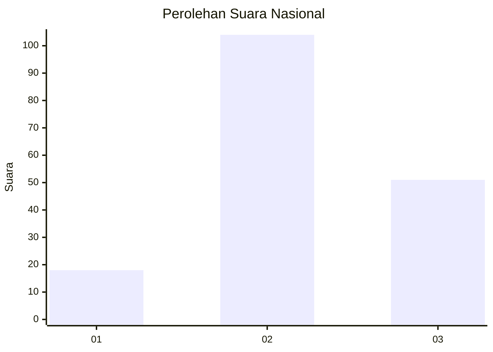
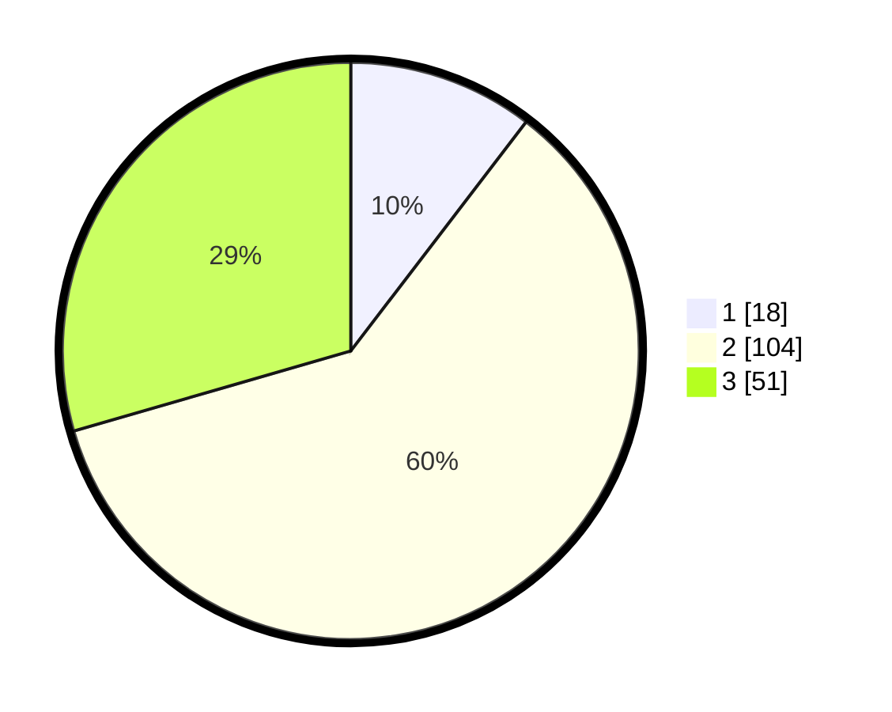

# Hasil

## Grafik

## Tabel

| No. | Nama Paslon    | Suara | Suara (raw) | Persentase |
|:--- |:-------------- | -----:| -----------:| ----------:|
| 1   | ANIES MUHAIMIN | 18    | [18][p-1]   | 10,40      |
| 2   | PRABOWO GIBRAN | 104   | [104][p-2]  | 60,12      |
| 3   | GANJAR MAHFUD  | 51    | [51][p-3]   | 29,48      |

[p-1]: https://github.com/gigit-pemilu/pemilu-2024/blob/main/pilpres/hitung-suara/sub/15-jambi/sub/02--merangin/sub/06-pamenang/sub/2013-pematang-kancil/sub/003-tps/sub/paslon-1.txt
[p-2]: https://github.com/gigit-pemilu/pemilu-2024/blob/main/pilpres/hitung-suara/sub/15-jambi/sub/02--merangin/sub/06-pamenang/sub/2013-pematang-kancil/sub/003-tps/sub/paslon-2.txt
[p-3]: https://github.com/gigit-pemilu/pemilu-2024/blob/main/pilpres/hitung-suara/sub/15-jambi/sub/02--merangin/sub/06-pamenang/sub/2013-pematang-kancil/sub/003-tps/sub/paslon-3.txt

## Foto C Plano

https://sirekap-obj-formc.kpu.go.id/c58c/pemilu/ppwp/15/02/06/20/13/1502062013003-20240215-012032--ef815da8-6722-44ac-8c10-420e4278e9aa.jpg

https://sirekap-obj-formc.kpu.go.id/c58c/pemilu/ppwp/15/02/06/20/13/1502062013003-20240215-012213--692bbf2a-906a-4b0c-aebe-448534edfe96.jpg

https://sirekap-obj-formc.kpu.go.id/c58c/pemilu/ppwp/15/02/06/20/13/1502062013003-20240217-192150--01c01a10-5227-4cfc-857e-f51b268ea671.jpg

## Metadata

| Key        | Value               |
| ---------- | ------------------- |
| Time Stamp | 2024-02-17 19:30:00 |

