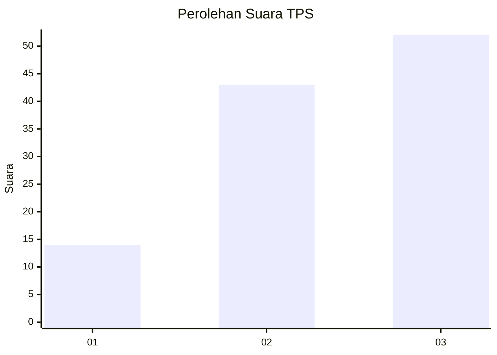
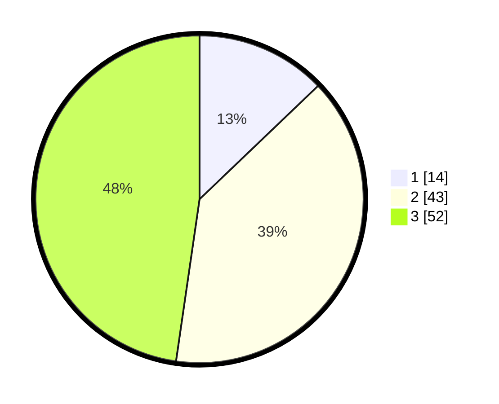

# Hasil

## Grafik

## Tabel

| No. | Nama Paslon    | Suara | Suara (raw) | Persentase |
|:--- |:-------------- | -----:| -----------:| ----------:|
| 1   | ANIES MUHAIMIN | 14    | [14][p-1]   | 12,84      |
| 2   | PRABOWO GIBRAN | 43    | [43][p-2]   | 39,45      |
| 3   | GANJAR MAHFUD  | 52    | [52][p-3]   | 47,71      |

[p-1]: https://github.com/gigit-pemilu/pemilu-2024-15-jambi/blob/main/pilpres/hitung-suara/sub/15-jambi/sub/02--merangin/sub/07-tabir-ulu/sub/2009-muara-jernih/sub/006-tps/sub/paslon-1.txt
[p-2]: https://github.com/gigit-pemilu/pemilu-2024-15-jambi/blob/main/pilpres/hitung-suara/sub/15-jambi/sub/02--merangin/sub/07-tabir-ulu/sub/2009-muara-jernih/sub/006-tps/sub/paslon-2.txt
[p-3]: https://github.com/gigit-pemilu/pemilu-2024-15-jambi/blob/main/pilpres/hitung-suara/sub/15-jambi/sub/02--merangin/sub/07-tabir-ulu/sub/2009-muara-jernih/sub/006-tps/sub/paslon-3.txt

## Foto C Plano

https://sirekap-obj-formc.kpu.go.id/0e17/pemilu/ppwp/15/02/07/20/09/1502072009006-20240214-212044--ef7d360f-82cc-41c6-9026-581aafd8f47b.jpg

https://sirekap-obj-formc.kpu.go.id/0e17/pemilu/ppwp/15/02/07/20/09/1502072009006-20240214-212755--687c3841-5246-458c-ab9a-e3bacee64fd0.jpg

https://sirekap-obj-formc.kpu.go.id/0e17/pemilu/ppwp/15/02/07/20/09/1502072009006-20240214-212955--68e3b37d-69fe-4fff-b6e2-e428602faf90.jpg

## Metadata

| Key        | Value               |
| ---------- | ------------------- |
| Time Stamp | 2024-02-15 19:30:26 |

