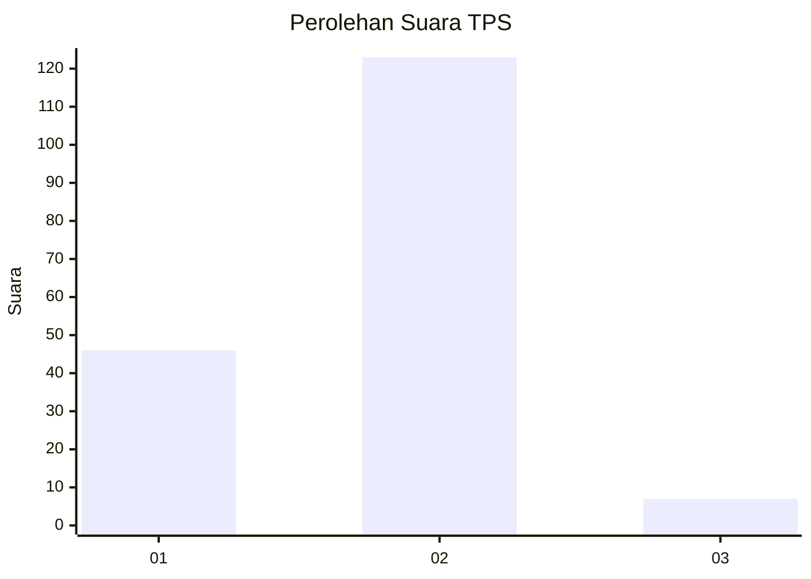
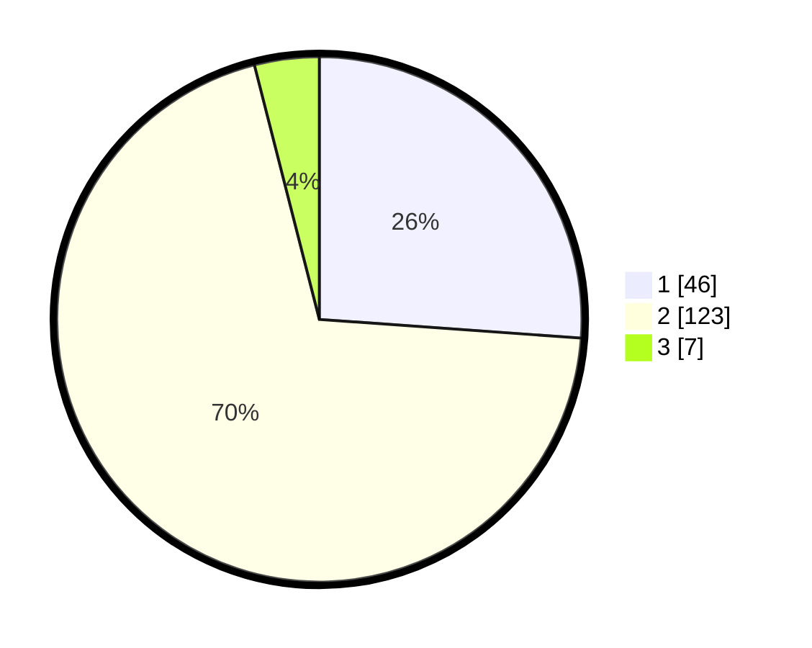

# Hasil

## Grafik

## Tabel

| No. | Nama Paslon    | Suara | Suara (raw) | Persentase |
|:--- |:-------------- | -----:| -----------:| ----------:|
| 1   | ANIES MUHAIMIN | 46    | [46][p-1]   | 26,14      |
| 2   | PRABOWO GIBRAN | 123   | [123][p-2]  | 69,89      |
| 3   | GANJAR MAHFUD  | 7     | [7][p-3]    | 3,98       |

[p-1]: https://github.com/gigit-pemilu/pemilu-2024-15-jambi/blob/main/pilpres/hitung-suara/sub/15-jambi/sub/02--merangin/sub/09-lembah-masurai/sub/2001-nilo-dingin/sub/001-tps/sub/paslon-1.txt
[p-2]: https://github.com/gigit-pemilu/pemilu-2024-15-jambi/blob/main/pilpres/hitung-suara/sub/15-jambi/sub/02--merangin/sub/09-lembah-masurai/sub/2001-nilo-dingin/sub/001-tps/sub/paslon-2.txt
[p-3]: https://github.com/gigit-pemilu/pemilu-2024-15-jambi/blob/main/pilpres/hitung-suara/sub/15-jambi/sub/02--merangin/sub/09-lembah-masurai/sub/2001-nilo-dingin/sub/001-tps/sub/paslon-3.txt

## Foto C Plano

https://sirekap-obj-formc.kpu.go.id/521f/pemilu/ppwp/15/02/09/20/01/1502092001001-20240227-171940--b7729c38-3821-423d-9239-79bf2e895bc0.jpg

https://sirekap-obj-formc.kpu.go.id/521f/pemilu/ppwp/15/02/09/20/01/1502092001001-20240215-163540--415b49e9-b469-46ee-aaf0-de6b9c3f7690.jpg

https://sirekap-obj-formc.kpu.go.id/521f/pemilu/ppwp/15/02/09/20/01/1502092001001-20240215-163601--66c5b369-c6b5-4e4a-81d0-33191e43dfe2.jpg

## Metadata

| Key        | Value               |
| ---------- | ------------------- |
| Time Stamp | 2024-02-27 18:00:00 |

