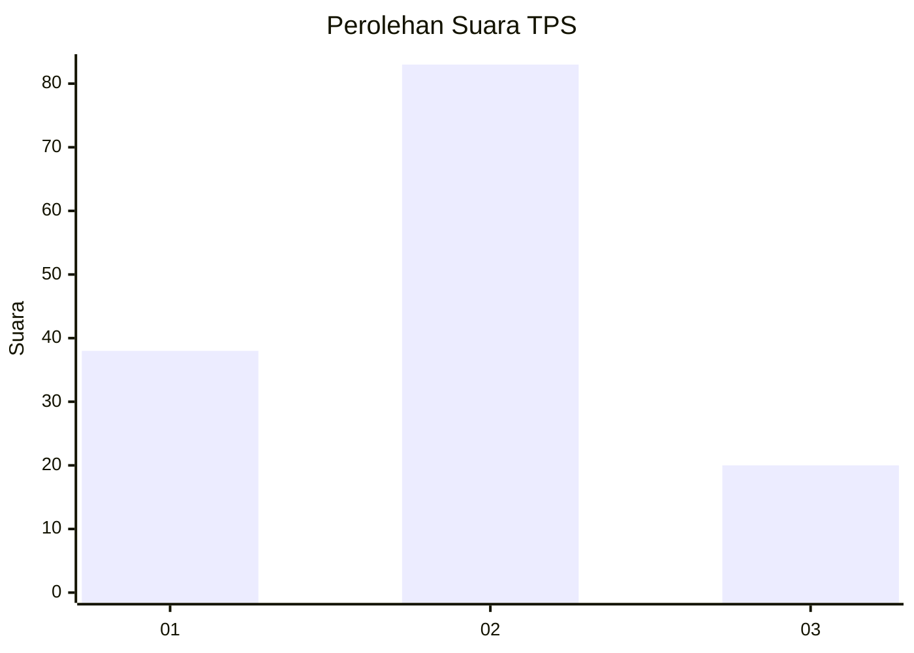
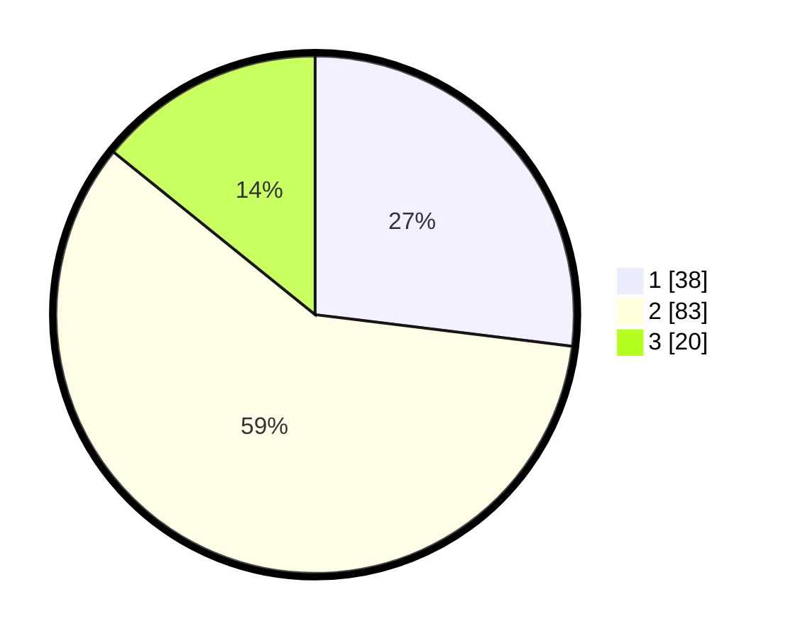

# Hasil

## Grafik

## Tabel

| No. | Nama Paslon    | Suara | Suara (raw) | Persentase |
|:--- |:-------------- | -----:| -----------:| ----------:|
| 1   | ANIES MUHAIMIN | 38    | [38][p-1]   | 26,95      |
| 2   | PRABOWO GIBRAN | 83    | [83][p-2]   | 58,87      |
| 3   | GANJAR MAHFUD  | 20    | [20][p-3]   | 14,18      |

[p-1]: https://github.com/gigit-pemilu/pemilu-2024-15-jambi/blob/main/pilpres/hitung-suara/sub/15-jambi/sub/02--merangin/sub/09-lembah-masurai/sub/2001-nilo-dingin/sub/004-tps/sub/paslon-1.txt
[p-2]: https://github.com/gigit-pemilu/pemilu-2024-15-jambi/blob/main/pilpres/hitung-suara/sub/15-jambi/sub/02--merangin/sub/09-lembah-masurai/sub/2001-nilo-dingin/sub/004-tps/sub/paslon-2.txt
[p-3]: https://github.com/gigit-pemilu/pemilu-2024-15-jambi/blob/main/pilpres/hitung-suara/sub/15-jambi/sub/02--merangin/sub/09-lembah-masurai/sub/2001-nilo-dingin/sub/004-tps/sub/paslon-3.txt

## Foto C Plano

https://sirekap-obj-formc.kpu.go.id/3732/pemilu/ppwp/15/02/09/20/01/1502092001004-20240215-183826--9cf55a2c-444e-4aae-acb0-f79ebaf20f42.jpg

https://sirekap-obj-formc.kpu.go.id/3732/pemilu/ppwp/15/02/09/20/01/1502092001004-20240215-184037--46d8957b-ab53-4c2e-bad7-64ec129b820d.jpg

https://sirekap-obj-formc.kpu.go.id/3732/pemilu/ppwp/15/02/09/20/01/1502092001004-20240215-184302--492a4e33-a935-44fd-9589-54a88b529dc0.jpg

## Metadata

| Key        | Value               |
| ---------- | ------------------- |
| Time Stamp | 2024-02-15 21:30:27 |

