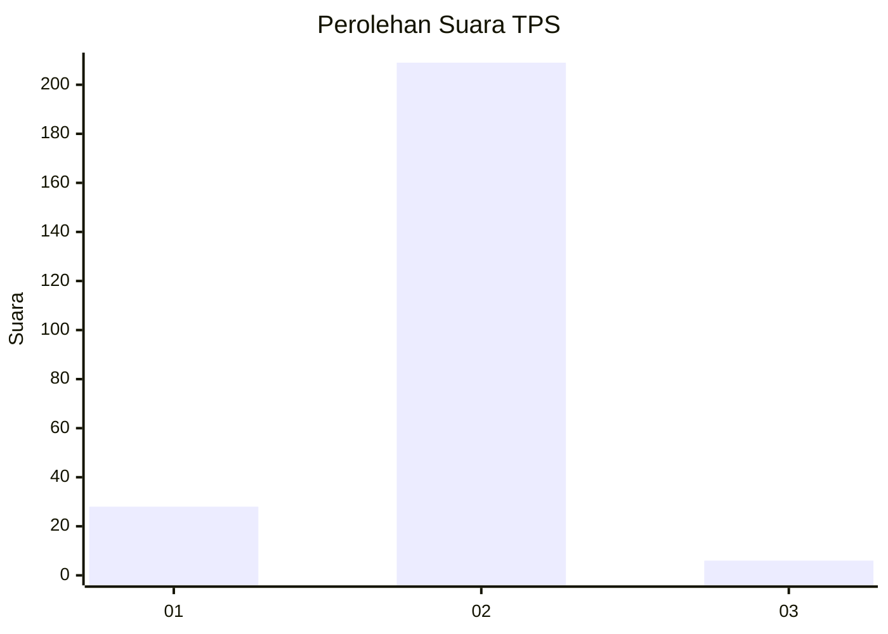
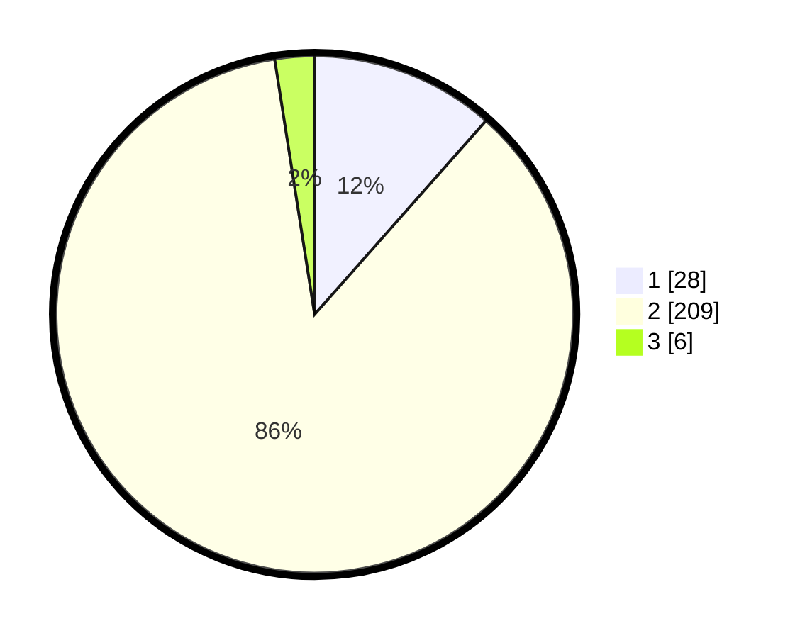

# Hasil

## Grafik

## Tabel

| No. | Nama Paslon    | Suara | Suara (raw) | Persentase |
|:--- |:-------------- | -----:| -----------:| ----------:|
| 1   | ANIES MUHAIMIN | 28    | [28][p-1]   | 11,52      |
| 2   | PRABOWO GIBRAN | 209   | [209][p-2]  | 86,01      |
| 3   | GANJAR MAHFUD  | 6     | [6][p-3]    | 2,47       |

[p-1]: https://github.com/gigit-pemilu/pemilu-2024-15-jambi/blob/main/pilpres/hitung-suara/sub/15-jambi/sub/02--merangin/sub/09-lembah-masurai/sub/2012-muara-kelukup/sub/002-tps/sub/paslon-1.txt
[p-2]: https://github.com/gigit-pemilu/pemilu-2024-15-jambi/blob/main/pilpres/hitung-suara/sub/15-jambi/sub/02--merangin/sub/09-lembah-masurai/sub/2012-muara-kelukup/sub/002-tps/sub/paslon-2.txt
[p-3]: https://github.com/gigit-pemilu/pemilu-2024-15-jambi/blob/main/pilpres/hitung-suara/sub/15-jambi/sub/02--merangin/sub/09-lembah-masurai/sub/2012-muara-kelukup/sub/002-tps/sub/paslon-3.txt

## Foto C Plano

https://sirekap-obj-formc.kpu.go.id/38de/pemilu/ppwp/15/02/09/20/12/1502092012002-20240218-065947--d5969796-fe49-4d8f-82e1-1f8822ac0cea.jpg

https://sirekap-obj-formc.kpu.go.id/38de/pemilu/ppwp/15/02/09/20/12/1502092012002-20240218-071239--5d57391b-6352-4162-9db4-c752a0fac222.jpg

https://sirekap-obj-formc.kpu.go.id/38de/pemilu/ppwp/15/02/09/20/12/1502092012002-20240215-112125--05b580ab-18aa-4b6c-bc4c-ef428073542e.jpg

## Metadata

| Key        | Value               |
| ---------- | ------------------- |
| Time Stamp | 2024-02-21 00:00:00 |

