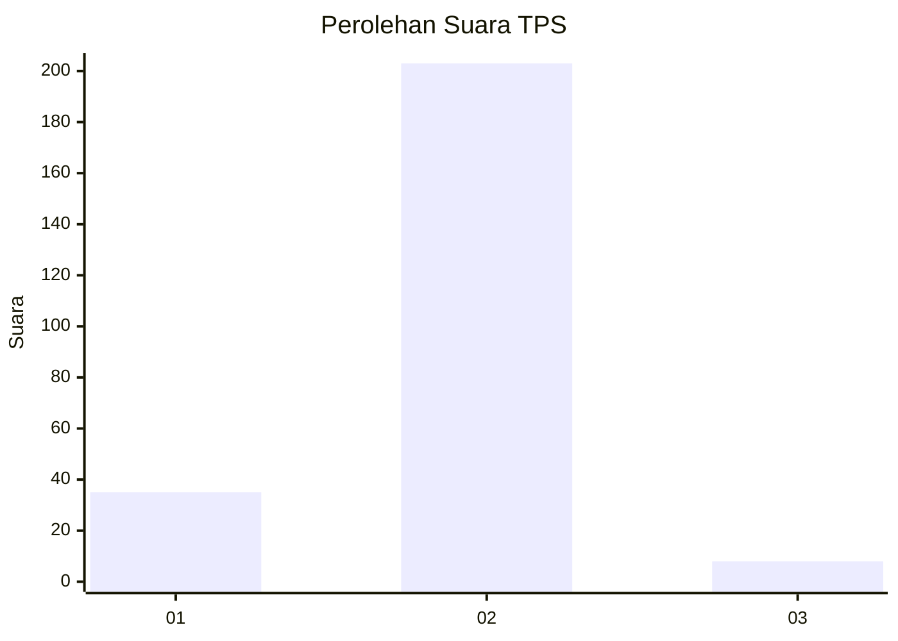
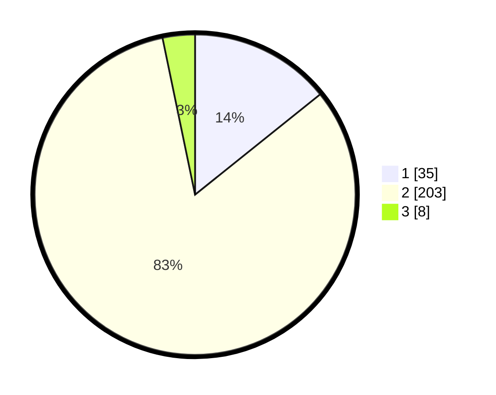

# Hasil

## Grafik

## Tabel

| No. | Nama Paslon    | Suara | Suara (raw) | Persentase |
|:--- |:-------------- | -----:| -----------:| ----------:|
| 1   | ANIES MUHAIMIN | 35    | [35][p-1]   | 14,23      |
| 2   | PRABOWO GIBRAN | 203   | [203][p-2]  | 82,52      |
| 3   | GANJAR MAHFUD  | 8     | [8][p-3]    | 3,25       |

[p-1]: https://github.com/gigit-pemilu/pemilu-2024-15-jambi/blob/main/pilpres/hitung-suara/sub/15-jambi/sub/02--merangin/sub/11-nalo-tantan/sub/2001-sungai-ulak/sub/008-tps/sub/paslon-1.txt
[p-2]: https://github.com/gigit-pemilu/pemilu-2024-15-jambi/blob/main/pilpres/hitung-suara/sub/15-jambi/sub/02--merangin/sub/11-nalo-tantan/sub/2001-sungai-ulak/sub/008-tps/sub/paslon-2.txt
[p-3]: https://github.com/gigit-pemilu/pemilu-2024-15-jambi/blob/main/pilpres/hitung-suara/sub/15-jambi/sub/02--merangin/sub/11-nalo-tantan/sub/2001-sungai-ulak/sub/008-tps/sub/paslon-3.txt

## Foto C Plano

https://sirekap-obj-formc.kpu.go.id/fc22/pemilu/ppwp/15/02/11/20/01/1502112001008-20240215-093407--c73ec493-3517-4b47-b3ad-28ec334b0488.jpg

https://sirekap-obj-formc.kpu.go.id/fc22/pemilu/ppwp/15/02/11/20/01/1502112001008-20240215-093613--bdf52d1d-5bd3-47cd-a5e6-018dd438be76.jpg

https://sirekap-obj-formc.kpu.go.id/fc22/pemilu/ppwp/15/02/11/20/01/1502112001008-20240216-171524--7222f9d7-916b-443a-baa5-450725b827d3.jpg

## Metadata

| Key        | Value               |
| ---------- | ------------------- |
| Time Stamp | 2024-02-16 17:30:00 |

