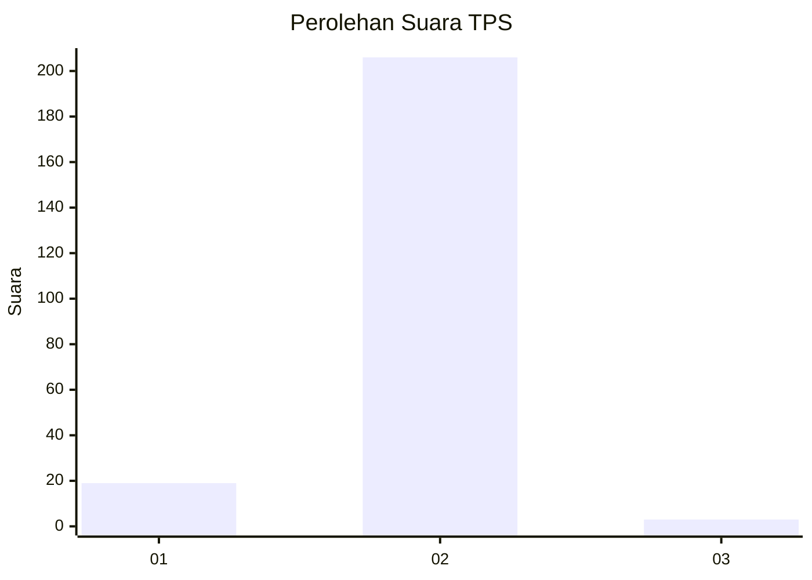
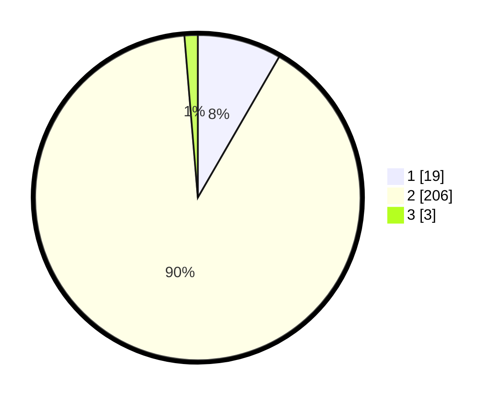

# Hasil

## Grafik

## Tabel

| No. | Nama Paslon    | Suara | Suara (raw) | Persentase |
|:--- |:-------------- | -----:| -----------:| ----------:|
| 1   | ANIES MUHAIMIN | 19    | [19][p-1]   | 8,33       |
| 2   | PRABOWO GIBRAN | 206   | [206][p-2]  | 90,35      |
| 3   | GANJAR MAHFUD  | 3     | [3][p-3]    | 1,32       |

[p-1]: https://github.com/gigit-pemilu/pemilu-2024-15-jambi/blob/main/pilpres/hitung-suara/sub/15-jambi/sub/02--merangin/sub/14-tabir-ilir/sub/2006-tunggul-bulin/sub/001-tps/sub/paslon-1.txt
[p-2]: https://github.com/gigit-pemilu/pemilu-2024-15-jambi/blob/main/pilpres/hitung-suara/sub/15-jambi/sub/02--merangin/sub/14-tabir-ilir/sub/2006-tunggul-bulin/sub/001-tps/sub/paslon-2.txt
[p-3]: https://github.com/gigit-pemilu/pemilu-2024-15-jambi/blob/main/pilpres/hitung-suara/sub/15-jambi/sub/02--merangin/sub/14-tabir-ilir/sub/2006-tunggul-bulin/sub/001-tps/sub/paslon-3.txt

## Foto C Plano

https://sirekap-obj-formc.kpu.go.id/cb97/pemilu/ppwp/15/02/14/20/06/1502142006001-20240215-034211--1dc3ecb6-7092-4ebf-8b9f-91477af79ce3.jpg

https://sirekap-obj-formc.kpu.go.id/cb97/pemilu/ppwp/15/02/14/20/06/1502142006001-20240215-034504--6273a04f-cf09-4ec0-9e73-8035653b63b8.jpg

https://sirekap-obj-formc.kpu.go.id/cb97/pemilu/ppwp/15/02/14/20/06/1502142006001-20240215-034628--4a8a90d6-4a36-4f38-a8e8-412a6f69aa52.jpg

## Metadata

| Key        | Value               |
| ---------- | ------------------- |
| Time Stamp | 2024-02-15 22:30:27 |

