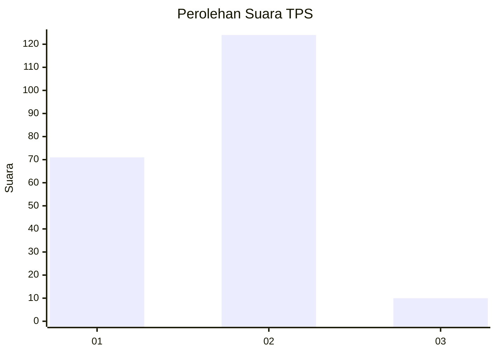
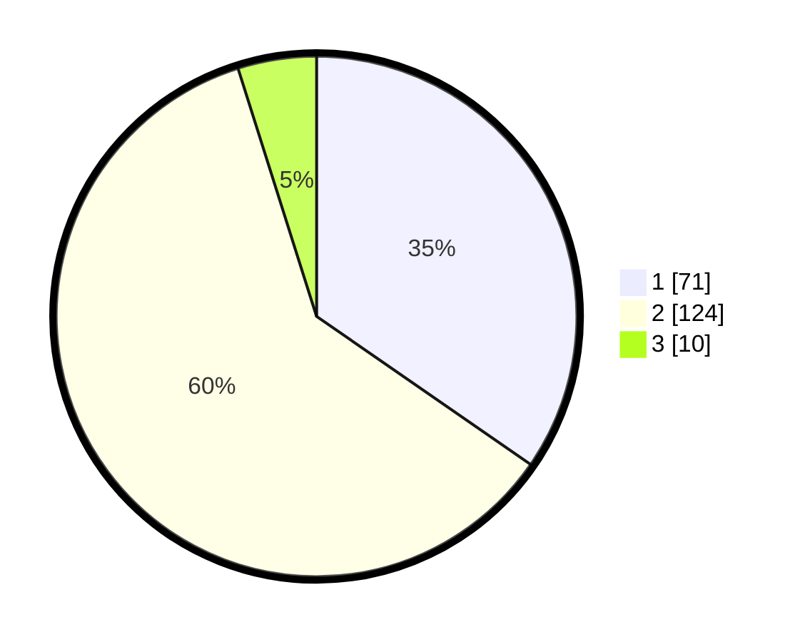

# Hasil

## Grafik

## Tabel

| No. | Nama Paslon    | Suara | Suara (raw) | Persentase |
|:--- |:-------------- | -----:| -----------:| ----------:|
| 1   | ANIES MUHAIMIN | 71    | [71][p-1]   | 34,63      |
| 2   | PRABOWO GIBRAN | 124   | [124][p-2]  | 60,49      |
| 3   | GANJAR MAHFUD  | 10    | [10][p-3]   | 4,88       |

[p-1]: https://github.com/gigit-pemilu/pemilu-2024-15-jambi/blob/main/pilpres/hitung-suara/sub/15-jambi/sub/03-sarolangun/sub/02-limun/sub/2005-pulau-pandan/sub/004-tps/sub/paslon-1.txt
[p-2]: https://github.com/gigit-pemilu/pemilu-2024-15-jambi/blob/main/pilpres/hitung-suara/sub/15-jambi/sub/03-sarolangun/sub/02-limun/sub/2005-pulau-pandan/sub/004-tps/sub/paslon-2.txt
[p-3]: https://github.com/gigit-pemilu/pemilu-2024-15-jambi/blob/main/pilpres/hitung-suara/sub/15-jambi/sub/03-sarolangun/sub/02-limun/sub/2005-pulau-pandan/sub/004-tps/sub/paslon-3.txt

## Foto C Plano

https://sirekap-obj-formc.kpu.go.id/2277/pemilu/ppwp/15/03/02/20/05/1503022005004-20240215-044357--b2d651b7-ea8a-438f-8691-4926027ae2f6.jpg

https://sirekap-obj-formc.kpu.go.id/2277/pemilu/ppwp/15/03/02/20/05/1503022005004-20240215-044519--eea4e05e-0100-4e45-b101-d97c5c7b5edf.jpg

https://sirekap-obj-formc.kpu.go.id/2277/pemilu/ppwp/15/03/02/20/05/1503022005004-20240215-044602--42843ee4-e55d-4f74-8e1f-cdd403911af7.jpg

## Metadata

| Key        | Value               |
| ---------- | ------------------- |
| Time Stamp | 2024-02-15 15:00:29 |

