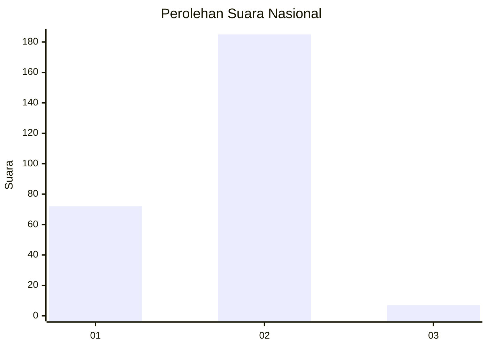
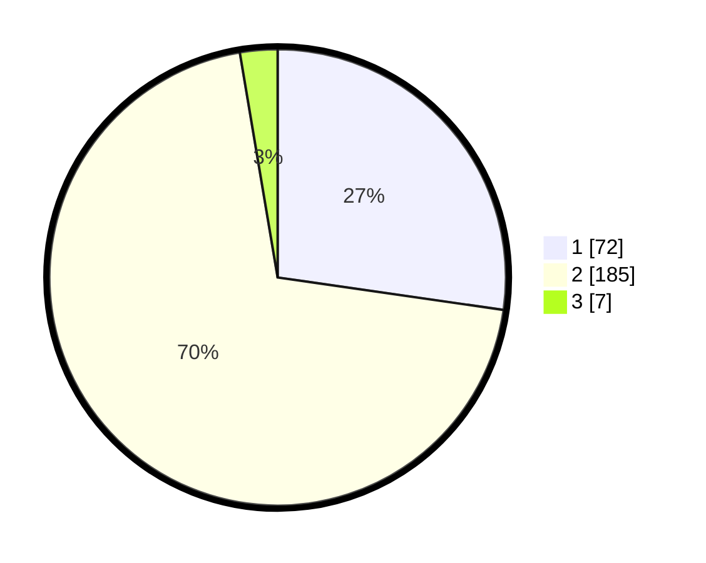

# Hasil

## Grafik

## Tabel

| No. | Nama Paslon    | Suara | Suara (raw) | Persentase |
|:--- |:-------------- | -----:| -----------:| ----------:|
| 1   | ANIES MUHAIMIN | 72    | [72][p-1]   | 27,27      |
| 2   | PRABOWO GIBRAN | 185   | [185][p-2]  | 70,08      |
| 3   | GANJAR MAHFUD  | 7     | [7][p-3]    | 2,65       |

[p-1]: https://github.com/gigit-pemilu/pemilu-2024/blob/main/pilpres/hitung-suara/sub/15-jambi/sub/03-sarolangun/sub/02-limun/sub/2007-ranggo/sub/005-tps/sub/paslon-1.txt
[p-2]: https://github.com/gigit-pemilu/pemilu-2024/blob/main/pilpres/hitung-suara/sub/15-jambi/sub/03-sarolangun/sub/02-limun/sub/2007-ranggo/sub/005-tps/sub/paslon-2.txt
[p-3]: https://github.com/gigit-pemilu/pemilu-2024/blob/main/pilpres/hitung-suara/sub/15-jambi/sub/03-sarolangun/sub/02-limun/sub/2007-ranggo/sub/005-tps/sub/paslon-3.txt

## Foto C Plano

https://sirekap-obj-formc.kpu.go.id/b0b9/pemilu/ppwp/15/03/02/20/07/1503022007005-20240215-103527--31713cc6-11c2-4da6-aac8-450236523e7a.jpg

https://sirekap-obj-formc.kpu.go.id/b0b9/pemilu/ppwp/15/03/02/20/07/1503022007005-20240215-110122--341d624f-150e-454d-a51a-732193b17a54.jpg

https://sirekap-obj-formc.kpu.go.id/b0b9/pemilu/ppwp/15/03/02/20/07/1503022007005-20240215-104412--6eaa1901-5e03-4517-b398-27c6b5e5a19d.jpg

## Metadata

| Key        | Value               |
| ---------- | ------------------- |
| Time Stamp | 2024-02-16 08:30:27 |

