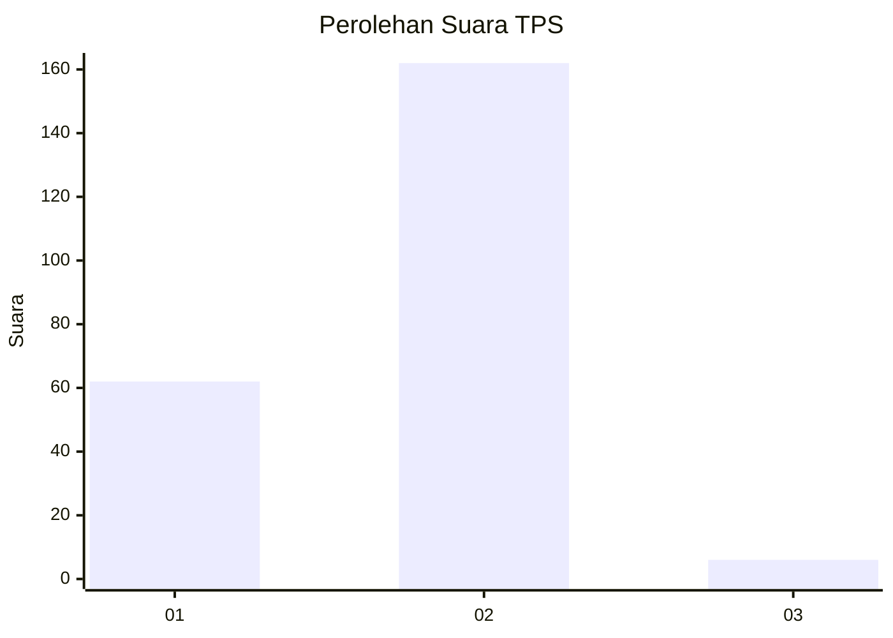
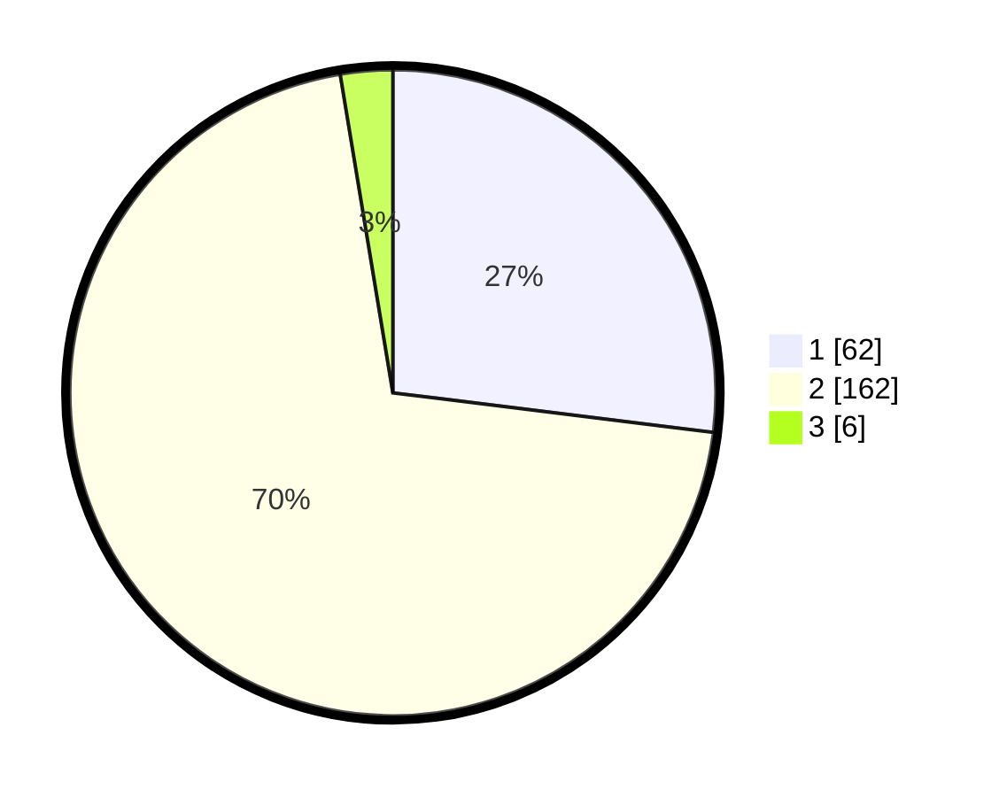

# Hasil

## Grafik

## Tabel

| No. | Nama Paslon    | Suara | Suara (raw) | Persentase |
|:--- |:-------------- | -----:| -----------:| ----------:|
| 1   | ANIES MUHAIMIN | 62    | [62][p-1]   | 26,96      |
| 2   | PRABOWO GIBRAN | 162   | [162][p-2]  | 70,43      |
| 3   | GANJAR MAHFUD  | 6     | [6][p-3]    | 2,61       |

[p-1]: https://github.com/gigit-pemilu/pemilu-2024-15-jambi/blob/main/pilpres/hitung-suara/sub/15-jambi/sub/03-sarolangun/sub/03-sarolangun/sub/1001-dusun-sarolangun/sub/003-tps/sub/paslon-1.txt
[p-2]: https://github.com/gigit-pemilu/pemilu-2024-15-jambi/blob/main/pilpres/hitung-suara/sub/15-jambi/sub/03-sarolangun/sub/03-sarolangun/sub/1001-dusun-sarolangun/sub/003-tps/sub/paslon-2.txt
[p-3]: https://github.com/gigit-pemilu/pemilu-2024-15-jambi/blob/main/pilpres/hitung-suara/sub/15-jambi/sub/03-sarolangun/sub/03-sarolangun/sub/1001-dusun-sarolangun/sub/003-tps/sub/paslon-3.txt

## Foto C Plano

https://sirekap-obj-formc.kpu.go.id/2c1b/pemilu/ppwp/15/03/03/10/01/1503031001003-20240214-195648--98c33f45-7653-4cc8-8ea3-b8386a22a7f3.jpg

https://sirekap-obj-formc.kpu.go.id/2c1b/pemilu/ppwp/15/03/03/10/01/1503031001003-20240214-192653--9805878c-8fb1-4673-ab2a-a4cd3e77a2a1.jpg

https://sirekap-obj-formc.kpu.go.id/2c1b/pemilu/ppwp/15/03/03/10/01/1503031001003-20240214-195945--0fb79326-9702-4b77-b19c-1946ab1d6f96.jpg

## Metadata

| Key        | Value               |
| ---------- | ------------------- |
| Time Stamp | 2024-02-15 00:41:44 |

