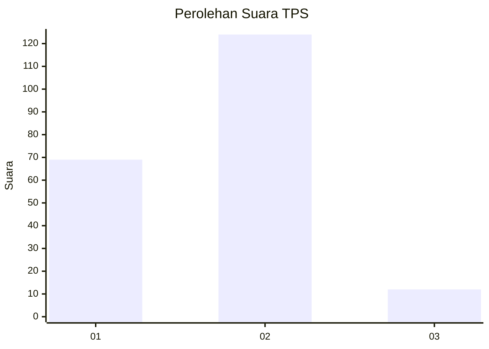
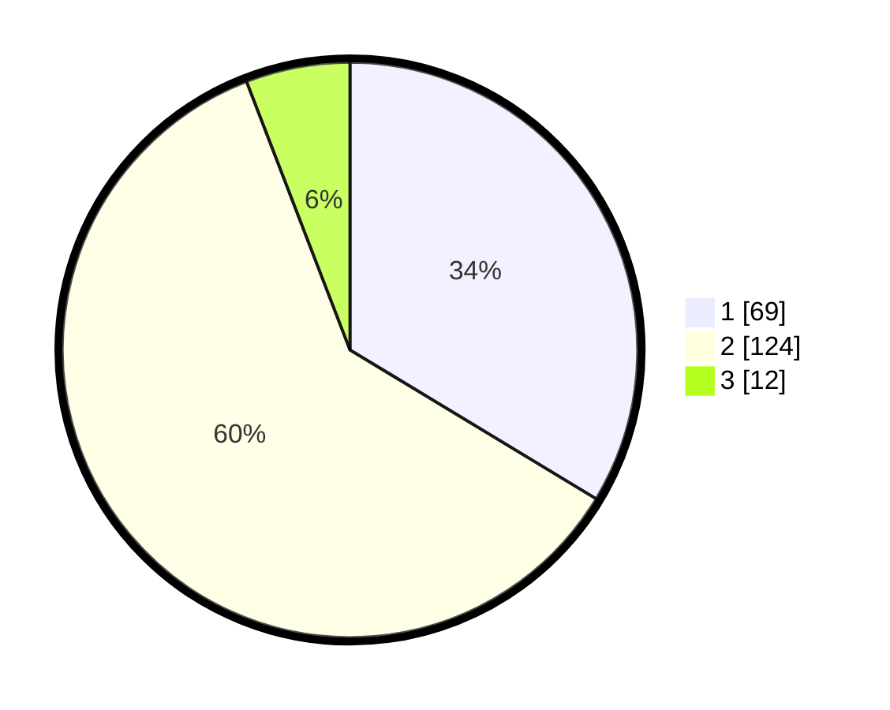

# Hasil

## Grafik

## Tabel

| No. | Nama Paslon    | Suara | Suara (raw) | Persentase |
|:--- |:-------------- | -----:| -----------:| ----------:|
| 1   | ANIES MUHAIMIN | 69    | [69][p-1]   | 33,66      |
| 2   | PRABOWO GIBRAN | 124   | [124][p-2]  | 60,49      |
| 3   | GANJAR MAHFUD  | 12    | [12][p-3]   | 5,85       |

[p-1]: https://github.com/gigit-pemilu/pemilu-2024-15-jambi/blob/main/pilpres/hitung-suara/sub/15-jambi/sub/03-sarolangun/sub/03-sarolangun/sub/1015-sukasari/sub/004-tps/sub/paslon-1.txt
[p-2]: https://github.com/gigit-pemilu/pemilu-2024-15-jambi/blob/main/pilpres/hitung-suara/sub/15-jambi/sub/03-sarolangun/sub/03-sarolangun/sub/1015-sukasari/sub/004-tps/sub/paslon-2.txt
[p-3]: https://github.com/gigit-pemilu/pemilu-2024-15-jambi/blob/main/pilpres/hitung-suara/sub/15-jambi/sub/03-sarolangun/sub/03-sarolangun/sub/1015-sukasari/sub/004-tps/sub/paslon-3.txt

## Foto C Plano

https://sirekap-obj-formc.kpu.go.id/e005/pemilu/ppwp/15/03/03/10/15/1503031015004-20240216-175659--31126aae-9c9c-4170-a142-8f4512a139dc.jpg

https://sirekap-obj-formc.kpu.go.id/e005/pemilu/ppwp/15/03/03/10/15/1503031015004-20240215-045747--1d061f9d-dc60-41a8-8bdd-8119ec398f90.jpg

https://sirekap-obj-formc.kpu.go.id/e005/pemilu/ppwp/15/03/03/10/15/1503031015004-20240215-045951--3e6d5e18-5b55-4aa5-b78e-6bbdaea27811.jpg

## Metadata

| Key        | Value               |
| ---------- | ------------------- |
| Time Stamp | 2024-02-16 21:01:00 |

