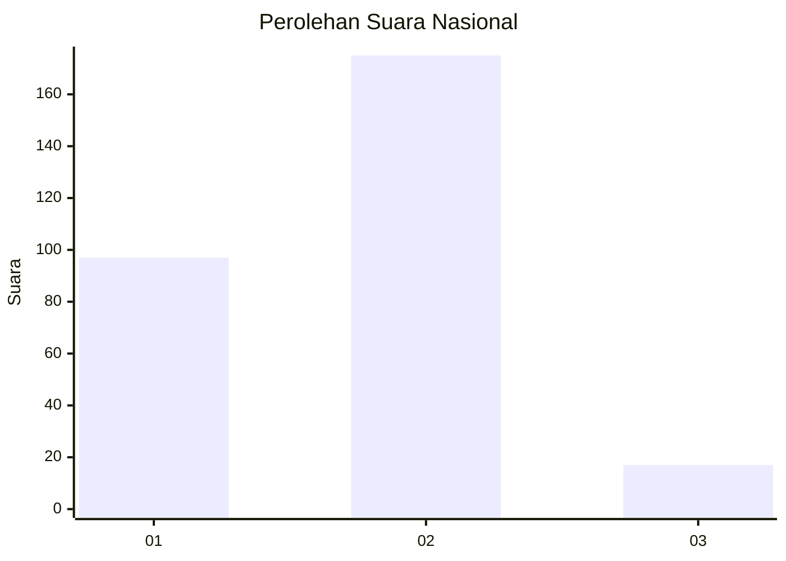
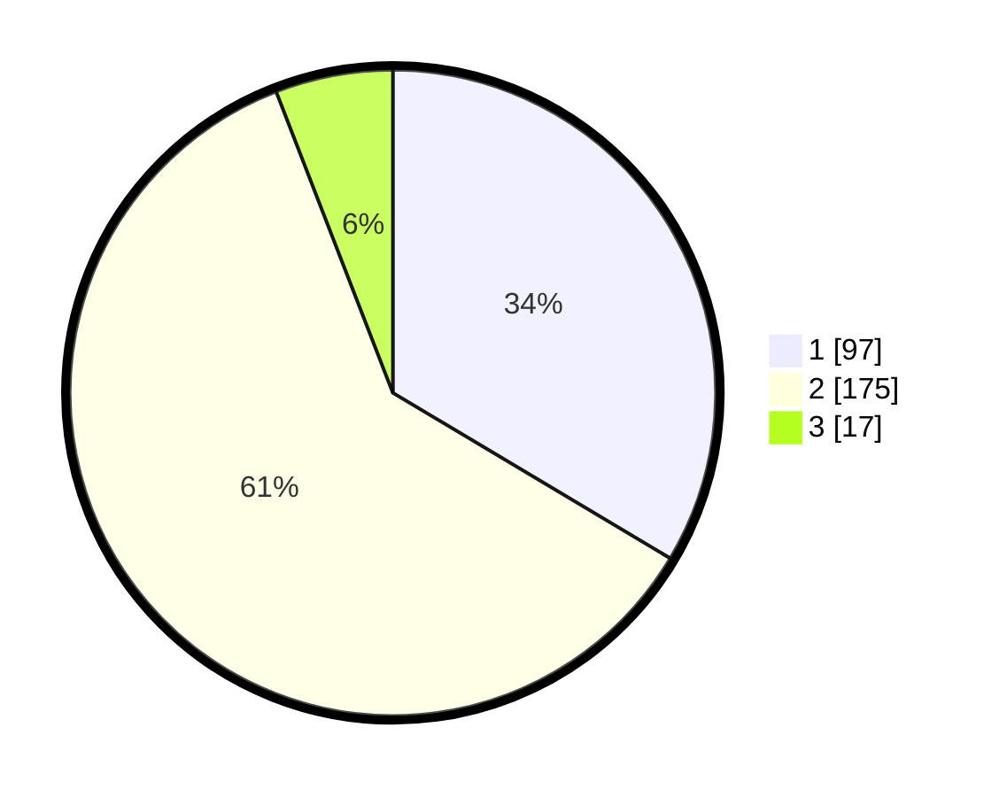

# Hasil

## Grafik

## Tabel

| No. | Nama Paslon    | Suara | Suara (raw) | Persentase |
|:--- |:-------------- | -----:| -----------:| ----------:|
| 1   | ANIES MUHAIMIN | 97    | [97][p-1]   | 33,56      |
| 2   | PRABOWO GIBRAN | 175   | [175][p-2]  | 60,55      |
| 3   | GANJAR MAHFUD  | 17    | [17][p-3]   | 5,88       |

[p-1]: https://github.com/gigit-pemilu/pemilu-2024/blob/main/pilpres/hitung-suara/sub/15-jambi/sub/03-sarolangun/sub/03-sarolangun/sub/1025-gunung-kembang/sub/006-tps/sub/paslon-1.txt
[p-2]: https://github.com/gigit-pemilu/pemilu-2024/blob/main/pilpres/hitung-suara/sub/15-jambi/sub/03-sarolangun/sub/03-sarolangun/sub/1025-gunung-kembang/sub/006-tps/sub/paslon-2.txt
[p-3]: https://github.com/gigit-pemilu/pemilu-2024/blob/main/pilpres/hitung-suara/sub/15-jambi/sub/03-sarolangun/sub/03-sarolangun/sub/1025-gunung-kembang/sub/006-tps/sub/paslon-3.txt

## Foto C Plano

https://sirekap-obj-formc.kpu.go.id/2bd9/pemilu/ppwp/15/03/03/10/25/1503031025006-20240215-055750--a55f61a1-4a90-4554-81c9-dd257c076354.jpg

https://sirekap-obj-formc.kpu.go.id/2bd9/pemilu/ppwp/15/03/03/10/25/1503031025006-20240215-063346--6d8623ad-60f0-4d97-a334-3578c9ce9d21.jpg

https://sirekap-obj-formc.kpu.go.id/2bd9/pemilu/ppwp/15/03/03/10/25/1503031025006-20240215-060001--a8c3ef32-ee32-47eb-85ac-5b682c2888d9.jpg

## Metadata

| Key        | Value               |
| ---------- | ------------------- |
| Time Stamp | 2024-02-16 09:00:28 |

