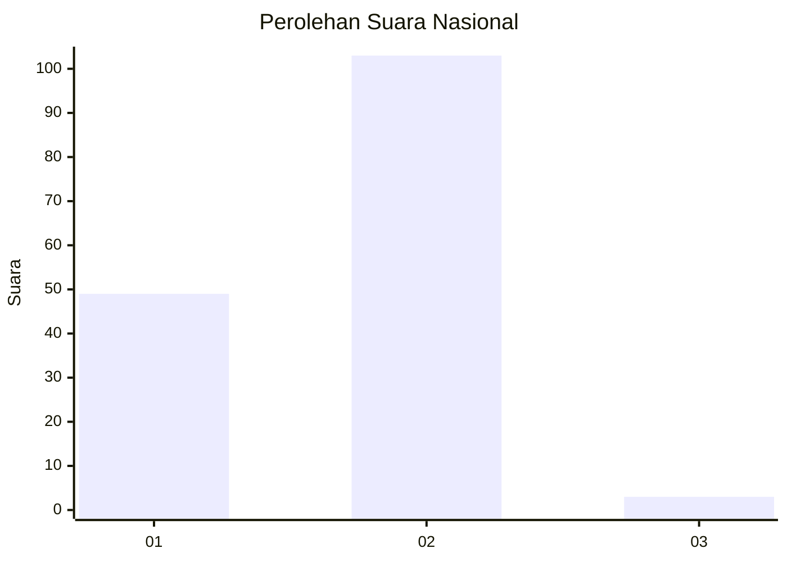
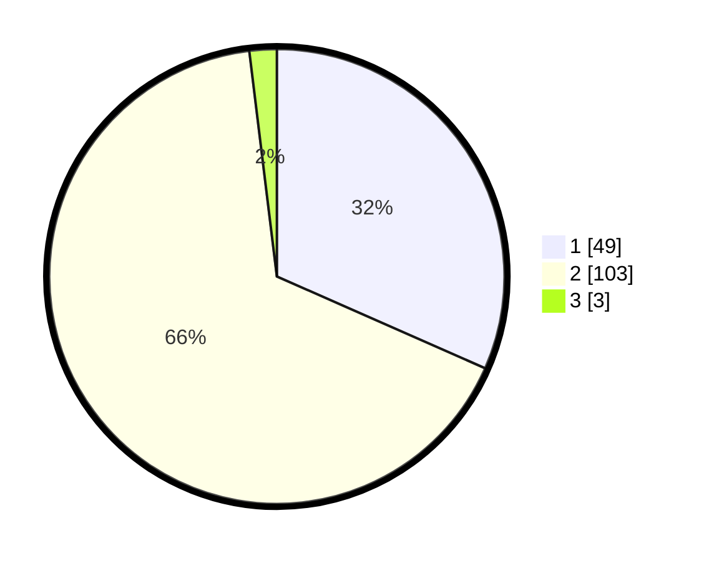

# Hasil

## Grafik

## Tabel

| No. | Nama Paslon    | Suara | Suara (raw) | Persentase |
|:--- |:-------------- | -----:| -----------:| ----------:|
| 1   | ANIES MUHAIMIN | 49    | [49][p-1]   | 31,61      |
| 2   | PRABOWO GIBRAN | 103   | [103][p-2]  | 66,45      |
| 3   | GANJAR MAHFUD  | 3     | [3][p-3]    | 1,94       |

[p-1]: https://github.com/gigit-pemilu/pemilu-2024/blob/main/pilpres/hitung-suara/sub/15-jambi/sub/03-sarolangun/sub/05-pelawan/sub/2002-pelawan/sub/003-tps/sub/paslon-1.txt
[p-2]: https://github.com/gigit-pemilu/pemilu-2024/blob/main/pilpres/hitung-suara/sub/15-jambi/sub/03-sarolangun/sub/05-pelawan/sub/2002-pelawan/sub/003-tps/sub/paslon-2.txt
[p-3]: https://github.com/gigit-pemilu/pemilu-2024/blob/main/pilpres/hitung-suara/sub/15-jambi/sub/03-sarolangun/sub/05-pelawan/sub/2002-pelawan/sub/003-tps/sub/paslon-3.txt

## Foto C Plano

https://sirekap-obj-formc.kpu.go.id/8da1/pemilu/ppwp/15/03/05/20/02/1503052002003-20240227-162616--4beb5727-fac5-4ed3-b034-139a217ecf0f.jpg

https://sirekap-obj-formc.kpu.go.id/8da1/pemilu/ppwp/15/03/05/20/02/1503052002003-20240227-162646--b7a82082-9031-4400-97b3-352530aa3c76.jpg

https://sirekap-obj-formc.kpu.go.id/8da1/pemilu/ppwp/15/03/05/20/02/1503052002003-20240227-162708--c1277faf-9f31-45f3-b213-c9fb9239c352.jpg

## Metadata

| Key        | Value               |
| ---------- | ------------------- |
| Time Stamp | 2024-02-28 19:00:00 |

