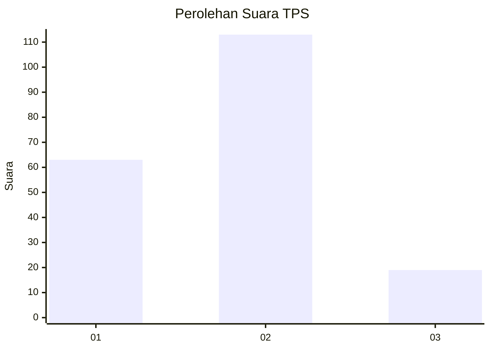
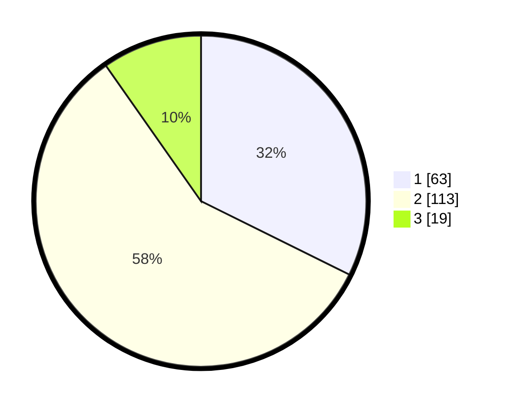

# Hasil

## Grafik

## Tabel

| No. | Nama Paslon    | Suara | Suara (raw) | Persentase |
|:--- |:-------------- | -----:| -----------:| ----------:|
| 1   | ANIES MUHAIMIN | 63    | [63][p-1]   | 32,31      |
| 2   | PRABOWO GIBRAN | 113   | [113][p-2]  | 57,95      |
| 3   | GANJAR MAHFUD  | 19    | [19][p-3]   | 9,74       |

[p-1]: https://github.com/gigit-pemilu/pemilu-2024-15-jambi/blob/main/pilpres/hitung-suara/sub/15-jambi/sub/03-sarolangun/sub/06-mandiangin/sub/2001-mandiangin/sub/003-tps/sub/paslon-1.txt
[p-2]: https://github.com/gigit-pemilu/pemilu-2024-15-jambi/blob/main/pilpres/hitung-suara/sub/15-jambi/sub/03-sarolangun/sub/06-mandiangin/sub/2001-mandiangin/sub/003-tps/sub/paslon-2.txt
[p-3]: https://github.com/gigit-pemilu/pemilu-2024-15-jambi/blob/main/pilpres/hitung-suara/sub/15-jambi/sub/03-sarolangun/sub/06-mandiangin/sub/2001-mandiangin/sub/003-tps/sub/paslon-3.txt

## Foto C Plano

https://sirekap-obj-formc.kpu.go.id/f393/pemilu/ppwp/15/03/06/20/01/1503062001003-20240216-104926--8f7a91b5-f915-494b-bbb9-0ed59fb7a3a1.jpg

https://sirekap-obj-formc.kpu.go.id/f393/pemilu/ppwp/15/03/06/20/01/1503062001003-20240222-212335--715e3d9f-df4b-4b7d-8ebe-91cdabf879a3.jpg

https://sirekap-obj-formc.kpu.go.id/f393/pemilu/ppwp/15/03/06/20/01/1503062001003-20240214-231738--d4a25f99-c7ae-4545-bcdc-a8ec0cec8870.jpg

## Metadata

| Key        | Value               |
| ---------- | ------------------- |
| Time Stamp | 2024-02-22 22:00:00 |

