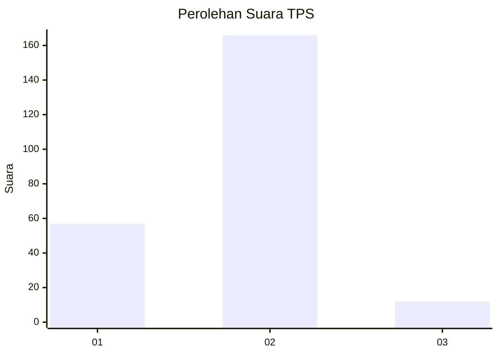
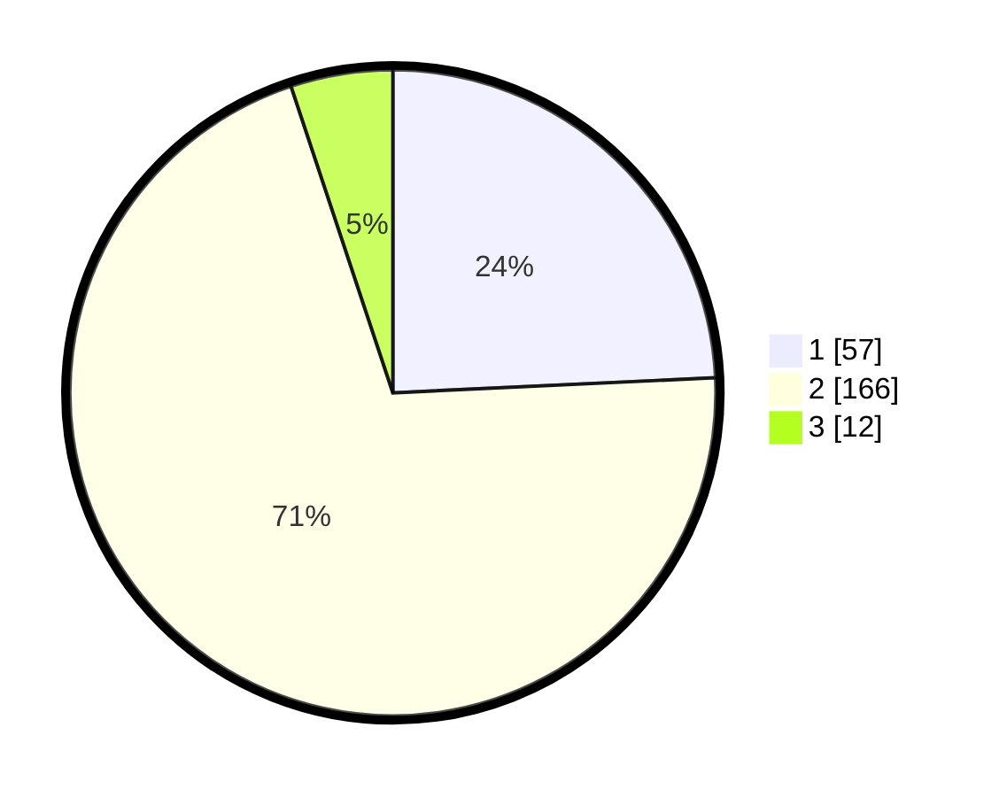

# Hasil

## Grafik

## Tabel

| No. | Nama Paslon    | Suara | Suara (raw) | Persentase |
|:--- |:-------------- | -----:| -----------:| ----------:|
| 1   | ANIES MUHAIMIN | 57    | [57][p-1]   | 24,26      |
| 2   | PRABOWO GIBRAN | 166   | [166][p-2]  | 70,64      |
| 3   | GANJAR MAHFUD  | 12    | [12][p-3]   | 5,11       |

[p-1]: https://github.com/gigit-pemilu/pemilu-2024-15-jambi/blob/main/pilpres/hitung-suara/sub/15-jambi/sub/03-sarolangun/sub/08-bathin-viii/sub/1011-limbur-tembesi/sub/005-tps/sub/paslon-1.txt
[p-2]: https://github.com/gigit-pemilu/pemilu-2024-15-jambi/blob/main/pilpres/hitung-suara/sub/15-jambi/sub/03-sarolangun/sub/08-bathin-viii/sub/1011-limbur-tembesi/sub/005-tps/sub/paslon-2.txt
[p-3]: https://github.com/gigit-pemilu/pemilu-2024-15-jambi/blob/main/pilpres/hitung-suara/sub/15-jambi/sub/03-sarolangun/sub/08-bathin-viii/sub/1011-limbur-tembesi/sub/005-tps/sub/paslon-3.txt

## Foto C Plano

https://sirekap-obj-formc.kpu.go.id/004c/pemilu/ppwp/15/03/08/10/11/1503081011005-20240215-092609--f047ecac-4ce6-4919-a9bf-0b19ba38307c.jpg

https://sirekap-obj-formc.kpu.go.id/004c/pemilu/ppwp/15/03/08/10/11/1503081011005-20240215-092832--fed7ec31-7293-4394-86c9-f01e7aa24f8a.jpg

https://sirekap-obj-formc.kpu.go.id/004c/pemilu/ppwp/15/03/08/10/11/1503081011005-20240215-093154--a2226676-bb34-4563-90e7-253e8cf3a709.jpg

## Metadata

| Key        | Value               |
| ---------- | ------------------- |
| Time Stamp | 2024-02-15 19:00:26 |

