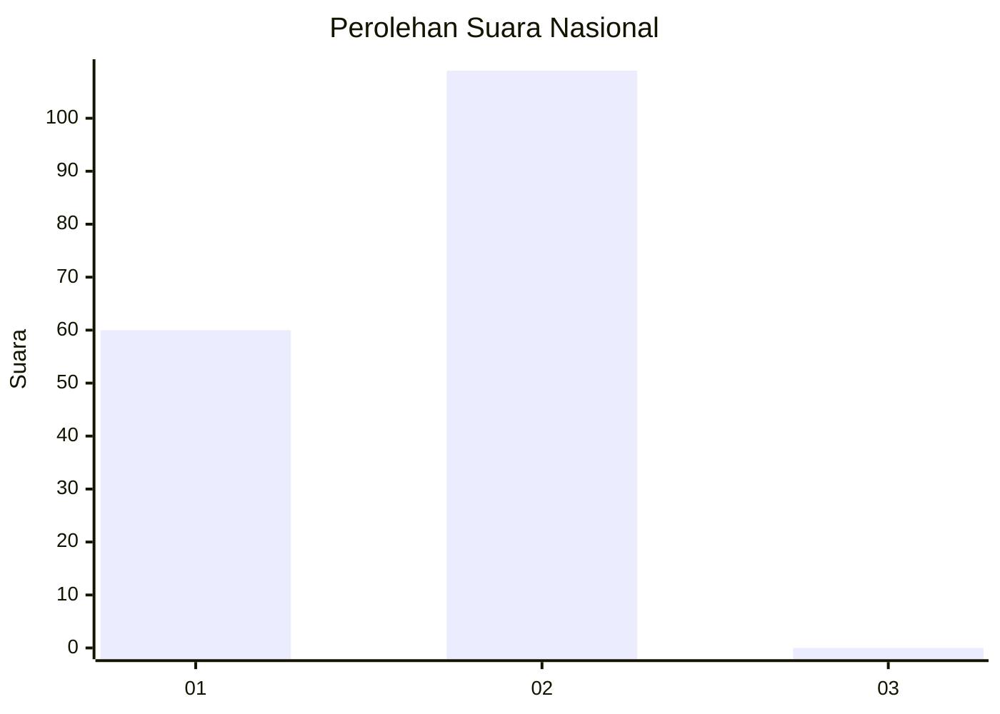
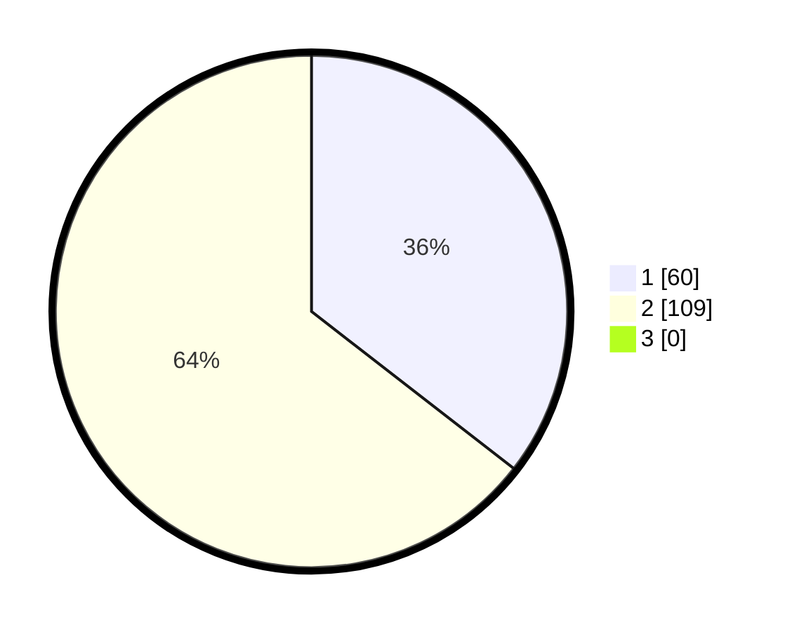

# Hasil

## Grafik

## Tabel

| No. | Nama Paslon    | Suara | Suara (raw) | Persentase |
|:--- |:-------------- | -----:| -----------:| ----------:|
| 1   | ANIES MUHAIMIN | 60    | [60][p-1]   | 35,50      |
| 2   | PRABOWO GIBRAN | 109   | [109][p-2]  | 64,50      |
| 3   | GANJAR MAHFUD  | 0     | [0][p-3]    | 0,00       |

[p-1]: https://github.com/gigit-pemilu/pemilu-2024/blob/main/pilpres/hitung-suara/sub/15-jambi/sub/03-sarolangun/sub/08-bathin-viii/sub/2006-teluk-kecimbung/sub/001-tps/sub/paslon-1.txt
[p-2]: https://github.com/gigit-pemilu/pemilu-2024/blob/main/pilpres/hitung-suara/sub/15-jambi/sub/03-sarolangun/sub/08-bathin-viii/sub/2006-teluk-kecimbung/sub/001-tps/sub/paslon-2.txt
[p-3]: https://github.com/gigit-pemilu/pemilu-2024/blob/main/pilpres/hitung-suara/sub/15-jambi/sub/03-sarolangun/sub/08-bathin-viii/sub/2006-teluk-kecimbung/sub/001-tps/sub/paslon-3.txt

## Foto C Plano

https://sirekap-obj-formc.kpu.go.id/20a0/pemilu/ppwp/15/03/08/20/06/1503082006001-20240221-221127--65d39bb3-3131-4e1d-beba-a2302df1bcae.jpg

https://sirekap-obj-formc.kpu.go.id/20a0/pemilu/ppwp/15/03/08/20/06/1503082006001-20240221-221753--c87ff903-e1bd-40ac-9384-d12a05b3f21e.jpg

https://sirekap-obj-formc.kpu.go.id/20a0/pemilu/ppwp/15/03/08/20/06/1503082006001-20240221-222010--175edd56-07d5-41ac-b980-989d55978a8e.jpg

## Metadata

| Key        | Value               |
| ---------- | ------------------- |
| Time Stamp | 2024-02-22 21:00:00 |

