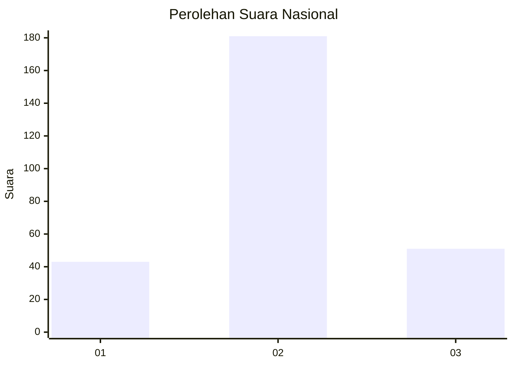
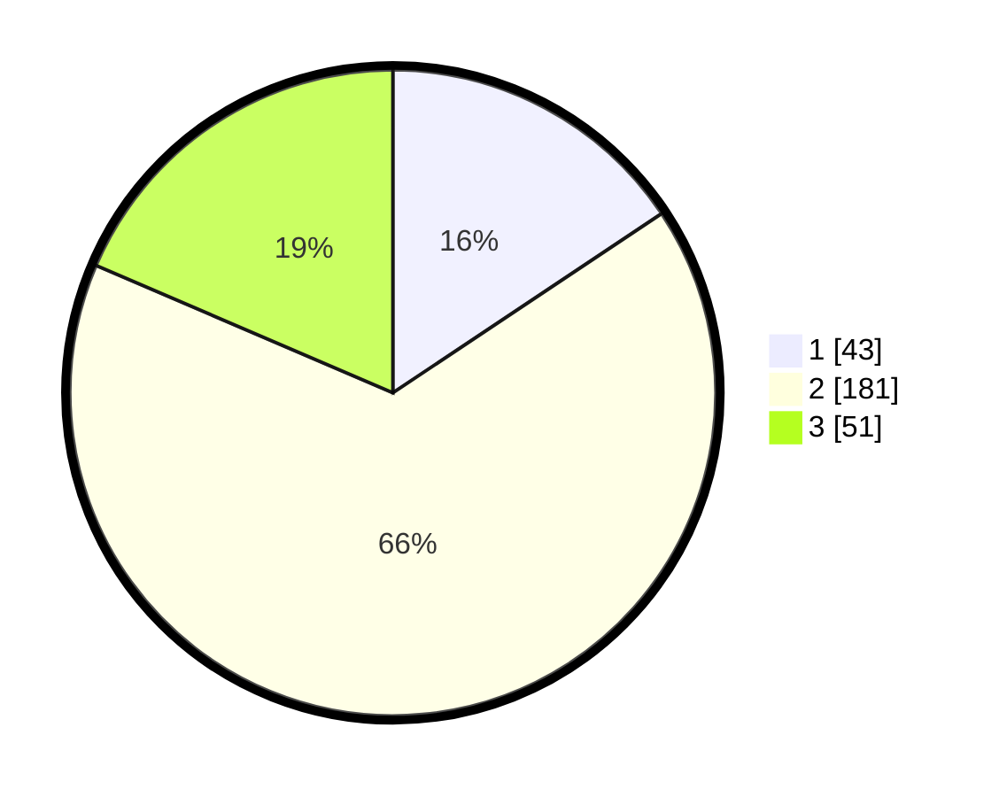

# Hasil

## Grafik

## Tabel

| No. | Nama Paslon    | Suara | Suara (raw) | Persentase |
|:--- |:-------------- | -----:| -----------:| ----------:|
| 1   | ANIES MUHAIMIN | 43    | [43][p-1]   | 15,64      |
| 2   | PRABOWO GIBRAN | 181   | [181][p-2]  | 65,82      |
| 3   | GANJAR MAHFUD  | 51    | [51][p-3]   | 18,55      |

[p-1]: https://github.com/gigit-pemilu/pemilu-2024/blob/main/pilpres/hitung-suara/sub/15-jambi/sub/03-sarolangun/sub/09-singkut/sub/2004-payo-lebar/sub/007-tps/sub/paslon-1.txt
[p-2]: https://github.com/gigit-pemilu/pemilu-2024/blob/main/pilpres/hitung-suara/sub/15-jambi/sub/03-sarolangun/sub/09-singkut/sub/2004-payo-lebar/sub/007-tps/sub/paslon-2.txt
[p-3]: https://github.com/gigit-pemilu/pemilu-2024/blob/main/pilpres/hitung-suara/sub/15-jambi/sub/03-sarolangun/sub/09-singkut/sub/2004-payo-lebar/sub/007-tps/sub/paslon-3.txt

## Foto C Plano

https://sirekap-obj-formc.kpu.go.id/df6a/pemilu/ppwp/15/03/09/20/04/1503092004007-20240215-005931--1fb28aad-39fb-472f-a9b4-a633ae3d4515.jpg

https://sirekap-obj-formc.kpu.go.id/df6a/pemilu/ppwp/15/03/09/20/04/1503092004007-20240220-221555--0785c4e1-a297-4054-ab63-68214f80ab99.jpg

https://sirekap-obj-formc.kpu.go.id/df6a/pemilu/ppwp/15/03/09/20/04/1503092004007-20240215-010143--fca9859c-8272-4ecd-87d8-ea82aacdeeff.jpg

## Metadata

| Key        | Value               |
| ---------- | ------------------- |
| Time Stamp | 2024-02-20 23:00:00 |

