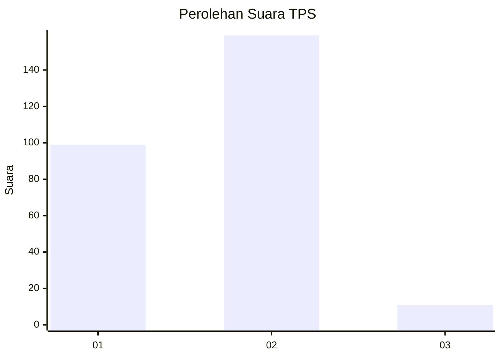
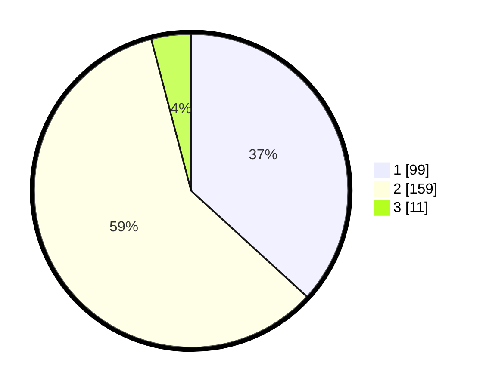

# Hasil

## Grafik

## Tabel

| No. | Nama Paslon    | Suara | Suara (raw) | Persentase |
|:--- |:-------------- | -----:| -----------:| ----------:|
| 1   | ANIES MUHAIMIN | 99    | [99][p-1]   | 36,80      |
| 2   | PRABOWO GIBRAN | 159   | [159][p-2]  | 59,11      |
| 3   | GANJAR MAHFUD  | 11    | [11][p-3]   | 4,09       |

[p-1]: https://github.com/gigit-pemilu/pemilu-2024-15-jambi/blob/main/pilpres/hitung-suara/sub/15-jambi/sub/03-sarolangun/sub/09-singkut/sub/2007-pasar-singkut/sub/003-tps/sub/paslon-1.txt
[p-2]: https://github.com/gigit-pemilu/pemilu-2024-15-jambi/blob/main/pilpres/hitung-suara/sub/15-jambi/sub/03-sarolangun/sub/09-singkut/sub/2007-pasar-singkut/sub/003-tps/sub/paslon-2.txt
[p-3]: https://github.com/gigit-pemilu/pemilu-2024-15-jambi/blob/main/pilpres/hitung-suara/sub/15-jambi/sub/03-sarolangun/sub/09-singkut/sub/2007-pasar-singkut/sub/003-tps/sub/paslon-3.txt

## Foto C Plano

https://sirekap-obj-formc.kpu.go.id/7700/pemilu/ppwp/15/03/09/20/07/1503092007003-20240215-014920--44957409-5592-4592-a6a5-d68af02af294.jpg

https://sirekap-obj-formc.kpu.go.id/7700/pemilu/ppwp/15/03/09/20/07/1503092007003-20240215-014805--0ac26931-b44f-416b-aba5-5f3e76194432.jpg

https://sirekap-obj-formc.kpu.go.id/7700/pemilu/ppwp/15/03/09/20/07/1503092007003-20240215-014855--44ca9b11-556d-454a-a6d4-c677ccfe98a4.jpg

## Metadata

| Key        | Value               |
| ---------- | ------------------- |
| Time Stamp | 2024-02-16 00:30:27 |

