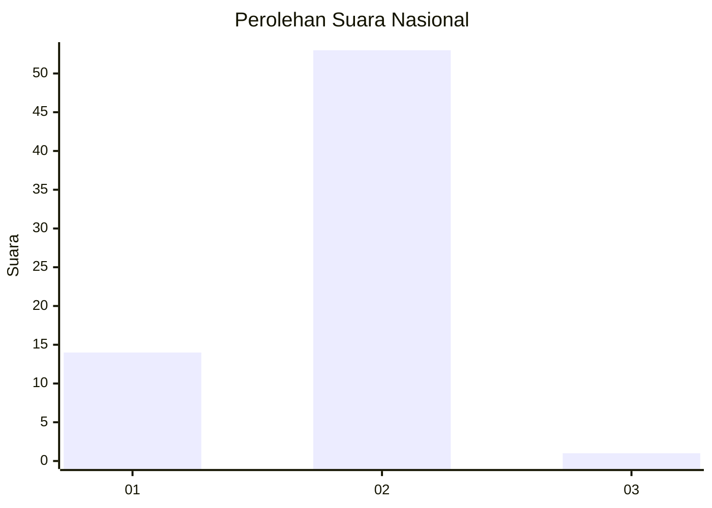
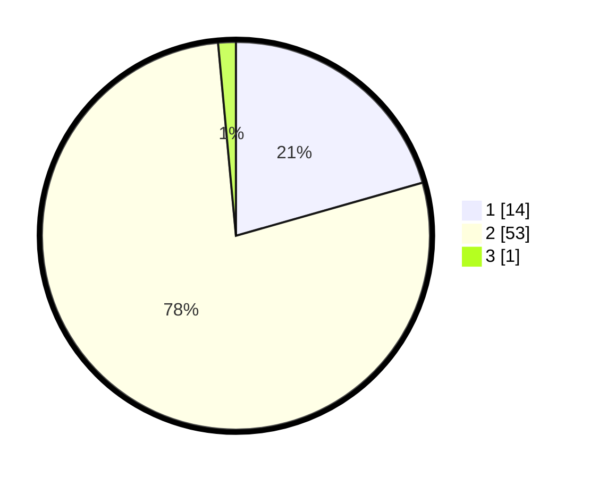

# Hasil

## Grafik

## Tabel

| No. | Nama Paslon    | Suara | Suara (raw) | Persentase |
|:--- |:-------------- | -----:| -----------:| ----------:|
| 1   | ANIES MUHAIMIN | 14    | [14][p-1]   | 20,59      |
| 2   | PRABOWO GIBRAN | 53    | [53][p-2]   | 77,94      |
| 3   | GANJAR MAHFUD  | 1     | [1][p-3]    | 1,47       |

[p-1]: https://github.com/gigit-pemilu/pemilu-2024/blob/main/pilpres/hitung-suara/sub/15-jambi/sub/03-sarolangun/sub/10-cermin-nan-gedang/sub/2001-kampung-tujuh/sub/004-tps/sub/paslon-1.txt
[p-2]: https://github.com/gigit-pemilu/pemilu-2024/blob/main/pilpres/hitung-suara/sub/15-jambi/sub/03-sarolangun/sub/10-cermin-nan-gedang/sub/2001-kampung-tujuh/sub/004-tps/sub/paslon-2.txt
[p-3]: https://github.com/gigit-pemilu/pemilu-2024/blob/main/pilpres/hitung-suara/sub/15-jambi/sub/03-sarolangun/sub/10-cermin-nan-gedang/sub/2001-kampung-tujuh/sub/004-tps/sub/paslon-3.txt

## Foto C Plano

https://sirekap-obj-formc.kpu.go.id/371a/pemilu/ppwp/15/03/10/20/01/1503102001004-20240220-230742--2bed2e0b-9adc-46f2-bd3a-4444b3b27a2f.jpg

https://sirekap-obj-formc.kpu.go.id/371a/pemilu/ppwp/15/03/10/20/01/1503102001004-20240221-023709--ec6e8c2c-cfea-4183-b107-c2a5695c4449.jpg

https://sirekap-obj-formc.kpu.go.id/371a/pemilu/ppwp/15/03/10/20/01/1503102001004-20240220-231430--10bf3d2b-41af-4df4-a741-2b4fcc10cb56.jpg

## Metadata

| Key        | Value               |
| ---------- | ------------------- |
| Time Stamp | 2024-02-21 11:00:00 |

## DATA PEMILIH TETAP

Jumlah pemilih dalam DPT: **79**.
 * L: **37**.
 * P: **42**.

## DATA PENGGUNA HAK PILIH

Jumlah pengguna hak pilih dalam DPT: **65**.
 * L: **28**.
 * P: **37**.

Jumlah pengguna hak pilih dalam DPTb: **700**.
 * L: **0**.
 * P: **0**.

Jumlah pengguna hak pilih dalam DPK: **3**.
 * L: **1**.
 * P: **2**.

Jumlah pengguna hak pilih: **66**.
 * L: **29**.
 * P: **79**.

## JUMLAH SUARA SAH DAN TIDAK SAH

JUMLAH SELURUH SUARA SAH: **68**.

JUMLAH SUARA TIDAK SAH: **0**.

JUMLAH SELURUH SUARA SAH DAN SUARA TIDAK SAH: **68**.

