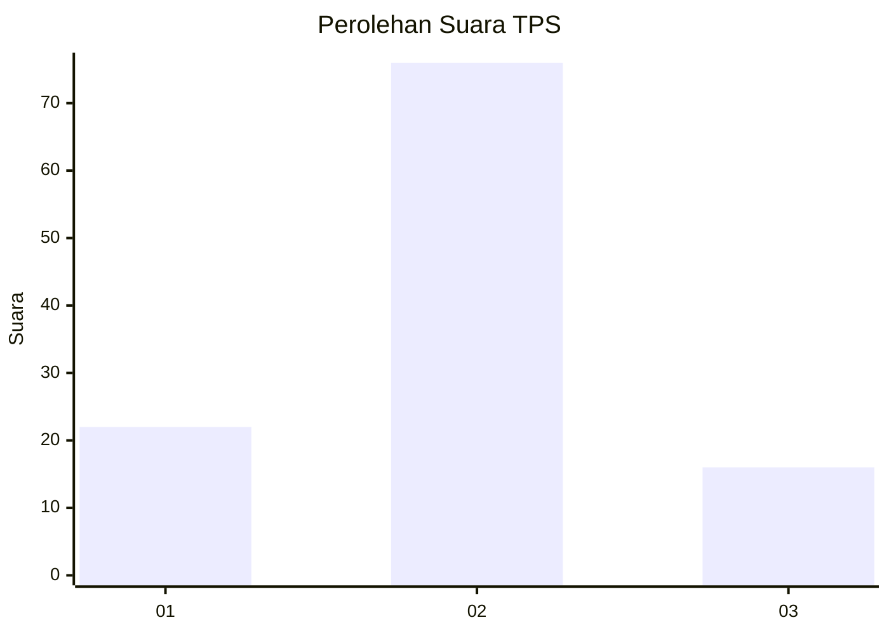
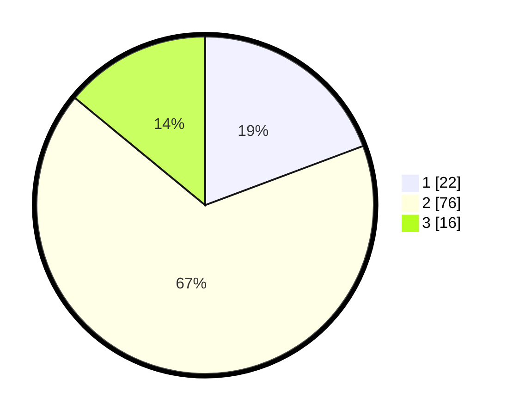

# Hasil

## Grafik

## Tabel

| No. | Nama Paslon    | Suara | Suara (raw) | Persentase |
|:--- |:-------------- | -----:| -----------:| ----------:|
| 1   | ANIES MUHAIMIN | 22    | [22][p-1]   | 19,30      |
| 2   | PRABOWO GIBRAN | 76    | [76][p-2]   | 66,67      |
| 3   | GANJAR MAHFUD  | 16    | [16][p-3]   | 14,04      |

[p-1]: https://github.com/gigit-pemilu/pemilu-2024-15-jambi/blob/main/pilpres/hitung-suara/sub/15-jambi/sub/04-batanghari/sub/06-maro-sebo-ulu/sub/2005-rengas-ix/sub/003-tps/sub/paslon-1.txt
[p-2]: https://github.com/gigit-pemilu/pemilu-2024-15-jambi/blob/main/pilpres/hitung-suara/sub/15-jambi/sub/04-batanghari/sub/06-maro-sebo-ulu/sub/2005-rengas-ix/sub/003-tps/sub/paslon-2.txt
[p-3]: https://github.com/gigit-pemilu/pemilu-2024-15-jambi/blob/main/pilpres/hitung-suara/sub/15-jambi/sub/04-batanghari/sub/06-maro-sebo-ulu/sub/2005-rengas-ix/sub/003-tps/sub/paslon-3.txt

## Foto C Plano

https://sirekap-obj-formc.kpu.go.id/affd/pemilu/ppwp/15/04/06/20/05/1504062005003-20240217-232552--77e322ed-a6b8-4ce4-a3c4-a39c128c3b88.jpg

https://sirekap-obj-formc.kpu.go.id/affd/pemilu/ppwp/15/04/06/20/05/1504062005003-20240214-212324--6b1ebaf6-cc99-410b-8a97-f2fb102ca68a.jpg

https://sirekap-obj-formc.kpu.go.id/affd/pemilu/ppwp/15/04/06/20/05/1504062005003-20240214-212457--4341fdd8-3fc5-41f3-9bef-2bc5499399ac.jpg

## Metadata

| Key        | Value               |
| ---------- | ------------------- |
| Time Stamp | 2024-02-19 06:16:00 |

