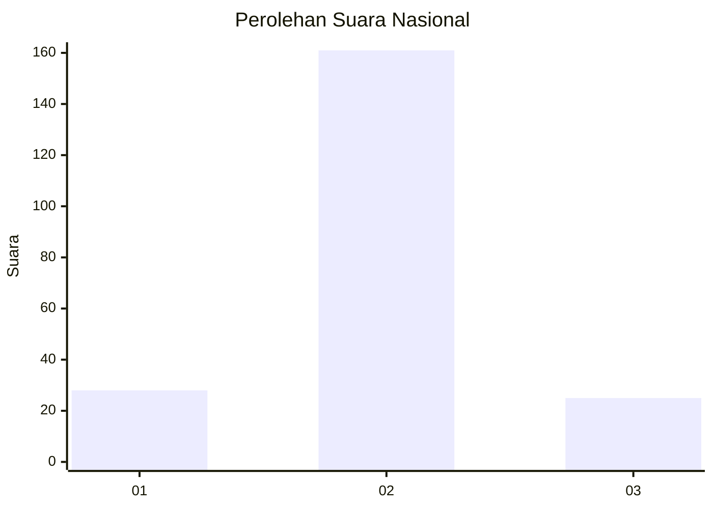
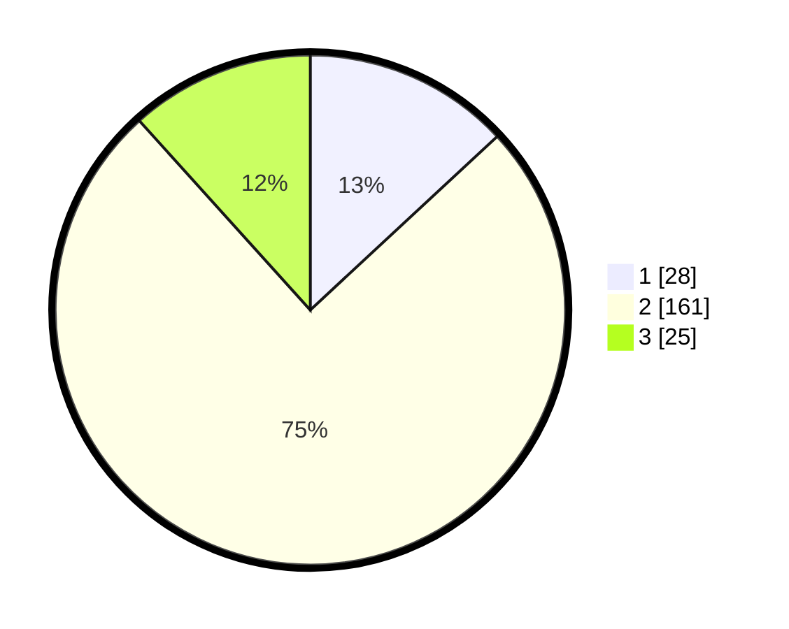

# Hasil

## Grafik

## Tabel

| No. | Nama Paslon    | Suara | Suara (raw) | Persentase |
|:--- |:-------------- | -----:| -----------:| ----------:|
| 1   | ANIES MUHAIMIN | 28    | [28][p-1]   | 13,08      |
| 2   | PRABOWO GIBRAN | 161   | [161][p-2]  | 75,23      |
| 3   | GANJAR MAHFUD  | 25    | [25][p-3]   | 11,68      |

[p-1]: https://github.com/gigit-pemilu/pemilu-2024/blob/main/pilpres/hitung-suara/sub/15-jambi/sub/04-batanghari/sub/07-bajubang/sub/1004-bajubang/sub/001-tps/sub/paslon-1.txt
[p-2]: https://github.com/gigit-pemilu/pemilu-2024/blob/main/pilpres/hitung-suara/sub/15-jambi/sub/04-batanghari/sub/07-bajubang/sub/1004-bajubang/sub/001-tps/sub/paslon-2.txt
[p-3]: https://github.com/gigit-pemilu/pemilu-2024/blob/main/pilpres/hitung-suara/sub/15-jambi/sub/04-batanghari/sub/07-bajubang/sub/1004-bajubang/sub/001-tps/sub/paslon-3.txt

## Foto C Plano

https://sirekap-obj-formc.kpu.go.id/db52/pemilu/ppwp/15/04/07/10/04/1504071004001-20240219-094619--3291ee42-fa96-4b2e-883c-9e6c0634ecf9.jpg

https://sirekap-obj-formc.kpu.go.id/db52/pemilu/ppwp/15/04/07/10/04/1504071004001-20240219-094733--a94b280f-5d77-4eb7-976b-66f65d47e2b3.jpg

https://sirekap-obj-formc.kpu.go.id/db52/pemilu/ppwp/15/04/07/10/04/1504071004001-20240219-094856--a003901d-2f63-4040-98bc-ee047d66cf31.jpg

## Metadata

| Key        | Value               |
| ---------- | ------------------- |
| Time Stamp | 2024-02-24 22:31:28 |

