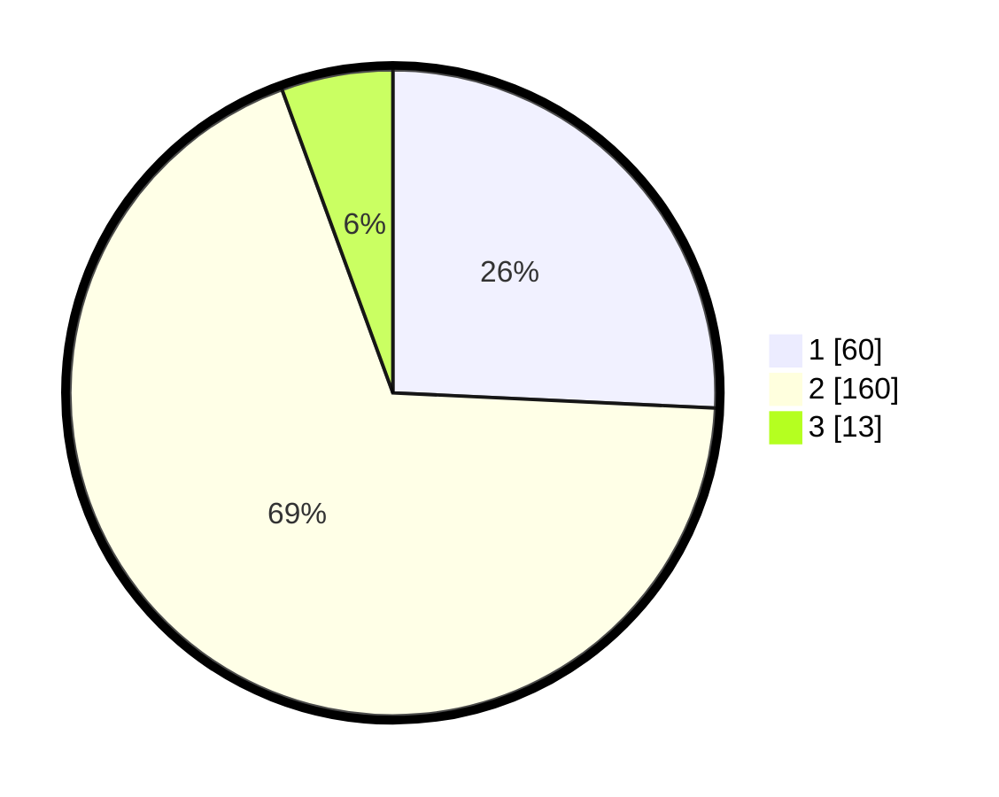

# Hasil

## Grafik

## Tabel

| No. | Nama Paslon    | Suara | Suara (raw) | Persentase |
|:--- |:-------------- | -----:| -----------:| ----------:|
| 1   | ANIES MUHAIMIN | 60    | [60][p-1]   | 25,75      |
| 2   | PRABOWO GIBRAN | 160   | [160][p-2]  | 68,67      |
| 3   | GANJAR MAHFUD  | 13    | [13][p-3]   | 5,58       |

[p-1]: https://github.com/gigit-pemilu/pemilu-2024-15-jambi/blob/main/pilpres/hitung-suara/sub/15-jambi/sub/05--muaro-jambi/sub/01-jambi-luar-kota/sub/1003-pijoan/sub/002-tps/sub/paslon-1.txt
[p-2]: https://github.com/gigit-pemilu/pemilu-2024-15-jambi/blob/main/pilpres/hitung-suara/sub/15-jambi/sub/05--muaro-jambi/sub/01-jambi-luar-kota/sub/1003-pijoan/sub/002-tps/sub/paslon-2.txt
[p-3]: https://github.com/gigit-pemilu/pemilu-2024-15-jambi/blob/main/pilpres/hitung-suara/sub/15-jambi/sub/05--muaro-jambi/sub/01-jambi-luar-kota/sub/1003-pijoan/sub/002-tps/sub/paslon-3.txt

## Foto C Plano

https://sirekap-obj-formc.kpu.go.id/6aa1/pemilu/ppwp/15/05/01/10/03/1505011003002-20240221-185756--62b49c5d-9bb5-40e7-8294-9e275ab2309e.jpg

https://sirekap-obj-formc.kpu.go.id/6aa1/pemilu/ppwp/15/05/01/10/03/1505011003002-20240221-185941--7bada1f8-92dd-4a31-9fee-46c305375b8c.jpg

https://sirekap-obj-formc.kpu.go.id/6aa1/pemilu/ppwp/15/05/01/10/03/1505011003002-20240222-093453--7544c0c8-6416-43df-becc-4976845a140a.jpg

## Metadata

| Key        | Value               |
| ---------- | ------------------- |
| Time Stamp | 2024-02-22 21:00:00 |

