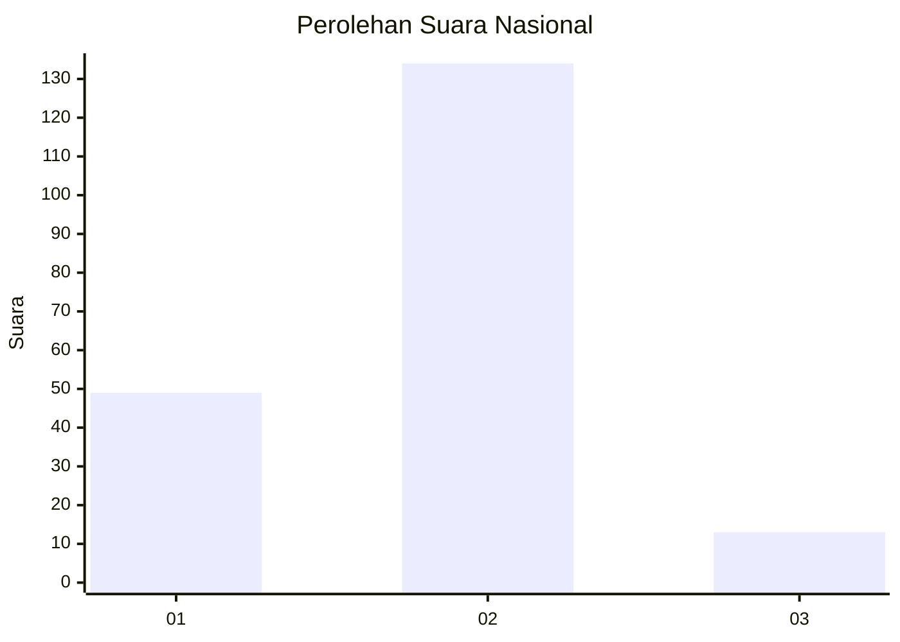
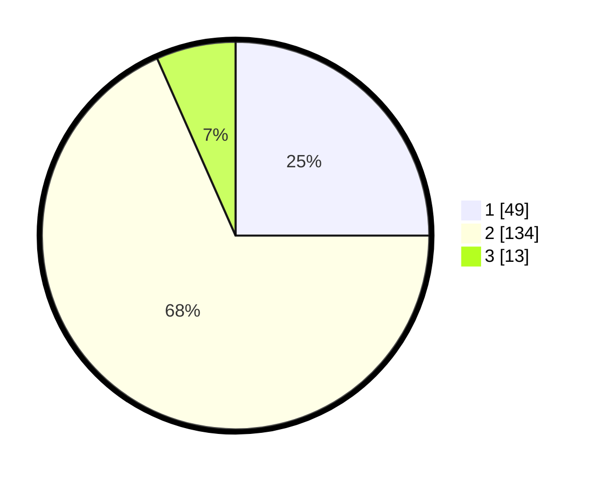

# Hasil

## Grafik

## Tabel

| No. | Nama Paslon    | Suara | Suara (raw) | Persentase |
|:--- |:-------------- | -----:| -----------:| ----------:|
| 1   | ANIES MUHAIMIN | 49    | [49][p-1]   | 25,00      |
| 2   | PRABOWO GIBRAN | 134   | [134][p-2]  | 68,37      |
| 3   | GANJAR MAHFUD  | 13    | [13][p-3]   | 6,63       |

[p-1]: https://github.com/gigit-pemilu/pemilu-2024/blob/main/pilpres/hitung-suara/sub/15-jambi/sub/05--muaro-jambi/sub/01-jambi-luar-kota/sub/1003-pijoan/sub/003-tps/sub/paslon-1.txt
[p-2]: https://github.com/gigit-pemilu/pemilu-2024/blob/main/pilpres/hitung-suara/sub/15-jambi/sub/05--muaro-jambi/sub/01-jambi-luar-kota/sub/1003-pijoan/sub/003-tps/sub/paslon-2.txt
[p-3]: https://github.com/gigit-pemilu/pemilu-2024/blob/main/pilpres/hitung-suara/sub/15-jambi/sub/05--muaro-jambi/sub/01-jambi-luar-kota/sub/1003-pijoan/sub/003-tps/sub/paslon-3.txt

## Foto C Plano

https://sirekap-obj-formc.kpu.go.id/bc4f/pemilu/ppwp/15/05/01/10/03/1505011003003-20240215-032021--16f90f6b-fc9f-46c6-903a-5f4005f885ff.jpg

https://sirekap-obj-formc.kpu.go.id/bc4f/pemilu/ppwp/15/05/01/10/03/1505011003003-20240215-022219--1069b838-0f7e-4346-9f03-70378281d2f8.jpg

## Metadata

| Key        | Value               |
| ---------- | ------------------- |
| Time Stamp | 2024-02-16 22:30:00 |

