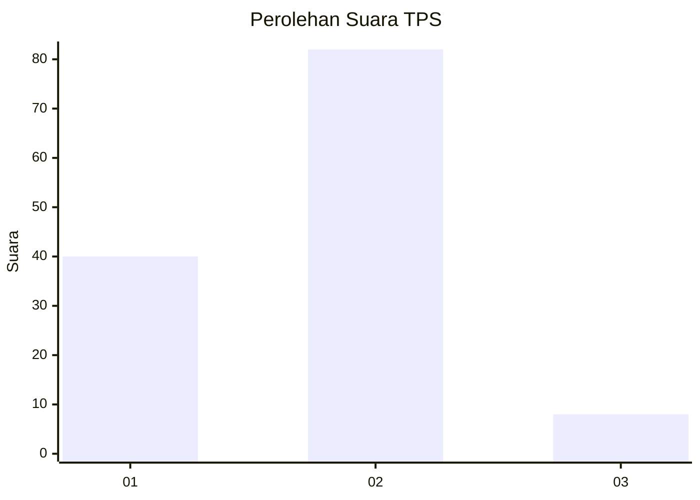
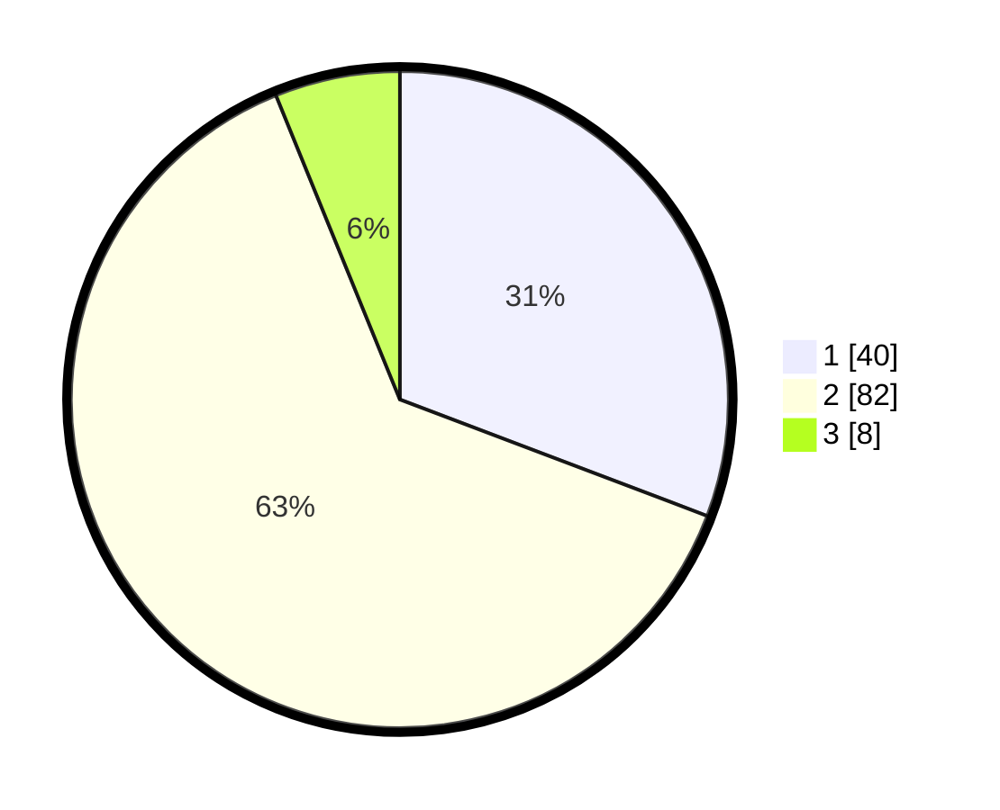

# Hasil

## Grafik

## Tabel

| No. | Nama Paslon    | Suara | Suara (raw) | Persentase |
|:--- |:-------------- | -----:| -----------:| ----------:|
| 1   | ANIES MUHAIMIN | 40    | [40][p-1]   | 30,77      |
| 2   | PRABOWO GIBRAN | 82    | [82][p-2]   | 63,08      |
| 3   | GANJAR MAHFUD  | 8     | [8][p-3]    | 6,15       |

[p-1]: https://github.com/gigit-pemilu/pemilu-2024-15-jambi/blob/main/pilpres/hitung-suara/sub/15-jambi/sub/05--muaro-jambi/sub/01-jambi-luar-kota/sub/1003-pijoan/sub/004-tps/sub/paslon-1.txt
[p-2]: https://github.com/gigit-pemilu/pemilu-2024-15-jambi/blob/main/pilpres/hitung-suara/sub/15-jambi/sub/05--muaro-jambi/sub/01-jambi-luar-kota/sub/1003-pijoan/sub/004-tps/sub/paslon-2.txt
[p-3]: https://github.com/gigit-pemilu/pemilu-2024-15-jambi/blob/main/pilpres/hitung-suara/sub/15-jambi/sub/05--muaro-jambi/sub/01-jambi-luar-kota/sub/1003-pijoan/sub/004-tps/sub/paslon-3.txt

## Foto C Plano

https://sirekap-obj-formc.kpu.go.id/0221/pemilu/ppwp/15/05/01/10/03/1505011003004-20240214-141759--1a149ca8-b46c-488f-992e-3640332c9384.jpg

https://sirekap-obj-formc.kpu.go.id/0221/pemilu/ppwp/15/05/01/10/03/1505011003004-20240214-141911--a4755120-4f75-4687-834f-fde8335f4075.jpg

https://sirekap-obj-formc.kpu.go.id/0221/pemilu/ppwp/15/05/01/10/03/1505011003004-20240214-190400--4bbe79b7-98ac-4dc4-a2ce-06fd79060f9f.jpg

## Metadata

| Key        | Value               |
| ---------- | ------------------- |
| Time Stamp | 2024-02-14 21:46:01 |

