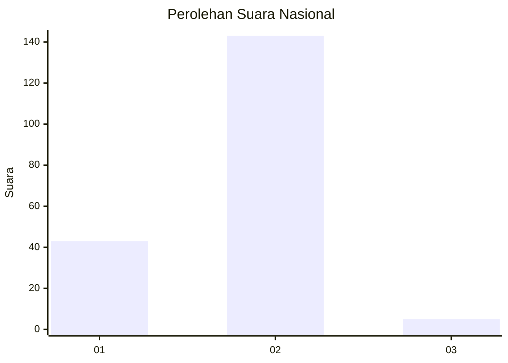

# Hasil

## Grafik

## Tabel

| No. | Nama Paslon    | Suara | Suara (raw) | Persentase |
|:--- |:-------------- | -----:| -----------:| ----------:|
| 1   | ANIES MUHAIMIN | 43    | [43][p-1]   | 22,51      |
| 2   | PRABOWO GIBRAN | 143   | [143][p-2]  | 74,87      |
| 3   | GANJAR MAHFUD  | 5     | [5][p-3]    | 2,62       |

[p-1]: https://github.com/gigit-pemilu/pemilu-2024/blob/main/pilpres/hitung-suara/sub/15-jambi/sub/05--muaro-jambi/sub/01-jambi-luar-kota/sub/1003-pijoan/sub/005-tps/sub/paslon-1.txt
[p-2]: https://github.com/gigit-pemilu/pemilu-2024/blob/main/pilpres/hitung-suara/sub/15-jambi/sub/05--muaro-jambi/sub/01-jambi-luar-kota/sub/1003-pijoan/sub/005-tps/sub/paslon-2.txt
[p-3]: https://github.com/gigit-pemilu/pemilu-2024/blob/main/pilpres/hitung-suara/sub/15-jambi/sub/05--muaro-jambi/sub/01-jambi-luar-kota/sub/1003-pijoan/sub/005-tps/sub/paslon-3.txt

## Foto C Plano

https://sirekap-obj-formc.kpu.go.id/a7b5/pemilu/ppwp/15/05/01/10/03/1505011003005-20240214-225346--7155e187-8977-4f37-a573-cfcd3d3a27e2.jpg

https://sirekap-obj-formc.kpu.go.id/a7b5/pemilu/ppwp/15/05/01/10/03/1505011003005-20240214-225953--9e0a9fde-2d7c-44da-8006-d3d2278b600f.jpg

https://sirekap-obj-formc.kpu.go.id/a7b5/pemilu/ppwp/15/05/01/10/03/1505011003005-20240214-225840--423e461a-265b-40d3-bf91-297cc3821fa9.jpg

## Metadata

| Key        | Value               |
| ---------- | ------------------- |
| Time Stamp | 2024-02-16 12:51:22 |

