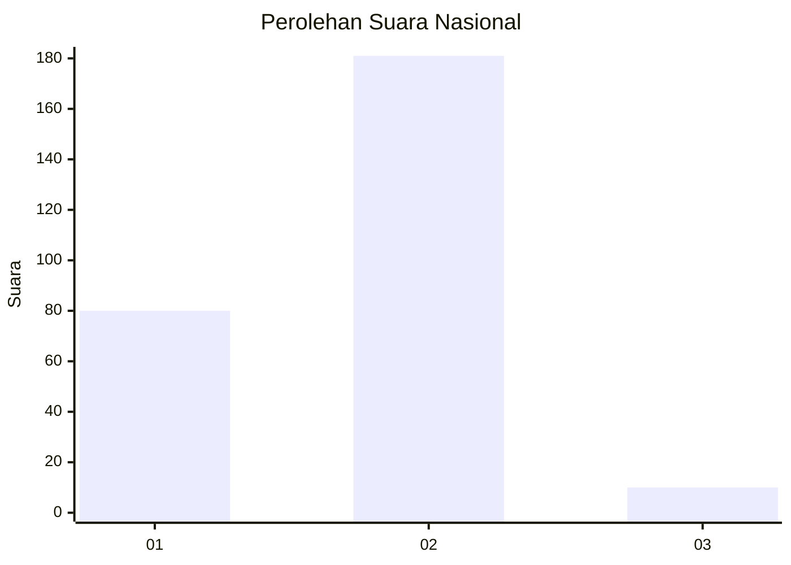
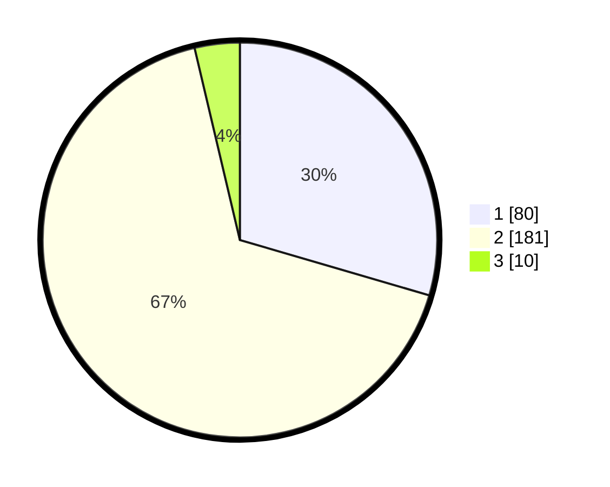

# Hasil

## Grafik

## Tabel

| No. | Nama Paslon    | Suara | Suara (raw) | Persentase |
|:--- |:-------------- | -----:| -----------:| ----------:|
| 1   | ANIES MUHAIMIN | 80    | [80][p-1]   | 29,52      |
| 2   | PRABOWO GIBRAN | 181   | [181][p-2]  | 66,79      |
| 3   | GANJAR MAHFUD  | 10    | [10][p-3]   | 3,69       |

[p-1]: https://github.com/gigit-pemilu/pemilu-2024/blob/main/pilpres/hitung-suara/sub/15-jambi/sub/05--muaro-jambi/sub/01-jambi-luar-kota/sub/2022-pematang-gajah/sub/005-tps/sub/paslon-1.txt
[p-2]: https://github.com/gigit-pemilu/pemilu-2024/blob/main/pilpres/hitung-suara/sub/15-jambi/sub/05--muaro-jambi/sub/01-jambi-luar-kota/sub/2022-pematang-gajah/sub/005-tps/sub/paslon-2.txt
[p-3]: https://github.com/gigit-pemilu/pemilu-2024/blob/main/pilpres/hitung-suara/sub/15-jambi/sub/05--muaro-jambi/sub/01-jambi-luar-kota/sub/2022-pematang-gajah/sub/005-tps/sub/paslon-3.txt

## Foto C Plano

https://sirekap-obj-formc.kpu.go.id/3b81/pemilu/ppwp/15/05/01/20/22/1505012022005-20240215-055944--f41c1f22-f829-456f-81b7-dc1b3fde74b3.jpg

https://sirekap-obj-formc.kpu.go.id/3b81/pemilu/ppwp/15/05/01/20/22/1505012022005-20240215-083400--3874970b-9e39-42a7-8b2e-53f9fee80f9d.jpg

https://sirekap-obj-formc.kpu.go.id/3b81/pemilu/ppwp/15/05/01/20/22/1505012022005-20240215-060422--69b3256c-b319-4050-accc-99b94059db8a.jpg

## Metadata

| Key        | Value               |
| ---------- | ------------------- |
| Time Stamp | 2024-02-16 21:01:00 |

