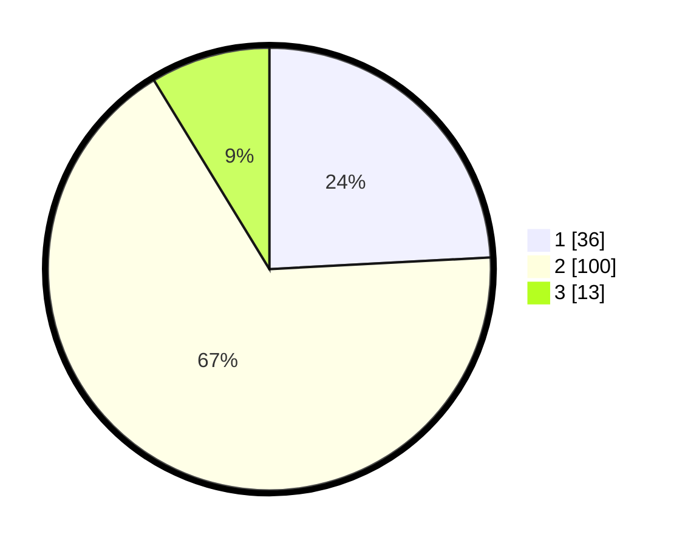

# Hasil

## Grafik

## Tabel

| No. | Nama Paslon    | Suara | Suara (raw) | Persentase |
|:--- |:-------------- | -----:| -----------:| ----------:|
| 1   | ANIES MUHAIMIN | 36    | [36][p-1]   | 24,16      |
| 2   | PRABOWO GIBRAN | 100   | [100][p-2]  | 67,11      |
| 3   | GANJAR MAHFUD  | 13    | [13][p-3]   | 8,72       |

[p-1]: https://github.com/gigit-pemilu/pemilu-2024-15-jambi/blob/main/pilpres/hitung-suara/sub/15-jambi/sub/05--muaro-jambi/sub/02-sekernan/sub/1010-sengeti/sub/004-tps/sub/paslon-1.txt
[p-2]: https://github.com/gigit-pemilu/pemilu-2024-15-jambi/blob/main/pilpres/hitung-suara/sub/15-jambi/sub/05--muaro-jambi/sub/02-sekernan/sub/1010-sengeti/sub/004-tps/sub/paslon-2.txt
[p-3]: https://github.com/gigit-pemilu/pemilu-2024-15-jambi/blob/main/pilpres/hitung-suara/sub/15-jambi/sub/05--muaro-jambi/sub/02-sekernan/sub/1010-sengeti/sub/004-tps/sub/paslon-3.txt

## Foto C Plano

https://sirekap-obj-formc.kpu.go.id/0a85/pemilu/ppwp/15/05/02/10/10/1505021010004-20240215-104814--d94c2220-b6dc-4991-8b36-7d072338f4c4.jpg

https://sirekap-obj-formc.kpu.go.id/0a85/pemilu/ppwp/15/05/02/10/10/1505021010004-20240215-104820--d497233f-630c-46df-b238-c2d5484c28ae.jpg

https://sirekap-obj-formc.kpu.go.id/0a85/pemilu/ppwp/15/05/02/10/10/1505021010004-20240215-104825--666bf1f1-a69c-4f2a-ba3e-4be23138f81e.jpg

## Metadata

| Key        | Value               |
| ---------- | ------------------- |
| Time Stamp | 2024-02-20 15:00:00 |

