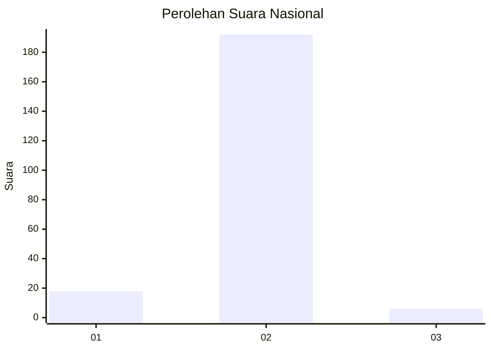
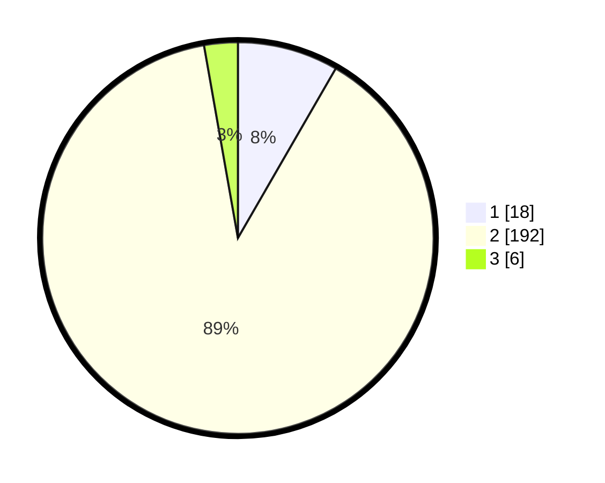

# Hasil

## Grafik

## Tabel

| No. | Nama Paslon    | Suara | Suara (raw) | Persentase |
|:--- |:-------------- | -----:| -----------:| ----------:|
| 1   | ANIES MUHAIMIN | 18    | [18][p-1]   | 8,33       |
| 2   | PRABOWO GIBRAN | 192   | [192][p-2]  | 88,89      |
| 3   | GANJAR MAHFUD  | 6     | [6][p-3]    | 2,78       |

[p-1]: https://github.com/gigit-pemilu/pemilu-2024/blob/main/pilpres/hitung-suara/sub/15-jambi/sub/05--muaro-jambi/sub/02-sekernan/sub/2003-pulau-kayu-aro/sub/003-tps/sub/paslon-1.txt
[p-2]: https://github.com/gigit-pemilu/pemilu-2024/blob/main/pilpres/hitung-suara/sub/15-jambi/sub/05--muaro-jambi/sub/02-sekernan/sub/2003-pulau-kayu-aro/sub/003-tps/sub/paslon-2.txt
[p-3]: https://github.com/gigit-pemilu/pemilu-2024/blob/main/pilpres/hitung-suara/sub/15-jambi/sub/05--muaro-jambi/sub/02-sekernan/sub/2003-pulau-kayu-aro/sub/003-tps/sub/paslon-3.txt

## Foto C Plano

https://sirekap-obj-formc.kpu.go.id/782b/pemilu/ppwp/15/05/02/20/03/1505022003003-20240215-095853--5a4d8140-880c-44ac-a527-0347c1248c1f.jpg

https://sirekap-obj-formc.kpu.go.id/782b/pemilu/ppwp/15/05/02/20/03/1505022003003-20240215-100525--46c2fdae-89ba-4403-b49f-e7239d8f6af6.jpg

https://sirekap-obj-formc.kpu.go.id/782b/pemilu/ppwp/15/05/02/20/03/1505022003003-20240215-100811--7be16603-db80-4330-87d4-60c30e3860f3.jpg

## Metadata

| Key        | Value               |
| ---------- | ------------------- |
| Time Stamp | 2024-02-22 21:00:00 |

