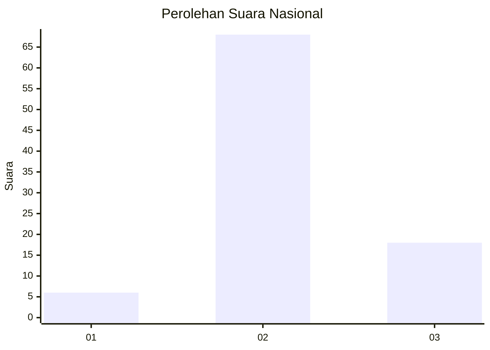
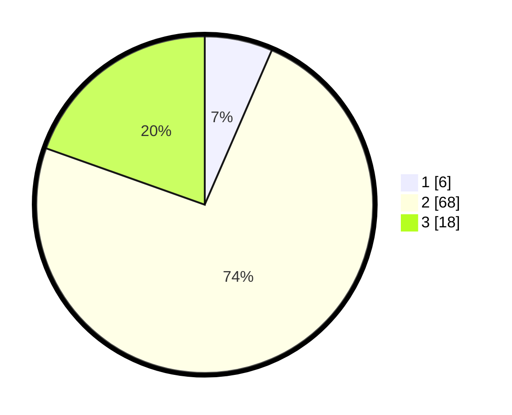

# Hasil

## Grafik

## Tabel

| No. | Nama Paslon    | Suara | Suara (raw) | Persentase |
|:--- |:-------------- | -----:| -----------:| ----------:|
| 1   | ANIES MUHAIMIN | 6     | [6][p-1]    | 6,52       |
| 2   | PRABOWO GIBRAN | 68    | [68][p-2]   | 73,91      |
| 3   | GANJAR MAHFUD  | 18    | [18][p-3]   | 19,57      |

[p-1]: https://github.com/gigit-pemilu/pemilu-2024/blob/main/pilpres/hitung-suara/sub/15-jambi/sub/05--muaro-jambi/sub/02-sekernan/sub/2013-bukit-baling/sub/024-tps/sub/paslon-1.txt
[p-2]: https://github.com/gigit-pemilu/pemilu-2024/blob/main/pilpres/hitung-suara/sub/15-jambi/sub/05--muaro-jambi/sub/02-sekernan/sub/2013-bukit-baling/sub/024-tps/sub/paslon-2.txt
[p-3]: https://github.com/gigit-pemilu/pemilu-2024/blob/main/pilpres/hitung-suara/sub/15-jambi/sub/05--muaro-jambi/sub/02-sekernan/sub/2013-bukit-baling/sub/024-tps/sub/paslon-3.txt

## Foto C Plano

https://sirekap-obj-formc.kpu.go.id/e937/pemilu/ppwp/15/05/02/20/13/1505022013024-20240214-223554--594b3f74-1364-4f4f-9960-e8220ba40136.jpg

https://sirekap-obj-formc.kpu.go.id/e937/pemilu/ppwp/15/05/02/20/13/1505022013024-20240214-225425--97404b2f-4a94-43ea-8444-95f491dbe49f.jpg

https://sirekap-obj-formc.kpu.go.id/e937/pemilu/ppwp/15/05/02/20/13/1505022013024-20240214-225753--17c516d2-02e7-4941-9296-8a02d4a7974b.jpg

## Metadata

| Key        | Value               |
| ---------- | ------------------- |
| Time Stamp | 2024-02-22 17:00:00 |

