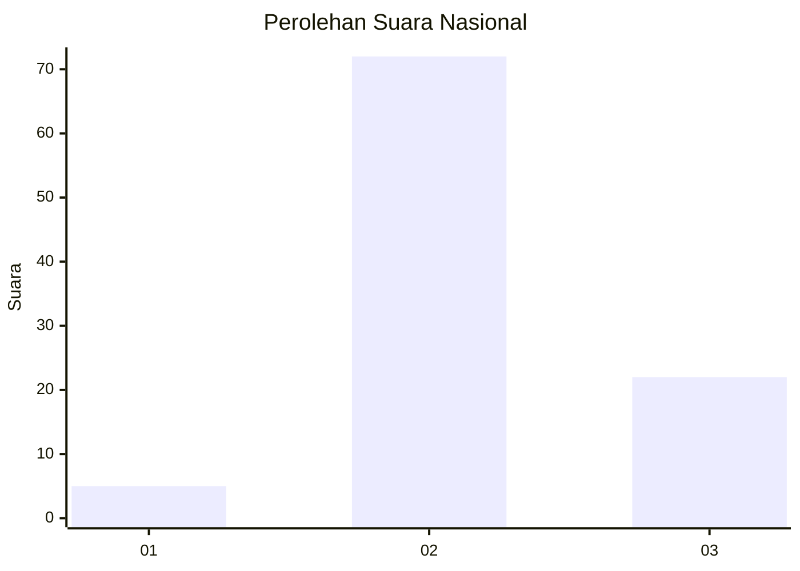
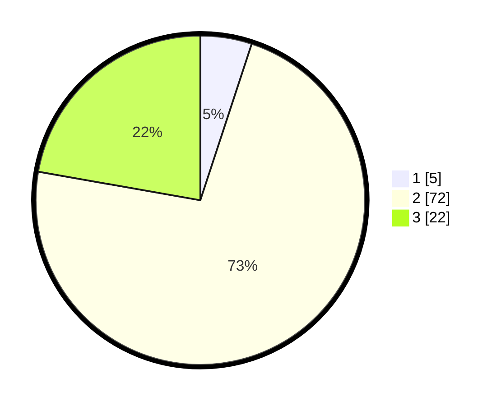

# Hasil

## Grafik

## Tabel

| No. | Nama Paslon    | Suara | Suara (raw) | Persentase |
|:--- |:-------------- | -----:| -----------:| ----------:|
| 1   | ANIES MUHAIMIN | 5     | [5][p-1]    | 5,05       |
| 2   | PRABOWO GIBRAN | 72    | [72][p-2]   | 72,73      |
| 3   | GANJAR MAHFUD  | 22    | [22][p-3]   | 22,22      |

[p-1]: https://github.com/gigit-pemilu/pemilu-2024/blob/main/pilpres/hitung-suara/sub/15-jambi/sub/05--muaro-jambi/sub/02-sekernan/sub/2013-bukit-baling/sub/027-tps/sub/paslon-1.txt
[p-2]: https://github.com/gigit-pemilu/pemilu-2024/blob/main/pilpres/hitung-suara/sub/15-jambi/sub/05--muaro-jambi/sub/02-sekernan/sub/2013-bukit-baling/sub/027-tps/sub/paslon-2.txt
[p-3]: https://github.com/gigit-pemilu/pemilu-2024/blob/main/pilpres/hitung-suara/sub/15-jambi/sub/05--muaro-jambi/sub/02-sekernan/sub/2013-bukit-baling/sub/027-tps/sub/paslon-3.txt

## Foto C Plano

https://sirekap-obj-formc.kpu.go.id/867d/pemilu/ppwp/15/05/02/20/13/1505022013027-20240214-231618--169b3561-af7b-49c9-9651-41350ba1ddfd.jpg

https://sirekap-obj-formc.kpu.go.id/867d/pemilu/ppwp/15/05/02/20/13/1505022013027-20240214-231700--3206eb7d-993d-4d4d-9d9d-0cf3a5560e0d.jpg

https://sirekap-obj-formc.kpu.go.id/867d/pemilu/ppwp/15/05/02/20/13/1505022013027-20240214-231746--b6ed1656-a5f6-426c-ab28-1f00ee2e0954.jpg

## Metadata

| Key        | Value               |
| ---------- | ------------------- |
| Time Stamp | 2024-02-22 17:00:00 |

