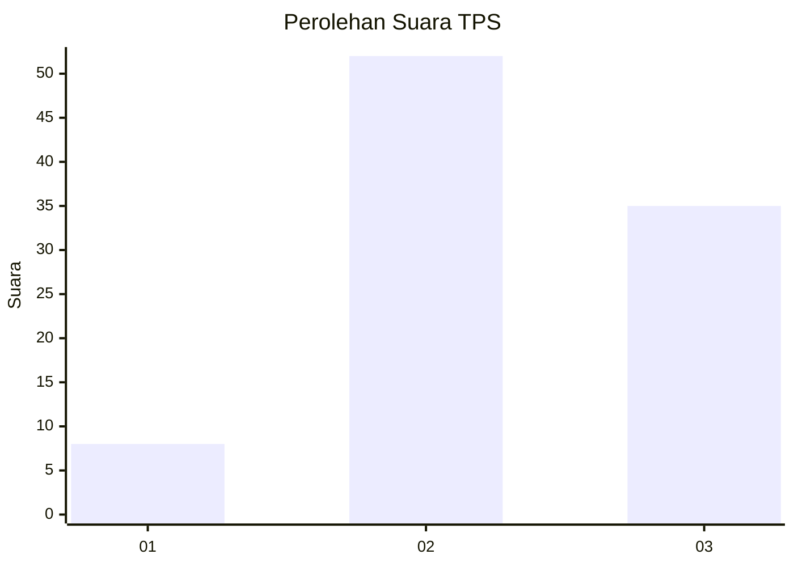
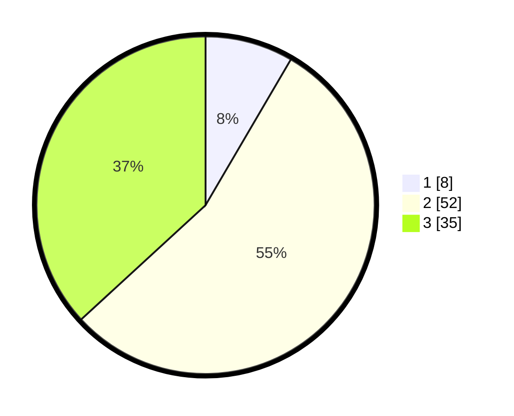

# Hasil

## Grafik

## Tabel

| No. | Nama Paslon    | Suara | Suara (raw) | Persentase |
|:--- |:-------------- | -----:| -----------:| ----------:|
| 1   | ANIES MUHAIMIN | 8     | [8][p-1]    | 8,42       |
| 2   | PRABOWO GIBRAN | 52    | [52][p-2]   | 54,74      |
| 3   | GANJAR MAHFUD  | 35    | [35][p-3]   | 36,84      |

[p-1]: https://github.com/gigit-pemilu/pemilu-2024-15-jambi/blob/main/pilpres/hitung-suara/sub/15-jambi/sub/05--muaro-jambi/sub/03-kumpeh/sub/2005-sungai-bungur/sub/007-tps/sub/paslon-1.txt
[p-2]: https://github.com/gigit-pemilu/pemilu-2024-15-jambi/blob/main/pilpres/hitung-suara/sub/15-jambi/sub/05--muaro-jambi/sub/03-kumpeh/sub/2005-sungai-bungur/sub/007-tps/sub/paslon-2.txt
[p-3]: https://github.com/gigit-pemilu/pemilu-2024-15-jambi/blob/main/pilpres/hitung-suara/sub/15-jambi/sub/05--muaro-jambi/sub/03-kumpeh/sub/2005-sungai-bungur/sub/007-tps/sub/paslon-3.txt

## Foto C Plano

https://sirekap-obj-formc.kpu.go.id/1b7f/pemilu/ppwp/15/05/03/20/05/1505032005007-20240215-111236--9596ccb9-8921-448c-a499-67466ca0b5b0.jpg

https://sirekap-obj-formc.kpu.go.id/1b7f/pemilu/ppwp/15/05/03/20/05/1505032005007-20240215-111045--60323107-5096-40ff-86c2-50a6bd8bb977.jpg

https://sirekap-obj-formc.kpu.go.id/1b7f/pemilu/ppwp/15/05/03/20/05/1505032005007-20240214-220102--7fd3e8f5-b12c-4df0-a2dc-93fcc85f3284.jpg

## Metadata

| Key        | Value               |
| ---------- | ------------------- |
| Time Stamp | 2024-02-22 21:00:00 |

