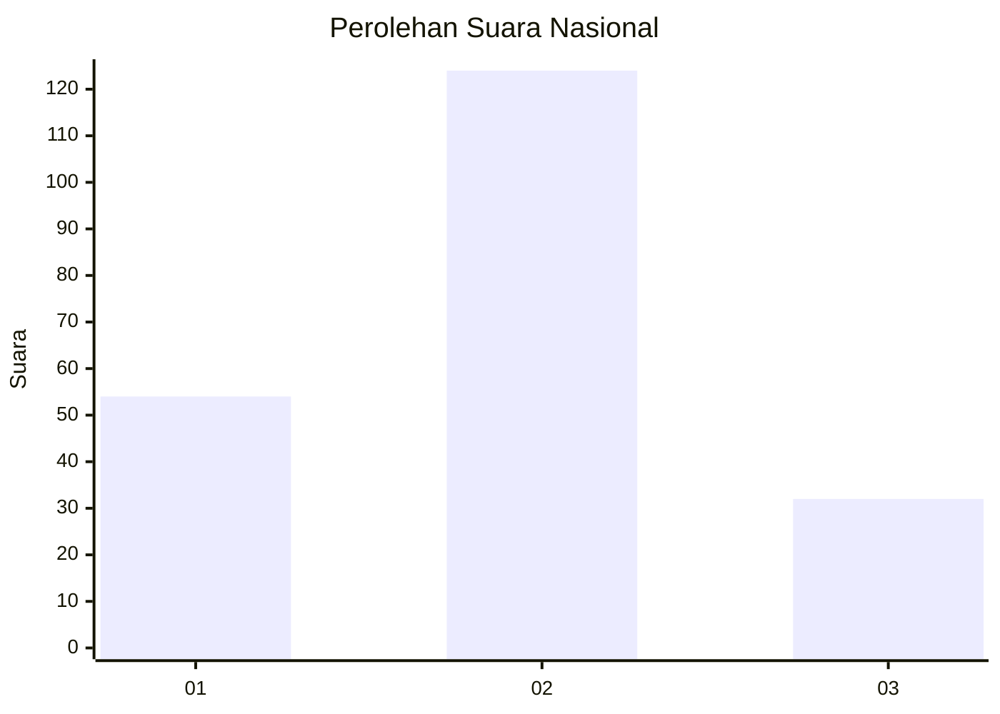

# Hasil

## Grafik

## Tabel

| No. | Nama Paslon    | Suara | Suara (raw) | Persentase |
|:--- |:-------------- | -----:| -----------:| ----------:|
| 1   | ANIES MUHAIMIN | 54    | [54][p-1]   | 25,71      |
| 2   | PRABOWO GIBRAN | 124   | [124][p-2]  | 59,05      |
| 3   | GANJAR MAHFUD  | 32    | [32][p-3]   | 15,24      |

[p-1]: https://github.com/gigit-pemilu/pemilu-2024/blob/main/pilpres/hitung-suara/sub/15-jambi/sub/05--muaro-jambi/sub/04-maro-sebo/sub/1002-jambi-kecil/sub/002-tps/sub/paslon-1.txt
[p-2]: https://github.com/gigit-pemilu/pemilu-2024/blob/main/pilpres/hitung-suara/sub/15-jambi/sub/05--muaro-jambi/sub/04-maro-sebo/sub/1002-jambi-kecil/sub/002-tps/sub/paslon-2.txt
[p-3]: https://github.com/gigit-pemilu/pemilu-2024/blob/main/pilpres/hitung-suara/sub/15-jambi/sub/05--muaro-jambi/sub/04-maro-sebo/sub/1002-jambi-kecil/sub/002-tps/sub/paslon-3.txt

## Foto C Plano

https://sirekap-obj-formc.kpu.go.id/667c/pemilu/ppwp/15/05/04/10/02/1505041002002-20240215-020833--4cadbe51-8008-4ca4-a8c2-e0e130e192ab.jpg

https://sirekap-obj-formc.kpu.go.id/667c/pemilu/ppwp/15/05/04/10/02/1505041002002-20240215-020935--6717a517-4f09-46dd-adcf-4651b1054c8d.jpg

https://sirekap-obj-formc.kpu.go.id/667c/pemilu/ppwp/15/05/04/10/02/1505041002002-20240215-021045--96693499-8515-4d8a-9ec8-058d36ad86e4.jpg

## Metadata

| Key        | Value               |
| ---------- | ------------------- |
| Time Stamp | 2024-02-22 17:00:00 |

