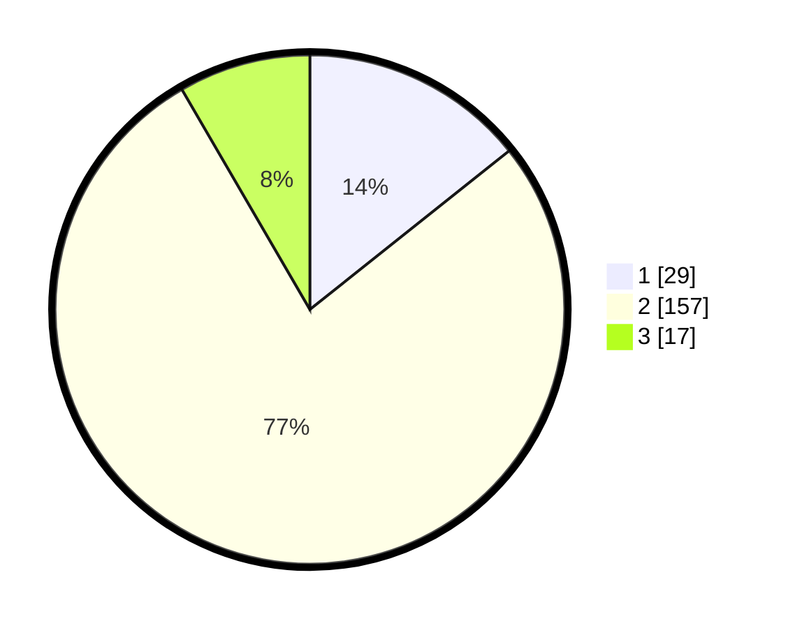

# Hasil

## Grafik

## Tabel

| No. | Nama Paslon    | Suara | Suara (raw) | Persentase |
|:--- |:-------------- | -----:| -----------:| ----------:|
| 1   | ANIES MUHAIMIN | 29    | [29][p-1]   | 14,29      |
| 2   | PRABOWO GIBRAN | 157   | [157][p-2]  | 77,34      |
| 3   | GANJAR MAHFUD  | 17    | [17][p-3]   | 8,37       |

[p-1]: https://github.com/gigit-pemilu/pemilu-2024-15-jambi/blob/main/pilpres/hitung-suara/sub/15-jambi/sub/05--muaro-jambi/sub/04-maro-sebo/sub/1002-jambi-kecil/sub/005-tps/sub/paslon-1.txt
[p-2]: https://github.com/gigit-pemilu/pemilu-2024-15-jambi/blob/main/pilpres/hitung-suara/sub/15-jambi/sub/05--muaro-jambi/sub/04-maro-sebo/sub/1002-jambi-kecil/sub/005-tps/sub/paslon-2.txt
[p-3]: https://github.com/gigit-pemilu/pemilu-2024-15-jambi/blob/main/pilpres/hitung-suara/sub/15-jambi/sub/05--muaro-jambi/sub/04-maro-sebo/sub/1002-jambi-kecil/sub/005-tps/sub/paslon-3.txt

## Foto C Plano

https://sirekap-obj-formc.kpu.go.id/0481/pemilu/ppwp/15/05/04/10/02/1505041002005-20240215-173511--581a88b9-ccd7-4f8b-a74a-b68f20f6b8aa.jpg

https://sirekap-obj-formc.kpu.go.id/0481/pemilu/ppwp/15/05/04/10/02/1505041002005-20240215-060925--cd042389-5b62-4cd2-ba16-88a193ed3074.jpg

https://sirekap-obj-formc.kpu.go.id/0481/pemilu/ppwp/15/05/04/10/02/1505041002005-20240215-060940--a2613fa3-b9c6-4825-8556-b9b1690993a1.jpg

## Metadata

| Key        | Value               |
| ---------- | ------------------- |
| Time Stamp | 2024-02-22 17:00:00 |

