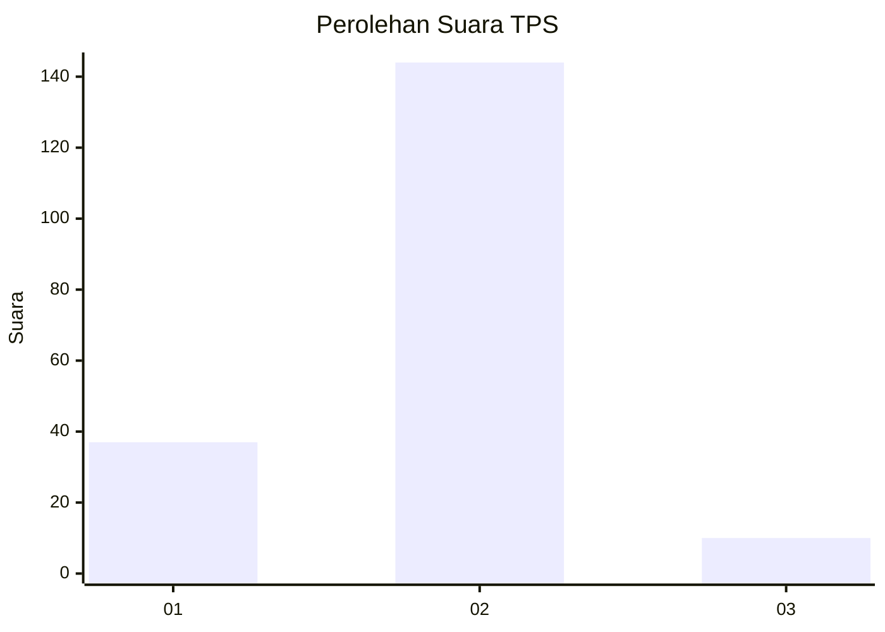
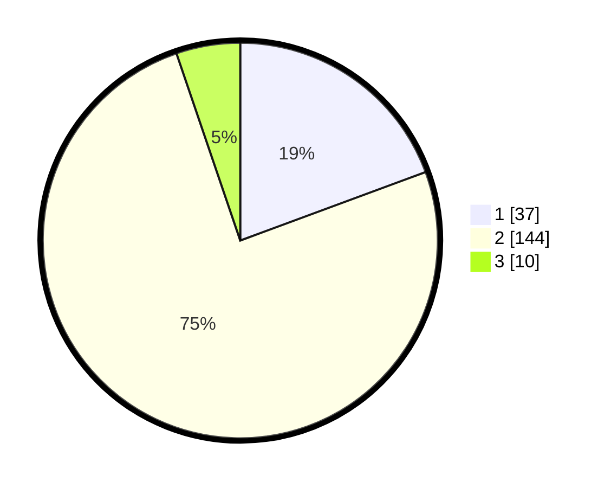

# Hasil

## Grafik

## Tabel

| No. | Nama Paslon    | Suara | Suara (raw) | Persentase |
|:--- |:-------------- | -----:| -----------:| ----------:|
| 1   | ANIES MUHAIMIN | 37    | [37][p-1]   | 19,37      |
| 2   | PRABOWO GIBRAN | 144   | [144][p-2]  | 75,39      |
| 3   | GANJAR MAHFUD  | 10    | [10][p-3]   | 5,24       |

[p-1]: https://github.com/gigit-pemilu/pemilu-2024-15-jambi/blob/main/pilpres/hitung-suara/sub/15-jambi/sub/05--muaro-jambi/sub/04-maro-sebo/sub/1002-jambi-kecil/sub/007-tps/sub/paslon-1.txt
[p-2]: https://github.com/gigit-pemilu/pemilu-2024-15-jambi/blob/main/pilpres/hitung-suara/sub/15-jambi/sub/05--muaro-jambi/sub/04-maro-sebo/sub/1002-jambi-kecil/sub/007-tps/sub/paslon-2.txt
[p-3]: https://github.com/gigit-pemilu/pemilu-2024-15-jambi/blob/main/pilpres/hitung-suara/sub/15-jambi/sub/05--muaro-jambi/sub/04-maro-sebo/sub/1002-jambi-kecil/sub/007-tps/sub/paslon-3.txt

## Foto C Plano

https://sirekap-obj-formc.kpu.go.id/174f/pemilu/ppwp/15/05/04/10/02/1505041002007-20240214-224031--d714aa51-6311-4459-9654-90e56ea0f5cc.jpg

https://sirekap-obj-formc.kpu.go.id/174f/pemilu/ppwp/15/05/04/10/02/1505041002007-20240214-224216--dc66fd35-b09e-4b0f-89a1-658e81e50cae.jpg

https://sirekap-obj-formc.kpu.go.id/174f/pemilu/ppwp/15/05/04/10/02/1505041002007-20240214-224311--72319641-0e28-41d2-af3e-e87550f5f29a.jpg

## Metadata

| Key        | Value               |
| ---------- | ------------------- |
| Time Stamp | 2024-02-22 17:00:00 |

