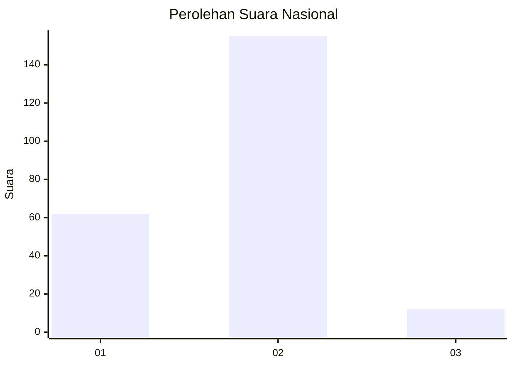
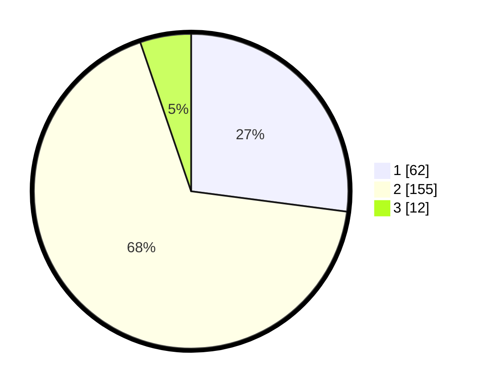

# Hasil

## Grafik

## Tabel

| No. | Nama Paslon    | Suara | Suara (raw) | Persentase |
|:--- |:-------------- | -----:| -----------:| ----------:|
| 1   | ANIES MUHAIMIN | 62    | [62][p-1]   | 27,07      |
| 2   | PRABOWO GIBRAN | 155   | [155][p-2]  | 67,69      |
| 3   | GANJAR MAHFUD  | 12    | [12][p-3]   | 5,24       |

[p-1]: https://github.com/gigit-pemilu/pemilu-2024/blob/main/pilpres/hitung-suara/sub/15-jambi/sub/05--muaro-jambi/sub/04-maro-sebo/sub/2018-danau-kedap/sub/003-tps/sub/paslon-1.txt
[p-2]: https://github.com/gigit-pemilu/pemilu-2024/blob/main/pilpres/hitung-suara/sub/15-jambi/sub/05--muaro-jambi/sub/04-maro-sebo/sub/2018-danau-kedap/sub/003-tps/sub/paslon-2.txt
[p-3]: https://github.com/gigit-pemilu/pemilu-2024/blob/main/pilpres/hitung-suara/sub/15-jambi/sub/05--muaro-jambi/sub/04-maro-sebo/sub/2018-danau-kedap/sub/003-tps/sub/paslon-3.txt

## Foto C Plano

https://sirekap-obj-formc.kpu.go.id/84bc/pemilu/ppwp/15/05/04/20/18/1505042018003-20240214-193348--e8a13422-4b08-434d-b78a-fbcafedad1ad.jpg

https://sirekap-obj-formc.kpu.go.id/84bc/pemilu/ppwp/15/05/04/20/18/1505042018003-20240214-193453--0d6e8d56-e146-49c2-8299-1b2cbbf73bdf.jpg

https://sirekap-obj-formc.kpu.go.id/84bc/pemilu/ppwp/15/05/04/20/18/1505042018003-20240214-193541--03924d04-6a5e-4f2f-9d85-ea6c879f3118.jpg

## Metadata

| Key        | Value               |
| ---------- | ------------------- |
| Time Stamp | 2024-02-25 12:00:00 |

