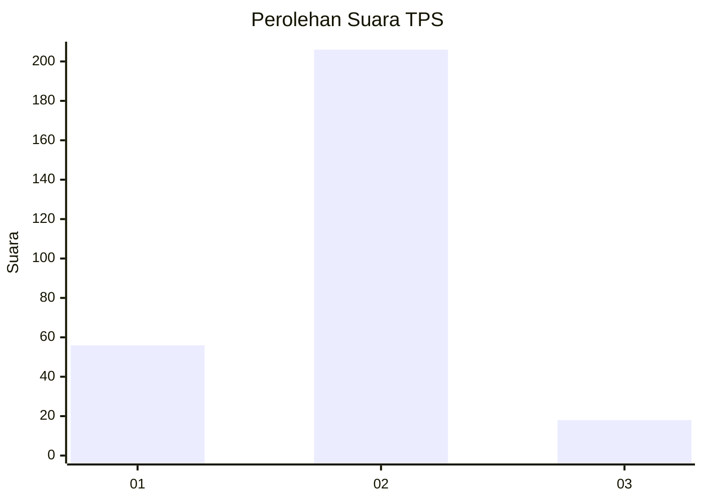

# Hasil

## Grafik

## Tabel

| No. | Nama Paslon    | Suara | Suara (raw) | Persentase |
|:--- |:-------------- | -----:| -----------:| ----------:|
| 1   | ANIES MUHAIMIN | 56    | [56][p-1]   | 20,00      |
| 2   | PRABOWO GIBRAN | 206   | [206][p-2]  | 73,57      |
| 3   | GANJAR MAHFUD  | 18    | [18][p-3]   | 6,43       |

[p-1]: https://github.com/gigit-pemilu/pemilu-2024-15-jambi/blob/main/pilpres/hitung-suara/sub/15-jambi/sub/05--muaro-jambi/sub/05-mestong/sub/2006-sebapo/sub/001-tps/sub/paslon-1.txt
[p-2]: https://github.com/gigit-pemilu/pemilu-2024-15-jambi/blob/main/pilpres/hitung-suara/sub/15-jambi/sub/05--muaro-jambi/sub/05-mestong/sub/2006-sebapo/sub/001-tps/sub/paslon-2.txt
[p-3]: https://github.com/gigit-pemilu/pemilu-2024-15-jambi/blob/main/pilpres/hitung-suara/sub/15-jambi/sub/05--muaro-jambi/sub/05-mestong/sub/2006-sebapo/sub/001-tps/sub/paslon-3.txt

## Foto C Plano

https://sirekap-obj-formc.kpu.go.id/ae0f/pemilu/ppwp/15/05/05/20/06/1505052006001-20240214-160143--a58a5c73-d328-488d-af32-dc4ca0091e25.jpg

https://sirekap-obj-formc.kpu.go.id/ae0f/pemilu/ppwp/15/05/05/20/06/1505052006001-20240215-084546--2a99a61c-2059-4fac-acec-d61b157a57af.jpg

https://sirekap-obj-formc.kpu.go.id/ae0f/pemilu/ppwp/15/05/05/20/06/1505052006001-20240214-155812--7f2f39a6-51c5-4a2f-b234-67b067d7c6b2.jpg

## Metadata

| Key        | Value               |
| ---------- | ------------------- |
| Time Stamp | 2024-02-22 12:00:00 |

