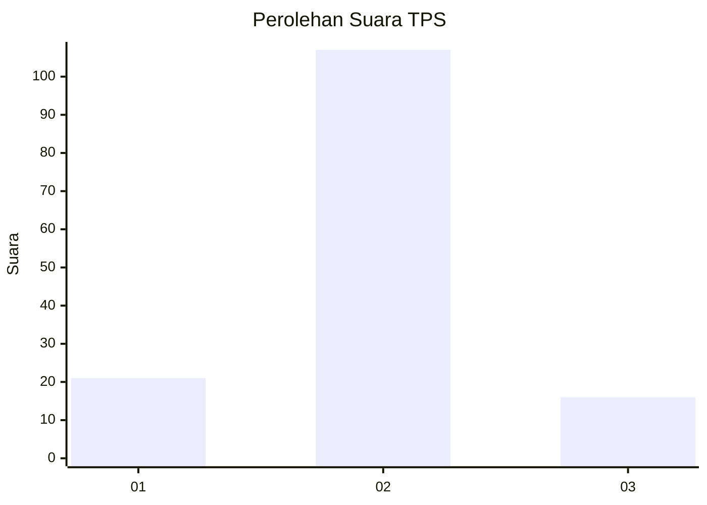
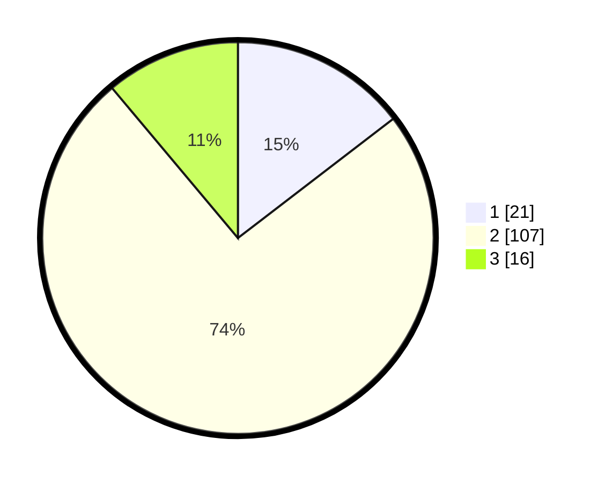

# Hasil

## Grafik

## Tabel

| No. | Nama Paslon    | Suara | Suara (raw) | Persentase |
|:--- |:-------------- | -----:| -----------:| ----------:|
| 1   | ANIES MUHAIMIN | 21    | [21][p-1]   | 14,58      |
| 2   | PRABOWO GIBRAN | 107   | [107][p-2]  | 74,31      |
| 3   | GANJAR MAHFUD  | 16    | [16][p-3]   | 11,11      |

[p-1]: https://github.com/gigit-pemilu/pemilu-2024-15-jambi/blob/main/pilpres/hitung-suara/sub/15-jambi/sub/05--muaro-jambi/sub/05-mestong/sub/2011-tanjung-pauh-km-39/sub/001-tps/sub/paslon-1.txt
[p-2]: https://github.com/gigit-pemilu/pemilu-2024-15-jambi/blob/main/pilpres/hitung-suara/sub/15-jambi/sub/05--muaro-jambi/sub/05-mestong/sub/2011-tanjung-pauh-km-39/sub/001-tps/sub/paslon-2.txt
[p-3]: https://github.com/gigit-pemilu/pemilu-2024-15-jambi/blob/main/pilpres/hitung-suara/sub/15-jambi/sub/05--muaro-jambi/sub/05-mestong/sub/2011-tanjung-pauh-km-39/sub/001-tps/sub/paslon-3.txt

## Foto C Plano

https://sirekap-obj-formc.kpu.go.id/74f3/pemilu/ppwp/15/05/05/20/11/1505052011001-20240215-021427--6e2667dc-ddeb-48d6-94fb-c028cb37e514.jpg

https://sirekap-obj-formc.kpu.go.id/74f3/pemilu/ppwp/15/05/05/20/11/1505052011001-20240215-021611--a23ac0c9-8ff3-4029-b68c-b3c06571ccb5.jpg

https://sirekap-obj-formc.kpu.go.id/74f3/pemilu/ppwp/15/05/05/20/11/1505052011001-20240215-020600--4c5a1ffc-597f-4c19-ab94-1d0935c5e899.jpg

## Metadata

| Key        | Value               |
| ---------- | ------------------- |
| Time Stamp | 2024-02-22 21:00:00 |

