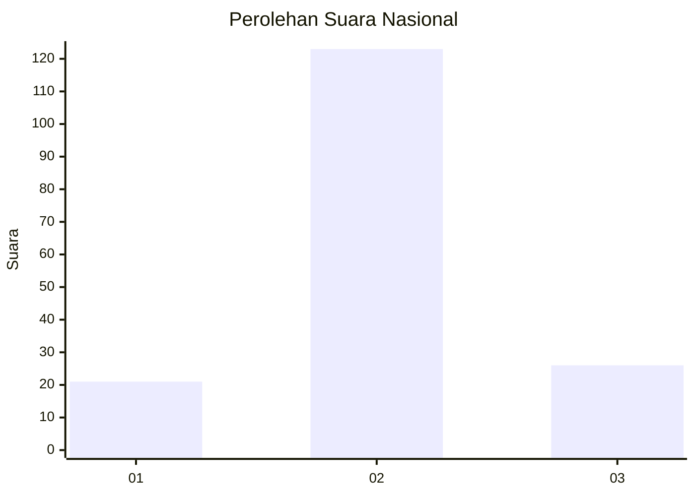
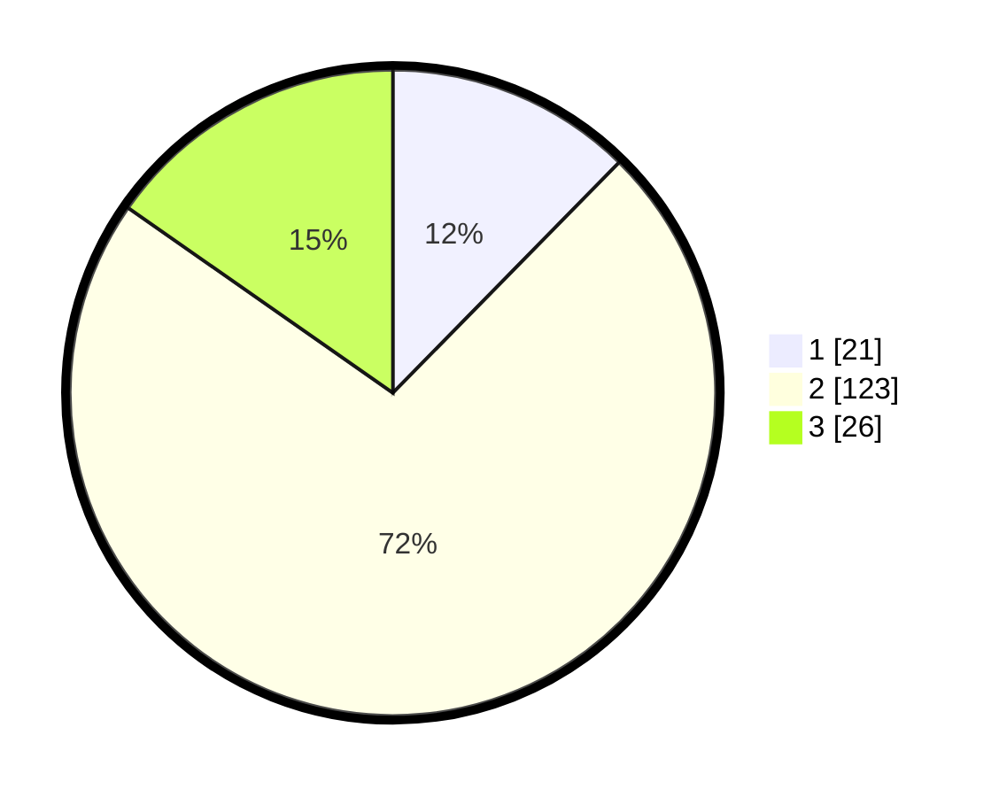

# Hasil

## Grafik

## Tabel

| No. | Nama Paslon    | Suara | Suara (raw) | Persentase |
|:--- |:-------------- | -----:| -----------:| ----------:|
| 1   | ANIES MUHAIMIN | 21    | [21][p-1]   | 12,35      |
| 2   | PRABOWO GIBRAN | 123   | [123][p-2]  | 72,35      |
| 3   | GANJAR MAHFUD  | 26    | [26][p-3]   | 15,29      |

[p-1]: https://github.com/gigit-pemilu/pemilu-2024/blob/main/pilpres/hitung-suara/sub/15-jambi/sub/05--muaro-jambi/sub/07-sungai-bahar/sub/2004-suka-makmur/sub/002-tps/sub/paslon-1.txt
[p-2]: https://github.com/gigit-pemilu/pemilu-2024/blob/main/pilpres/hitung-suara/sub/15-jambi/sub/05--muaro-jambi/sub/07-sungai-bahar/sub/2004-suka-makmur/sub/002-tps/sub/paslon-2.txt
[p-3]: https://github.com/gigit-pemilu/pemilu-2024/blob/main/pilpres/hitung-suara/sub/15-jambi/sub/05--muaro-jambi/sub/07-sungai-bahar/sub/2004-suka-makmur/sub/002-tps/sub/paslon-3.txt

## Foto C Plano

https://sirekap-obj-formc.kpu.go.id/ff71/pemilu/ppwp/15/05/07/20/04/1505072004002-20240214-162235--28e4516e-ecd5-4570-8ed4-ec077a082989.jpg

https://sirekap-obj-formc.kpu.go.id/ff71/pemilu/ppwp/15/05/07/20/04/1505072004002-20240214-160128--e21d7578-4815-4729-aa05-e8e961ec8292.jpg

https://sirekap-obj-formc.kpu.go.id/ff71/pemilu/ppwp/15/05/07/20/04/1505072004002-20240214-160101--7a9a51c8-634e-41a7-8916-6efcfa9ac562.jpg

## Metadata

| Key        | Value               |
| ---------- | ------------------- |
| Time Stamp | 2024-02-19 13:00:00 |

